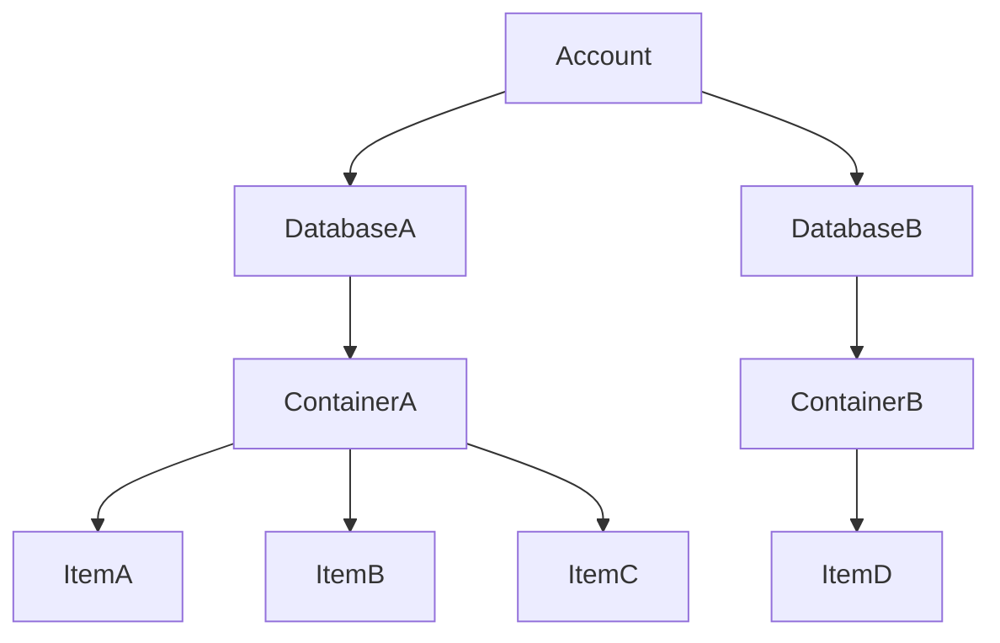

## 特徴

- フルマネージドの NoSQL
- 世界中の Azure リージョンに分散できる
- 書き込み可能なデータベースを複数持てる（マルチマスター）
- すべての整合性レベルの読み取り待機時間は 99 パーセンタイルで 10 ミリ秒未満となるように保証されている
- 最大 99.999%の読み取り/書き込み可用性 [SLA](https://learn.microsoft.com/ja-jp/azure/cosmos-db/high-availability#slas)
- NoSQL、MongoDB、PostgreSQL Cassandra、Gremlin、Table などの複数のデータベース API

## コスト

- データベース操作（RU:要求ユニット）あたり
- データとインデックスのストレージ容量
- バックアップストレージ容量
  - 定期的バックアップ 2 世代まで無料
  - 継続的バックアップ 7 日間まで無料（2024 年 6 月 30 日まで）

https://azure.microsoft.com/ja-jp/pricing/details/cosmos-db/autoscale-provisioned/
https://cosmos.azure.com/capacitycalculator/

## バックアップとリストア

- [定期的バックアップ](https://learn.microsoft.com/ja-jp/azure/cosmos-db/periodic-backup-restore-introduction)
  - 60-1440 分、1-24 時間おきにバックアップを取得
  - 8-720 時間、1-30 日ぶんのバックアップを保持
  - 既定は 4 時間ごとにバックアップされ 2 回分（8 時間ぶん）保持される
  - 復元操作は Azure サポートに依頼する必要がある
  - 復元時は新しいアカウントが作成される
- [継続的バックアップ](https://learn.microsoft.com/ja-jp/azure/cosmos-db/continuous-backup-restore-introduction)
  - 7 日間/168 時間、または、30 日/720 時間のバックアップウィンドウを選択
  - ウィンドウ内の任意の時点にリストア可能
  - 復元操作は Azure ポータル, PowerShell, CLI が可能
  - 復元時は[新しいアカウント](https://learn.microsoft.com/ja-jp/azure/cosmos-db/restore-account-continuous-backup)、[既存のアカウント](https://learn.microsoft.com/ja-jp/azure/cosmos-db/how-to-restore-in-account-continuous-backup?tabs=azure-portal&pivots=api-nosql)が選択できる

## データベース構造

| CosmosDB  | RDB      |
| --------- | -------- |
| Account   | -        |
| Database  | Database |
| Container | Table    |
| Item      | Record   |

## 要求ユニット (RU)

- 1 RU = 1KB のデータを 1 回読み込むのに必要な CPU、メモリ、IOPS を抽象化した単位
- 要求 (読み書き) ごとに一定の RU が消費される
- 1 秒あたりどれくらい要求を受けられるか RU に応じて課金される (例: 400RU / sec)
- RU を消費するのはユーザーデータだけではない (Index, Timestanp など)
- 瞬時に RU の増減ができる

### 標準（手動）

- 1 秒あたりの最大 RU を指定、サイズ変更は手動
- 最小 400RU
- トラフィックが予想できるパターンに適している

### 自動スケーリング

- 予想される 1 秒あたりの最大 RU を指定
- 設定した値の 1/10 から設定値まで動的にスケーリング
- 最小 1000RU
- トラフィックが予想できないパターンに適している

### バースト容量 (プレビュー)

- 未使用の RU を最大 5 分間バースト容量として蓄積
- 急激な高負荷時に蓄積した未使用容量を活かすことができる
- 1 パーティションあたり最大 3000RU のバーストが可能

### サーバレス

- 開発環境向け（本番環境は非推奨）
- RU の指定が不要で使った分だけ課金される
- マルチリージョンで構成できない
- 最大ストレージ 1TB
- 待機時間、スループットの SLA なし

https://learn.microsoft.com/ja-jp/azure/cosmos-db/throughput-serverless

## パーティション分割

データのサイズが大きくなった際、スケールアップするのではなく、複数のマシン間でデータを分散する手法。各マシンがデータの一部を処理する責任を負う。

- 論理パーティション
  - ユーザーが指定するパーティションキーに応じて分散
  - 同じパーティションキーに関連付けられるすべてのデータを格納
  - 新しい項目が追加されると新しい論理パーティションが透過的に作成される
  - 論理パーティションの数に制限はない
  - 最大 20 GB のデータを格納
- 物理パーティション
  - マイクロサービス化された一つ一つのマシン (CPU, メモリ, ストレージ)
  - 論理パーティションはどれか一つの物理パーティションにマッピングされる
  - データサイズが増加すると既存のパーティションが分割され、新しい物理パーティションが自動的に作成される
  - 物理パーティションの数に制限はない
  - 割り当てられた RU は物理パーティション全体に均等に分割される
  - 各物理パーティションは一連のレプリカで構成される (レプリカセット)
  - コンテナーは 1 つの物理パーティションのみを必要とするが、少なくとも 4 つのレプリカが保持される　(4 重化)
  - 最大 50 GB のデータを格納

https://learn.microsoft.com/ja-jp/azure/cosmos-db/partitioning-overview
https://learn.microsoft.com/ja-jp/azure/cosmos-db/global-dist-under-the-hood
