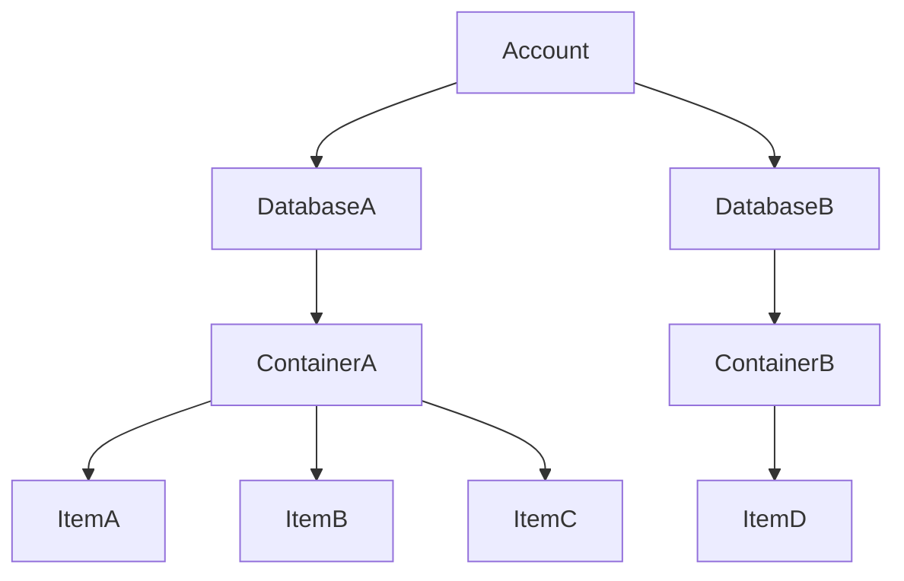

# 特徴

- フルマネージドの NoSQL
- 世界中の Azure リージョンに分散できる
- 書き込み可能なデータベースを複数持てる（マルチマスター）
- すべての整合性レベルの読み取り待機時間は 99 パーセンタイルで 10 ミリ秒未満となるように保証されている
- 最大 99.999%の読み取り/書き込み可用性 [SLA](https://learn.microsoft.com/ja-jp/azure/cosmos-db/high-availability#slas)
- NoSQL、MongoDB、PostgreSQL Cassandra、Gremlin、Table などの複数のデータベース API

# コスト

- データベース操作（RU:要求ユニット）あたり
- データとインデックスのストレージ容量
- バックアップストレージ容量
  - 定期的バックアップ 2 世代まで無料
  - 継続的バックアップ 7 日間まで無料（2024 年 6 月 30 日まで）

# バックアップとリストア

- [定期的バックアップ](https://learn.microsoft.com/ja-jp/azure/cosmos-db/periodic-backup-restore-introduction)
  - 60-1440 分、1-24 時間おきにバックアップを取得
  - 8-720 時間、1-30 日ぶんのバックアップを保持
  - 既定は 4 時間ごとにバックアップされ 2 回分（8 時間ぶん）保持される
  - 復元時は新しいアカウントが作成される
- [継続的バックアップ](https://learn.microsoft.com/ja-jp/azure/cosmos-db/continuous-backup-restore-introduction)
  - 7 日間/168 時間、または、30 日/720 時間のバックアップウィンドウを選択
  - ウィンドウ内の任意の時点にリストア可能
  - 復元時は新しいアカウント、既存のアカウントが選択できる

# データベース構造

| CosmosDB  | RDB      |
| --------- | -------- |
| Account   | -        |
| Database  | Database |
| Container | Table    |
| Item      | Record   |

