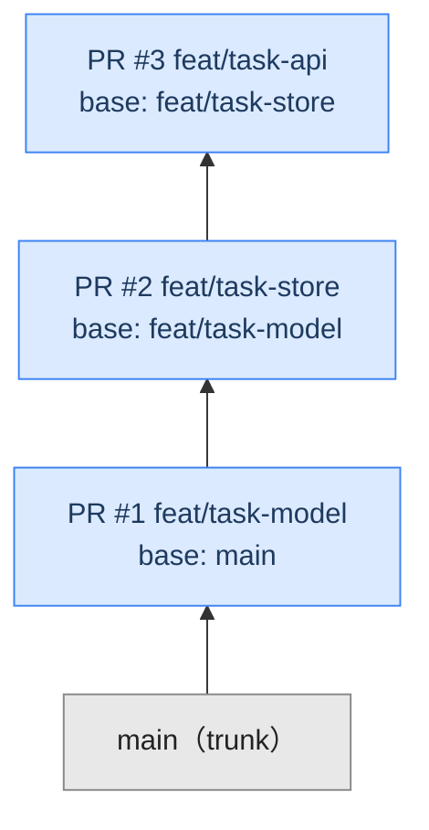

# GitHub Stacked Pull Requests ハンズオンカリキュラム

2026-07-30 に public preview となった GitHub の **Stacked Pull Requests**（スタック PR）を、
手を動かして理解するための実習カリキュラムです。

- 対象: 日常的に GitHub の PR フローを使っているエンジニア / テックリード
- 前提知識: `git` の基本操作（branch / rebase / conflict 解決）、GitHub の PR レビュー
- 所要時間: 座学 1.5h + 実習 5h（合計 約 6.5h。2 日に分割推奨）
  — **手を動かす時間の目安です。** CI の完了待ち、PR 作成・マージの往復、
  コンフリクト解決の試行錯誤を含めると **8〜9h** を見込んでください
- 環境: macOS / Linux / WSL2、`gh` v2.90.0 以上を推奨（最低 2.0）、`git` v2.28 以上、Node.js 20 以上

> [!IMPORTANT]
> 本機能は **public preview** です。UI・CLI・API は変更される可能性があります。
> 実習中に挙動が本教材と食い違ったら、`gh stack <command> --help` と
> [公式ドキュメント](https://docs.github.com/en/pull-requests/how-tos/stacked-pull-requests) を正としてください。

---

## スタック PR とは（30 秒版）

大きな変更を「1 本の巨大な PR」ではなく「依存関係を持つ小さな PR の連なり」に分解する仕組みです。
各 PR は 1 つ下の PR のブランチを base に取り、鎖のように積み上がって最終的に `main` へ着地します。



レビュアーは各 PR で**その層の差分だけ**を見ます。3 つを並行レビューでき、
下から順にマージすれば上の層は自動で再ターゲットされます。

---

## カリキュラム構成

### Part 0 — 座学（約 50 分）

| #   | 教材                              | 内容                                                                                  |
| --- | --------------------------------- | ------------------------------------------------------------------------------------- |
| 00  | [概念と用語](docs/00-concepts.md) | stack / layer / trunk / base、従来フローとの比較、向く変更・向かない変更              |
| 01  | [環境準備](docs/01-setup.md)      | `gh-stack` 拡張の導入、AI エージェント連携（skill）、練習用リポジトリの作成、動作確認 |

### Part 1 — 基本操作（約 2h）

| #   | 実習                                                  | 学ぶこと                                       | 目安  |
| --- | ----------------------------------------------------- | ---------------------------------------------- | ----- |
| 01  | [最初のスタックを作る](labs/lab01-first-stack.md)     | `init` / `add` / `push` / `submit`             | 40 分 |
| 02  | [スタックを見る・移動する](labs/lab02-navigate.md)    | `view` / `up` / `down` / `switch` / `checkout` | 20 分 |
| 03  | [Web UI でレビューする](labs/lab03-review.md)         | stack map、層ごとの差分、並行レビュー          | 30 分 |
| 04  | [下層の修正を上へ伝播させる](labs/lab04-propagate.md) | `sync` / `rebase`、カスケードリベース          | 30 分 |

### Part 2 — 実戦操作（約 2h）

| #   | 実習                                               | 学ぶこと                                          | 目安  |
| --- | -------------------------------------------------- | ------------------------------------------------- | ----- |
| 05  | [コンフリクトを解決する](labs/lab05-conflict.md)   | `rebase --continue` / `--abort`、多段コンフリクト | 40 分 |
| 06  | [スタックの構造を組み替える](labs/lab06-modify.md) | `modify` による並べ替え・挿入・削除               | 30 分 |
| 07  | [マージ戦略を選ぶ](labs/lab07-merge.md)            | 部分マージ / 一括マージ、再ターゲット、`unstack`  | 40 分 |

### Part 3 — チーム導入（約 1.8h）

| #   | 実習 / 教材                                              | 学ぶこと                                          | 目安  |
| --- | -------------------------------------------------------- | ------------------------------------------------- | ----- |
| 08  | [既存 PR をスタック化する](labs/lab08-adopt-existing.md) | `link`、Web UI からの変換、移行シナリオ           | 30 分 |
| 09  | [ブランチ保護と CI](labs/lab09-ci-protection.md)         | 全層への保護適用、`pull_request.stack` メタデータ | 40 分 |
| 10  | [組織へのロールアウト設計](docs/10-rollout.md)           | 規約策定、CI コスト、API 移行、パイロット計画     | 座学  |

### リファレンス

- [CLI チートシート](reference/cli-cheatsheet.md) — 全コマンド・フラグ一覧
- [トラブルシューティング](reference/troubleshooting.md) — 終了コード別の対処、詰まったときの復帰手順

---

## 進め方

1. **座学 Part 0 を読む** → 用語が頭に入っていないと Lab で迷子になります
2. **[環境準備](docs/01-setup.md)** で練習用リポジトリを作る

   ```bash
   ./scripts/bootstrap-playground.sh
   ```

3. **Lab 01 から順に**実施する。各 Lab の末尾に「確認ポイント」と「振り返り課題」があります
4. 途中で状態が壊れたら [`scripts/reset-playground.sh`](scripts/reset-playground.sh) でやり直す

各 Lab は前の Lab の状態を引き継ぐ前提です。飛ばす場合は Lab 冒頭の「開始状態」を作ってから進めてください。

---

## 到達目標

このカリキュラムを終えると、次ができるようになります。

- [ ] 1 つの機能開発を、レビュー可能な 3〜5 層のスタックに分解して起票できる
- [ ] 下層へのレビュー指摘を反映し、上層すべてに矛盾なく伝播させられる
- [ ] 多段コンフリクトを `gh stack rebase` の中で解決しきれる
- [ ] レビュー進捗に応じて「部分マージ」「一括マージ」を選べる
- [ ] 既存の PR 群をスタックに移行できる
- [ ] チームに導入する際の規約と CI コストの論点を説明できる

> [!NOTE]
>
> **このカリキュラムは 1 人で完結する構成です。** 次の要素は単独の練習環境では再現できないため
> 扱っていません。**実務へ持ち込む前に別途補ってください。**
>
> - 他者からの承認・変更要求と、リベース後の再レビューが実際にどう動くか
> - 複数人が同じスタックを共有・引き継ぐときの調整
> - ruleset / merge queue / 自動マージ bot を含む本番相当のブランチ保護
> - 部分マージ後に障害が出たときの、上の層から逆順に戻す実作業

---

## 出典

- [Stacked pull requests are now in public preview — GitHub Changelog](https://github.blog/changelog/2026-07-30-stacked-pull-requests-are-now-in-public-preview/)
- [About stacked pull requests — GitHub Docs](https://docs.github.com/en/pull-requests/get-started/about-stacked-prs)
- [Quickstart for stacked pull requests — GitHub Docs](https://docs.github.com/en/pull-requests/get-started/stacked-prs-quickstart)
- [Stacked pull requests CLI commands — GitHub Docs](https://docs.github.com/en/pull-requests/reference/stacked-prs-cli-commands)
- [Creating stacked pull requests — GitHub Docs](https://docs.github.com/en/pull-requests/how-tos/create-pull-requests/creating-stacked-pull-requests)
- [Roll out stacked pull requests to your organization — GitHub Docs](https://docs.github.com/en/pull-requests/tutorials/roll-out-stacked-prs)
