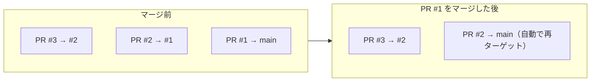

# 00. 概念と用語

所要 30 分・座学

---

## 1. なぜスタックが必要か

### 従来フローの行き詰まり

「認証機能を追加する」ような変更は、実装すると自然に 800 行の PR になります。ここで選択肢は 2 つでした。

**A. 1 本の大きい PR にまとめる**

- レビュアーの認知負荷が高く、レビューが後回しにされる
- 層ごとに独立した差分・承認・会話を持てない（誰がどこまで見たかを PR 単位で切り分けられない）
- 指摘が入ると全体を作り直す羽目になる
- マージまで長期化し、`main` との乖離が広がる

**B. 手動でブランチを積む**

- `feature-b` の base を `feature-a` にすれば差分は小さくなる。**ここまでは従来の GitHub でもできる**
- しかし `feature-a` に修正が入るたび、`feature-b` 以降を**自分で** rebase して push し直す必要がある
- `feature-a` が **squash / rebase マージ**されると、`feature-b` に残った元コミットが trunk 側と別物になり、
  差分に `feature-a` の変更が二重に現れる。`git rebase --onto` で重複を落とす作業が要る
- 誰がどの順序でマージするかを人間が管理する

スタック PR は **B を GitHub 側が面倒を見る形にしたもの**です。積む・並べ替える・伝播させる・順序を守ってマージする、を機能として提供します。

### 何が解決するか

| 課題                           | スタック PR での解決                                                             |
| ------------------------------ | -------------------------------------------------------------------------------- |
| 巨大 PR でレビューが進まない   | 層ごとに小さな差分。レビュアーは 1 層だけ見る                                    |
| 層ごとに承認を分けられない     | 全層を**並行**レビューし、層ごとに承認できる                                     |
| 下層修正の伝播が手作業         | `gh stack sync` / `rebase` がカスケード実行                                      |
| 下層マージで上層の差分が壊れる | base の再ターゲットに加え、squash マージで生じるコミット重複を `sync` が解消する |
| マージ順序の管理               | 下から上への順序が保証される                                                     |

> [!NOTE]
> base の再ターゲットだけなら、実は従来から GitHub の標準機能です
> （[Pull Request Retargeting](https://github.blog/changelog/2020-05-19-pull-request-retargeting/)、2020 年〜）。
> base ブランチがマージ後に削除されると、それを base にしていた open な PR は自動でマージ先へ張り替えられます。
> 手動運用で本当に困るのはその先で、**squash / rebase マージすると trunk 側のコミット SHA が変わるため、
> 張り替え後の差分に下層の変更が二重に現れる**点です。スタック PR はここまで面倒を見ます。

---

## 2. 用語

```
        ┌──────────────────────────────┐
        │  PR #3  feat/task-api        │  ← top PR（最上層）
        │  base: feat/task-store       │
        ├──────────────────────────────┤
        │  PR #2  feat/task-store      │  ← layer（層）
        │  base: feat/task-model       │
        ├──────────────────────────────┤
        │  PR #1  feat/task-model      │  ← bottom PR（最下層）
        │  base: main                  │
        ╞══════════════════════════════╡
        │  main                        │  ← trunk（幹）
        └──────────────────────────────┘
```

| 用語                  | 意味                                                                        |
| --------------------- | --------------------------------------------------------------------------- |
| **stack**（スタック） | 同一リポジトリ内の、base が数珠つなぎになった PR の並び                     |
| **layer**（層）       | スタック内の 1 つの PR。1 つ以上のコミットからなる、レビュー可能な単位      |
| **trunk**（幹）       | スタックが最終的に着地するブランチ。通常は `main`。リリースブランチでもよい |
| **base**              | 各 PR のターゲットブランチ。1 つ下の層のブランチ（最下層のみ trunk）        |
| **bottom PR**         | trunk を base に持つ最下層の PR                                             |
| **top PR**            | スタック最上部の PR                                                         |
| **stack number**      | スタックに振られる番号。`gh stack checkout <stack-number>` などで指定に使う |

> [!NOTE]
> スタックは **線形**です。木構造（1 つの層から複数の層が分岐する）にはなりません。
> 「A の上に B と C を並列で置きたい」場合は、別々のスタックにするか順序を決めて直列にします。

---

## 3. 3 つのフェーズで挙動を押さえる

### 作成（create）

最初のブランチと PR を作り、その上にブランチと PR を積んでいきます。
各 PR は自動的に 1 つ下の層のブランチを base に取ります。

CLI（`gh stack`）でも、github.com の Web UI でも扱えます。GitHub Mobile からも操作できます
（公式の表現は "work with stacks on ... the GitHub mobile app" で、作成まで含むかは明示されていません）。
AI コーディングエージェント（GitHub Copilot、Claude Code など）からも `gh-stack` skill 経由で扱えます
（導入手順は [01. 環境準備](01-setup.md) の「3. AI コーディングエージェント連携」）。

### レビュー（review）

任意の PR を開くと、**その層の差分だけ**が表示されます。
「そのブランチと 1 つ下のブランチの差分」なので、下層の変更はノイズになりません。

同時に **stack map**（スタック全体の俯瞰図）が表示され、
今どの層を見ているか・他の層のレビュー状態がどうかが分かります。

**すべての層**にブランチ保護ルールと CI が適用されます。
`main` を直接ターゲットしていない中間層の PR も例外ではありません。

### マージ（merge）

- **下から上へ**しかマージできません
- **一括マージ**: 準備できている最上位の PR をマージすると、その下の未マージ層もまとめて着地します
- **部分マージ**: 途中の層までマージすると（**選んだ層とその下がまとめて着地します**）、
  上の層は open のまま**自動で base が再ターゲット**されます
- merge commit / squash / rebase が選べます。**merge queue にも完全対応**しています（キュー使用時はキュー側の設定が優先）



---

## 4. 制約（public preview 時点）

| 制約                         | 内容                                                                                 |
| ---------------------------- | ------------------------------------------------------------------------------------ |
| **同一リポジトリのみ**       | fork をまたぐスタックは非対応。OSS の fork ベース貢献では使えない                    |
| **線形構造のみ**             | 分岐したスタックは作れない                                                           |
| **GitHub Desktop 非対応**    | CLI / Web / Mobile を使う                                                            |
| **並べ替えは CLI 必須**      | `gh stack modify` は Web UI に相当機能がない                                         |
| **スタックのライフサイクル** | 全 PR がマージされるとスタックは閉じる。閉じたスタックに後から層を足せない           |
| **merge queue**              | **完全対応**。全層が正しい順序でキューに入り、収まらなければ連続グループへ分割される |

---

## 5. スタックに向く変更・向かない変更

### 向く

- **層が自然に定義できる**変更
  例: データモデル → 永続化層 → API ハンドラ → UI
- **リファクタリング + 機能追加**
  「1 層目で純粋な整理、2 層目で振る舞いの追加」と分けるとレビューが劇的に楽になる
- **依存パッケージの更新 + 追随修正**
- **大規模な移行作業**（フレームワーク移行、命名規約の一括変更）

### 向かない

- **相互依存が強く分割すると動かない**変更
  各層が単体でテストを通る状態に保てないなら、分割コストが利益を上回る
- **層が 2 つ以下**で済む変更
  普通の PR で十分。スタックの管理コストが割に合わない
- **fork ベースの外部コントリビュート**
  そもそも非対応

> [!TIP]
> 分割の目安は「**各層が単体で CI を通り、レビュアーが 15 分で読める**」こと。
> これを満たせない分割は、分割の切り口がずれているサインです。

---

## 6. 事前に持っておくべきメンタルモデル

スタック PR を触るときに一番混乱するのは「**ローカルの git 状態**」と「**GitHub 上のスタック状態**」の 2 つがあることです。

|                     | 実体                                             | 更新するコマンド                                             |
| ------------------- | ------------------------------------------------ | ------------------------------------------------------------ |
| ローカルのスタック  | `gh stack` が管理する追跡情報 + ローカルブランチ | `init` / `add` / `modify` / `rebase`                         |
| GitHub 上のスタック | リモートブランチ + PR + スタックのリンク情報     | `push` / `submit` / `link` / `merge`                         |
| 両者の同期          | —                                                | `sync`（fetch → rebase → push → PR 状態同期を 1 コマンドで） |

この対応が頭に入っていれば、「ローカルで直したのに PR に反映されない」「PR は更新されたのにローカルが古い」で迷いません。

---

## 理解度チェック

1. `PR #2` の base はどのブランチか。`PR #1` がマージされた後はどうなるか。
2. 中間層の PR に対してブランチ保護ルールは適用されるか。
3. `feature-a` の上に `feature-b` と `feature-c` を並列に置きたい。スタックで実現できるか。
4. fork したリポジトリから upstream にスタック PR を送れるか。
5. 「ローカルで下層を修正した」あと、GitHub 上の全 PR を最新にするコマンドは何か。

<details>
<summary>解答</summary>

1. `feat/task-model`（= `PR #1` の head ブランチ）。`PR #1` マージ後は自動で `main` に再ターゲットされる
2. される。中間層も `main` を直接ターゲットしていなくても、保護ルールと必須チェックが評価される
3. できない。スタックは線形。順序を決めて直列にするか、別スタックに分ける
4. 送れない。cross-fork stack は非対応で、全ブランチが同一リポジトリにある必要がある
5. `gh stack sync`（fetch → カスケード rebase → push → PR 状態同期）

</details>

---

次は [01. 環境準備](01-setup.md) へ。
