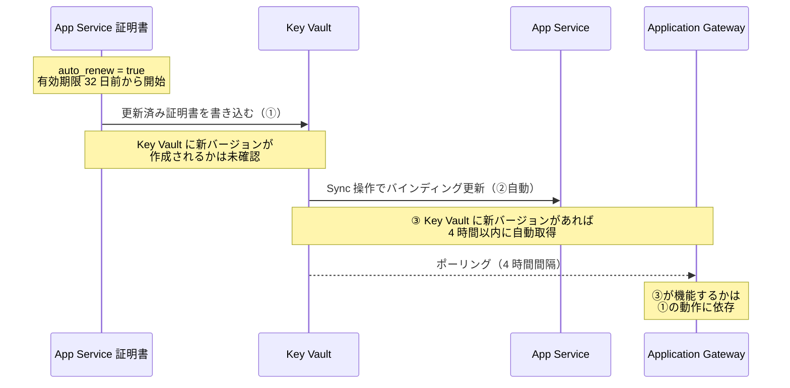
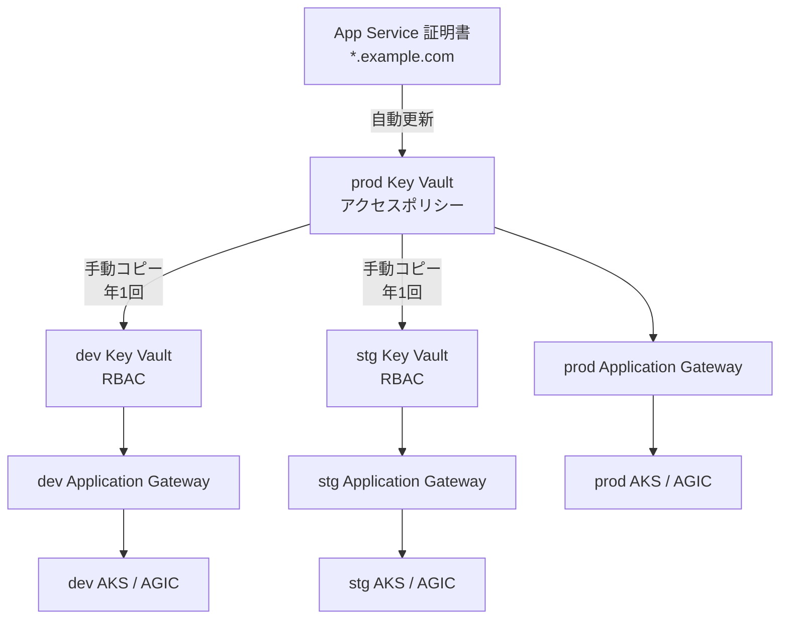
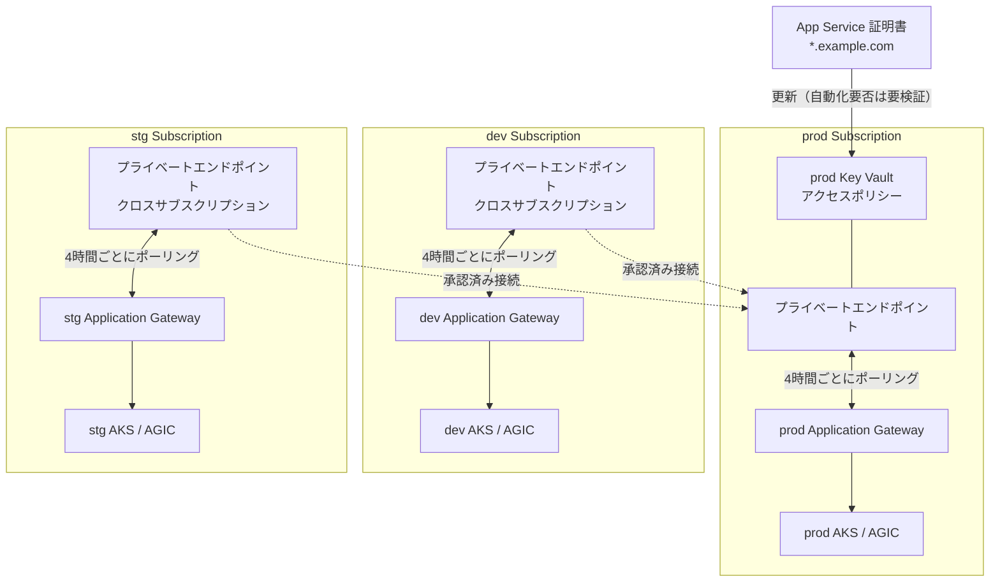
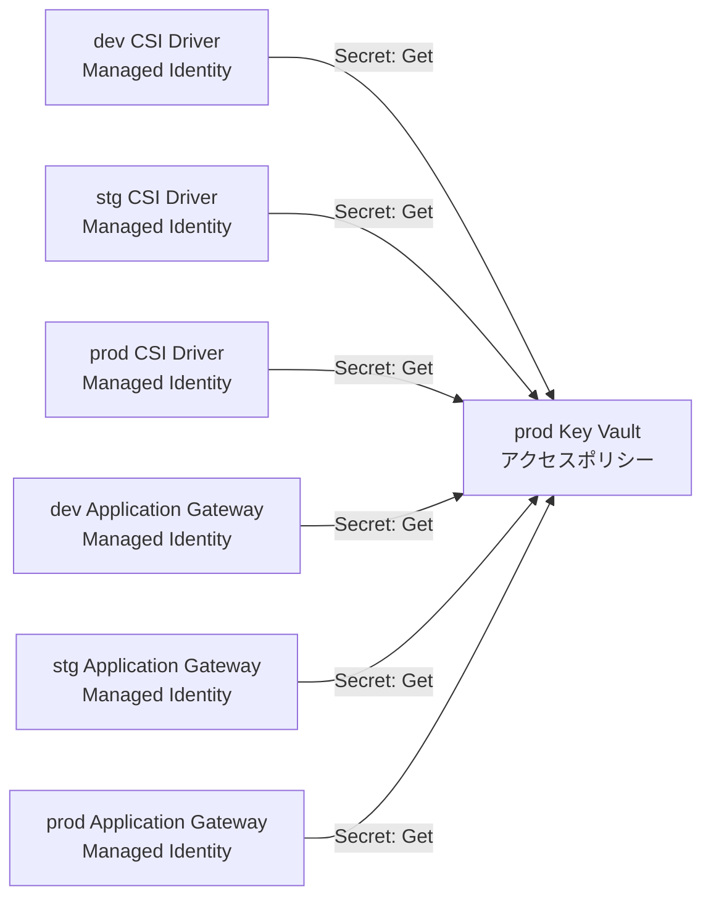
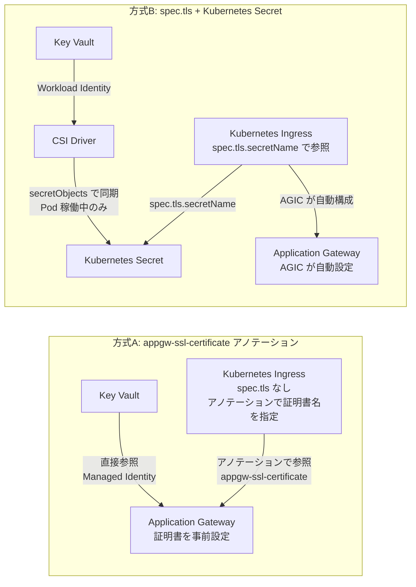
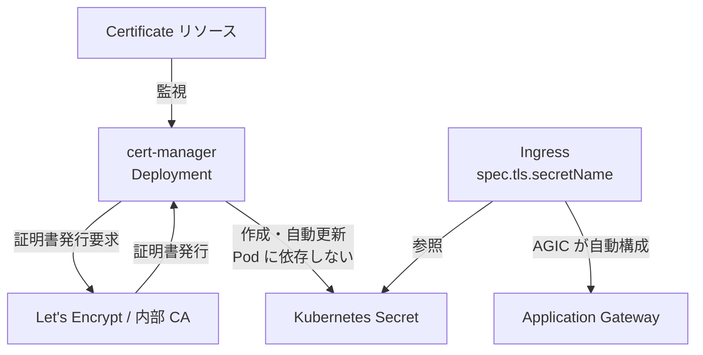
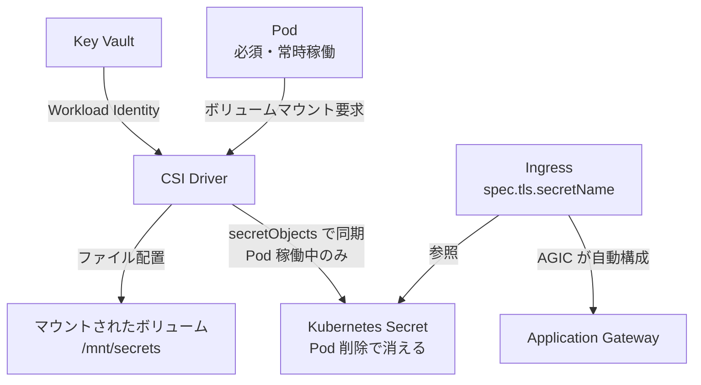
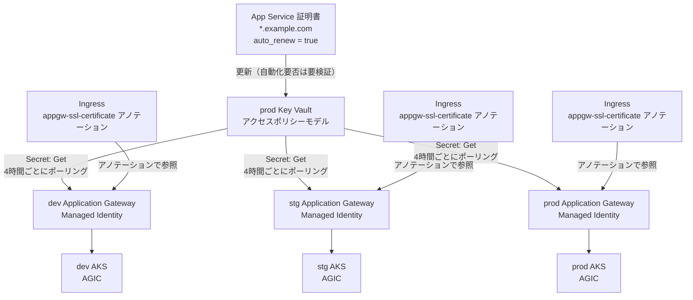

# AKS + AGIC TLS 証明書管理アーキテクチャ

## 概要

AKS ワークロードで Application Gateway Ingress Controller (AGIC) の HTTPS リスナーを構成する際の証明書管理方式を比較・整理します。環境別にサブスクリプションが分かれている構成（dev / stg / prod）で、ワイルドカード証明書を一元管理するアーキテクチャの選択肢と制約事項を説明します。

## 前提条件

- 環境別にサブスクリプションが分離されている（dev / stg / prod）
- AKS クラスターに AGIC を構成する
- App Service 証明書（ワイルドカード）で HTTPS リスナーを構成したい
- 同一 Azure AD テナント内の複数サブスクリプション

---

## App Service 証明書の制約

### アクセスポリシーモデルの強制

> **App Service 証明書は現在、Key Vault アクセスポリシーモデルのみサポートしています。RBAC モデルには対応していません。**
>
> 出典: [App Service 証明書の管理 | Microsoft Learn](https://learn.microsoft.com/en-us/azure/app-service/configure-ssl-app-service-certificate)

この制約により、証明書を格納する Key Vault は `enable_rbac_authorization = false`（アクセスポリシーモデル）で作成する必要があります。

### 年次更新と Application Gateway への反映（重要）

App Service 証明書は 1 年ごとに更新が必要です。`auto_renew = true` を設定すると有効期限の 32 日前から自動更新が開始されますが、**Application Gateway への反映が自動化されるかどうかは公式ドキュメント上で明確に確認できていません**。

公式ドキュメントには以下の矛盾する記述があります。

| ドキュメント                                                                                                                                                                                                                        | 記述                                                                                                                                                                                                                                             |
| ----------------------------------------------------------------------------------------------------------------------------------------------------------------------------------------------------------------------------------- | ------------------------------------------------------------------------------------------------------------------------------------------------------------------------------------------------------------------------------------------------ |
| [App Service 証明書 + Application Gateway（トラブルシューティング）](https://learn.microsoft.com/en-us/troubleshoot/azure/app-service/connection-issues-with-ssl-or-tls/use-azure-app-service-certificate-with-application-gateway) | "App Service Certificates support autorenewal **only for App Services**. When used in Application Gateway, **autorenewal doesn't automatically propagate**. You must manually update the certificate in Application Gateway after you renew it." |
| [Application Gateway 証明書の更新](https://learn.microsoft.com/ja-jp/azure/application-gateway/renew-certificates)                                                                                                                  | "The instances poll Key Vault at four-hour intervals to retrieve a renewed version of the certificate if it exists. If an updated certificate is found, the TLS/SSL certificate is **automatically rotated**."                                   |

この矛盾の背景を以下の通り分析しました。

**「Sync（同期）」操作の実態**

App Service 証明書の Sync 操作は、更新済み証明書を **App Service のホスト名バインディングに反映する**ものです。Application Gateway には関係しません。

> "The sync operation automatically updates the **hostname bindings for the certificate in App Service** without causing any downtime to your apps."
>
> 出典: [App Service 証明書の管理 | Microsoft Learn](https://learn.microsoft.com/en-us/azure/app-service/configure-ssl-app-service-certificate)

また、エクスポートした証明書については以下の記述があります。

> "**The exported certificate is an unmanaged artifact. App Service doesn't sync such artifacts when the App Service certificate is renewed.** You must export and install the renewed certificate where necessary."



**結論**: Microsoft のトラブルシューティング記事は「Application Gateway への自動伝播はしない」と明記しており、Azure Automation または Logic Apps による自動化を推奨しています。ただし、そのリンク先ドキュメントに記載されているのは Application Gateway に直接アップロードした証明書の手動更新手順のみで、**Key Vault 参照ケースの具体的な自動化方法は公式ドキュメントに存在しません**。

Key Vault 参照 + バージョンなし Secret URI の組み合わせで Application Gateway の自動ローテーションが機能するかどうかは、**動作検証または Microsoft サポートへの確認が必要**です。

---

## 証明書管理パターン比較

3 つのパターンを比較します。

| 項目                       | Pattern 1: 環境別 Key Vault | Pattern 2: クロスサブスクリプション共有 | Pattern 3: cert-manager |
| -------------------------- | --------------------------- | --------------------------------------- | ----------------------- |
| 証明書の管理場所           | 各環境の Key Vault          | prod Key Vault のみ                     | Kubernetes Secret       |
| 年次更新の手間             | 全環境に再コピーが必要      | 自動化要否は要検証（後述）              | 不要（自動更新）        |
| Key Vault モデル           | RBAC 可（証明書コピー後）   | アクセスポリシー必須                    | 不問                    |
| App Service 証明書への依存 | あり                        | あり                                    | なし                    |
| 構成の複雑さ               | 低                          | 中                                      | 中                      |
| 運用負荷                   | 高（更新時の再コピー）      | 中（更新時の動作が不明確）              | 低                      |

---

## Pattern 1: 環境別 Key Vault

各環境のサブスクリプションに独立した Key Vault を配置し、prod で購入した証明書を各環境にコピーする構成です。

証明書の自動更新は prod Key Vault にのみ反映されるため、**年 1 回の更新タイミングで各環境への再コピーが必要**です。



---

## Pattern 2: クロスサブスクリプション共有

prod サブスクリプションの Key Vault に証明書を一元管理し、dev / stg の Application Gateway が直接参照する構成です。

### ネットワーク接続

Key Vault にプライベートエンドポイントを設定している場合、各サブスクリプションからクロスサブスクリプションのプライベートエンドポイントを作成することで解決できます。`is_manual_connection = true` を指定し、prod 側で承認します（Terraform で自動化可能）。



### 必要なアクセスポリシー

CSI Driver と Application Gateway はそれぞれ独立して Key Vault にアクセスするため、**両方の Managed Identity にアクセスポリシーが必要**です。



---

## AGIC での証明書設定方式

AGIC で HTTPS を構成する方法は 2 通りあり、選択により Kubernetes Ingress の定義が変わります。

### 方式の比較



### 方式 A: appgw-ssl-certificate アノテーション

Application Gateway に証明書が事前設定済みであれば、`spec.tls` セクションなしで HTTPS リスナーを構成できます。

```yaml
apiVersion: networking.k8s.io/v1
kind: Ingress
metadata:
  name: myapp
  annotations:
    kubernetes.io/ingress.class: azure/application-gateway
    appgw.ingress.kubernetes.io/appgw-ssl-certificate: "kv-cert" # AppGW の証明書名
    appgw.ingress.kubernetes.io/ssl-redirect: "true"
spec:
  rules:
    - host: app.example.com
      http:
        paths:
          - path: /
            pathType: Prefix
            backend:
              service:
                name: myapp-svc
                port:
                  number: 80
  # spec.tls は不要
```

**重要な仕様**

> `appgw-ssl-certificate` アノテーションは、Ingress に `spec.tls` が定義されている場合は無視されます。両者は相互排他です。
>
> 出典: [Application Gateway Ingress Controller アノテーション | Microsoft Learn](https://learn.microsoft.com/ja-jp/azure/application-gateway/ingress-controller-annotations)

| 条件                      | 挙動                                          |
| ------------------------- | --------------------------------------------- |
| アノテーションのみ        | HTTPS リスナーが生成される                    |
| `spec.tls` のみ           | HTTPS リスナーが生成される                    |
| 両方を同時指定            | `spec.tls` が優先、アノテーションは無視される |
| 複数ホスト × 異なる証明書 | Ingress を分ける必要がある                    |

### 方式 B: CSI Driver 経由（cert-manager 類似）

CSI Driver の `secretObjects` を使って Kubernetes Secret に同期し、AGIC が `spec.tls.secretName` で参照する方式です。ただし、**CSI Driver は Pod がボリュームをマウントしている間のみ Kubernetes Secret を同期します。Pod を削除すると Kubernetes Secret も削除されます。**

> "シークレットは、ポッドを起動してマウントした後に同期されます。シークレットを使うポッドを削除すると、Kubernetes シークレットも削除されます。"
>
> 出典: [AKS 構成オプションのシークレット ストア CSI ドライバー | Microsoft Learn](https://learn.microsoft.com/ja-jp/azure/aks/csi-secrets-store-configuration-options)

このため、Kubernetes Secret を維持するには CSI ボリュームをマウントする Pod を常時稼働させる必要があります。

---

## cert-manager vs CSI Driver アーキテクチャ

### cert-manager

cert-manager は Kubernetes コントローラーとして動作します。Pod の存在に依存せず、独立して証明書のライフサイクルを管理します。



### CSI Driver

CSI Driver は Pod へのボリューム提供が主目的です。Kubernetes Secret の作成は副機能であり、Pod のライフサイクルに依存します。



### 設計思想の違い

| 観点                   | cert-manager               | CSI Driver                   |
| ---------------------- | -------------------------- | ---------------------------- |
| 主目的                 | 証明書のライフサイクル管理 | Pod へのシークレットマウント |
| Kubernetes Secret 作成 | 主機能                     | 副機能（secretObjects）      |
| Pod への依存           | なし                       | あり                         |
| Pod 削除時の Secret    | 残る                       | 削除される                   |
| 証明書の発行           | できる                     | できない（取得のみ）         |
| 証明書ソース           | Let's Encrypt / 内部 CA 等 | Key Vault に既存の証明書     |

---

## 推奨構成

今回のユースケース（App Service 証明書を Key Vault で管理し、AGIC で HTTPS 終端）では以下の構成が最もシンプルです。



### 採用理由

- prod Key Vault に証明書を一元管理し、全環境の Application Gateway が参照する
- `spec.tls` を使わないため、Kubernetes Secret の管理が不要
- Application Gateway が Key Vault を直接参照するため、CSI Driver や Pod への依存がない
- CSI Driver は別途必要なシークレット（DB 接続文字列等）の管理に専念できる

### 年次更新時の運用

App Service 証明書の更新が Application Gateway に自動伝播するかどうかは公式ドキュメント上で確認できていません。Microsoft は "autorenewal doesn't automatically propagate" と明記しており、**Azure Automation または Logic Apps による自動化を推奨**しています。

ただし、Azure Automation / Logic Apps による具体的な自動化手順は公式ドキュメントに存在しません。

導入前に以下のいずれかの対応を推奨します。

| 対応                               | 内容                                                                                      |
| ---------------------------------- | ----------------------------------------------------------------------------------------- |
| 動作検証                           | テスト環境で App Service 証明書を更新し、Application Gateway への反映を確認する           |
| Microsoft サポートへの確認         | Key Vault 参照 + バージョンなし Secret URI での自動ローテーション動作を問い合わせる       |
| Azure Automation による自動化      | 証明書有効期限を監視し、期限前に更新トリガーを実行する Runbook を構成する                 |
| Key Vault マネージド証明書への移行 | App Service 証明書ではなく Key Vault が DigiCert と直接統合する方式に変更する（完全自動） |

### 実装チェックリスト

- [ ] prod Key Vault を `enable_rbac_authorization = false` で作成する
- [ ] `purge_protection_enabled = true` と `soft_delete_retention_days = 90` を設定する
- [ ] App Service 証明書を購入し、prod Key Vault に格納する
- [ ] Application Gateway の Secret URI はバージョンなし形式で設定する（例: `https://vault.azure.net/secrets/cert/`）
- [ ] 各環境の Application Gateway に User-Assigned Managed Identity を割り当てる
- [ ] prod Key Vault のアクセスポリシーに各環境の Application Gateway Managed Identity（Secret: Get）を登録する
- [ ] CSI Driver を使用する場合は、各環境の AKS Workload Identity（Secret: Get）も登録する
- [ ] 各環境から prod Key Vault へのクロスサブスクリプション Private Endpoint を作成・承認する
- [ ] Private DNS ゾーン（privatelink.vaultcore.azure.net）を各環境の VNet にリンクする
- [ ] Ingress リソースで `appgw-ssl-certificate` アノテーションを使用する（`spec.tls` は書かない）
- [ ] 年次更新時の Application Gateway への反映動作を事前に検証する
