# AKS + AGIC SSL 証明書自動更新ガイド

Azure Kubernetes Service (AKS) と Application Gateway Ingress Controller (AGIC) 環境で SSL 証明書の自動更新を実現するための包括的なエンタープライズ向けガイドです。

## 目次

1. [概要](#概要)
2. [アーキテクチャ](#アーキテクチャ)
3. [アプローチ比較](#アプローチ比較)
4. [cert-manager + Let's Encrypt](#cert-manager--lets-encrypt)
5. [Azure Key Vault + CSI Driver](#azure-key-vault--csi-driver)
6. [Application Gateway for Containers](#application-gateway-for-containers)
7. [エンタープライズ向けベストプラクティス](#エンタープライズ向けベストプラクティス)
8. [監視・アラート設定](#監視アラート設定)
9. [高可用性・災害復旧](#高可用性災害復旧)
10. [トラブルシューティング](#トラブルシューティング)
11. [確認コマンド集](#確認コマンド集)
12. [参考リンク](#参考リンク)

---

## 概要

### SSL 証明書自動更新の必要性

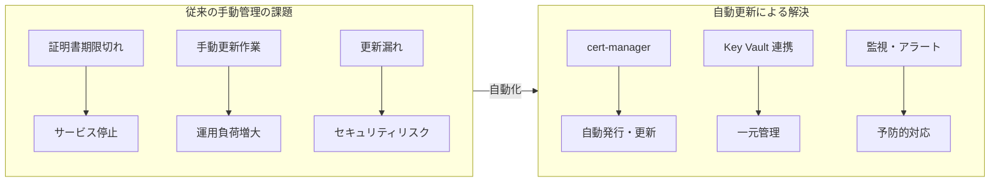

### 主要コンポーネント

| コンポーネント               | 役割                     | 説明                                       |
| ---------------------------- | ------------------------ | ------------------------------------------ |
| **cert-manager**             | 証明書ライフサイクル管理 | Kubernetes ネイティブの証明書管理ツール    |
| **Let's Encrypt**            | 無料 CA                  | ACME プロトコルによる自動証明書発行        |
| **Azure Key Vault**          | シークレット管理         | HSM バックアップによるセキュアな証明書保管 |
| **CSI Secrets Store Driver** | シークレット同期         | Key Vault から AKS への証明書マウント      |
| **Workload Identity**        | 認証                     | サービスアカウントベースのセキュア認証     |

---

## アーキテクチャ

### 全体構成図（cert-manager + Azure Key Vault 統合）

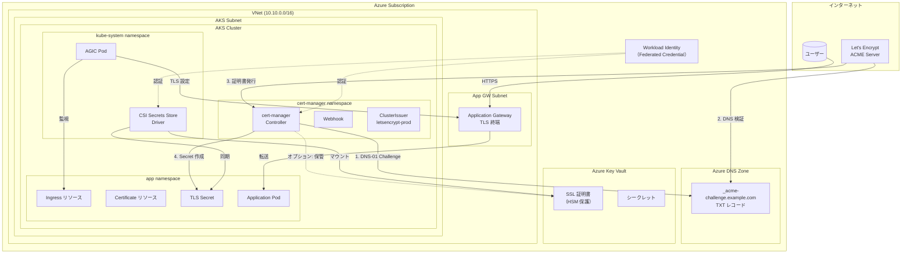

### 証明書発行フロー（DNS-01 チャレンジ）

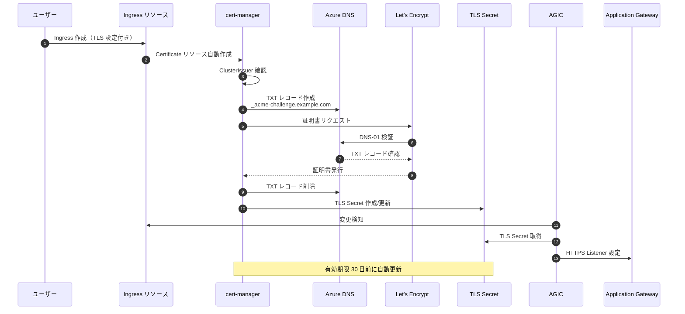

### 認証フロー（Workload Identity）

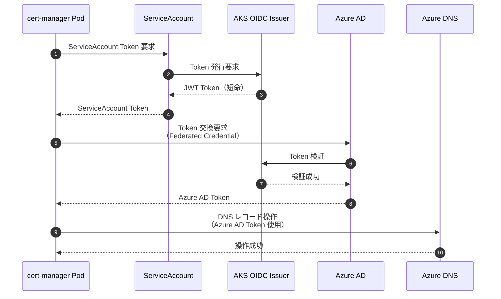

---

## アプローチ比較

### 3 つの主要アプローチ

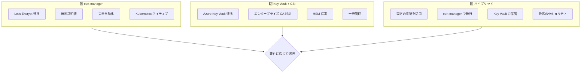

### 詳細比較表

| 観点                    | cert-manager + Let's Encrypt | Azure Key Vault + CSI  | ハイブリッド   |
| ----------------------- | ---------------------------- | ---------------------- | -------------- |
| **コスト**              | 無料                         | Key Vault 料金         | Key Vault 料金 |
| **証明書タイプ**        | DV 証明書のみ                | 任意（OV/EV 対応）     | 任意           |
| **自動更新**            | ✅ 完全自動                  | ✅ 自動ローテーション  | ✅ 完全自動    |
| **セキュリティ**        | 高                           | 最高（HSM）            | 最高（HSM）    |
| **エンタープライズ CA** | ❌ 非対応                    | ✅ 対応                | ✅ 対応        |
| **ワイルドカード**      | ✅ DNS-01 で対応             | ✅ 対応                | ✅ 対応        |
| **複雑度**              | 中                           | 中〜高                 | 高             |
| **推奨シーン**          | 公開 Web サービス            | 内部システム・規制対応 | 大規模本番環境 |

### 選択フローチャート

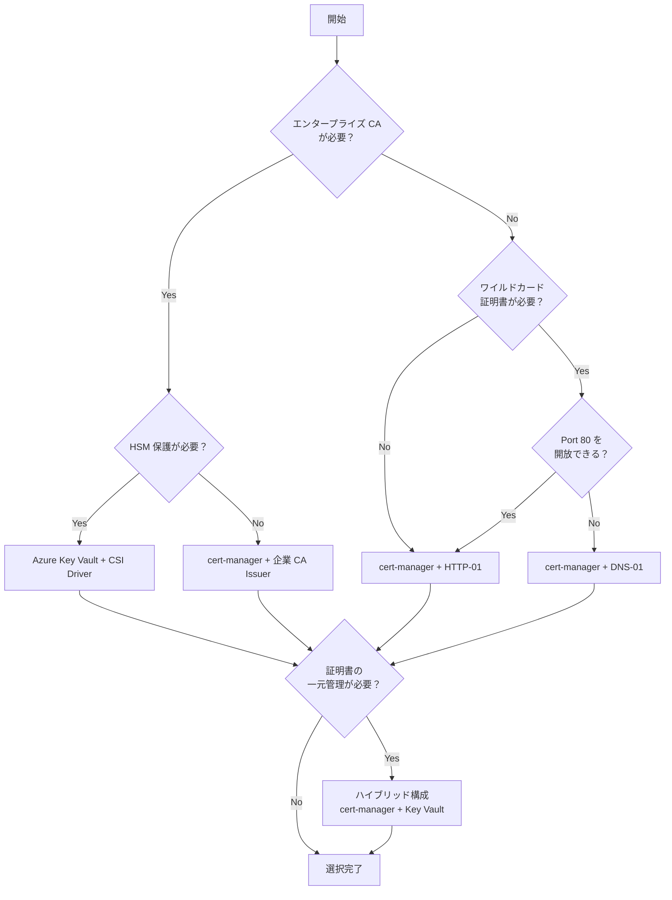

---

## cert-manager + Let's Encrypt

### 前提条件

| 要件                    | 詳細                                   |
| ----------------------- | -------------------------------------- |
| cert-manager バージョン | v1.11.0 以上（Workload Identity 対応） |
| AKS 機能                | OIDC Issuer + Workload Identity 有効化 |
| Azure DNS Zone          | 管理対象ドメインの DNS ゾーン          |
| RBAC 権限               | DNS Zone Contributor                   |

### インストール手順

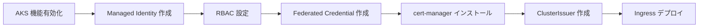

#### Step 1: AKS クラスターの機能有効化

```bash
# 変数設定
export CLUSTER_NAME="myAKSCluster"
export RESOURCE_GROUP="myResourceGroup"
export LOCATION="japaneast"
export DOMAIN_NAME="example.com"
export DNS_RESOURCE_GROUP="dns-rg"

# OIDC Issuer と Workload Identity を有効化
az aks update \
  --name $CLUSTER_NAME \
  --resource-group $RESOURCE_GROUP \
  --enable-oidc-issuer \
  --enable-workload-identity

# OIDC Issuer URL を取得
export OIDC_ISSUER=$(az aks show \
  --name $CLUSTER_NAME \
  --resource-group $RESOURCE_GROUP \
  --query "oidcIssuerProfile.issuerUrl" -o tsv)

echo "OIDC Issuer: $OIDC_ISSUER"
```

#### Step 2: Managed Identity の作成と RBAC 設定

```bash
# Managed Identity 作成
export IDENTITY_NAME="cert-manager-identity"

az identity create \
  --name $IDENTITY_NAME \
  --resource-group $RESOURCE_GROUP \
  --location $LOCATION

# Client ID と Principal ID を取得
export IDENTITY_CLIENT_ID=$(az identity show \
  --name $IDENTITY_NAME \
  --resource-group $RESOURCE_GROUP \
  --query 'clientId' -o tsv)

export IDENTITY_PRINCIPAL_ID=$(az identity show \
  --name $IDENTITY_NAME \
  --resource-group $RESOURCE_GROUP \
  --query 'principalId' -o tsv)

# DNS Zone に対する権限付与
export DNS_ZONE_ID=$(az network dns zone show \
  --name $DOMAIN_NAME \
  --resource-group $DNS_RESOURCE_GROUP \
  --query 'id' -o tsv)

az role assignment create \
  --role "DNS Zone Contributor" \
  --assignee $IDENTITY_PRINCIPAL_ID \
  --scope $DNS_ZONE_ID

echo "Identity Client ID: $IDENTITY_CLIENT_ID"
```

#### Step 3: Federated Credential の作成

```bash
# cert-manager 用 Federated Credential
az identity federated-credential create \
  --name "cert-manager" \
  --identity-name $IDENTITY_NAME \
  --resource-group $RESOURCE_GROUP \
  --issuer $OIDC_ISSUER \
  --subject "system:serviceaccount:cert-manager:cert-manager" \
  --audiences "api://AzureADTokenExchange"
```

#### Step 4: cert-manager のインストール

```bash
# Helm リポジトリ追加
helm repo add jetstack https://charts.jetstack.io
helm repo update

# cert-manager インストール（Workload Identity 対応）
helm install cert-manager jetstack/cert-manager \
  --namespace cert-manager \
  --create-namespace \
  --version v1.14.0 \
  --set crds.enabled=true \
  --set "podLabels.azure\.workload\.identity/use=true" \
  --set "serviceAccount.labels.azure\.workload\.identity/use=true"

# インストール確認
kubectl get pods -n cert-manager
```

#### Step 5: ClusterIssuer の作成

```yaml
# cluster-issuer-dns01.yaml
apiVersion: cert-manager.io/v1
kind: ClusterIssuer
metadata:
  name: letsencrypt-prod
spec:
  acme:
    # Let's Encrypt 本番サーバー
    server: https://acme-v02.api.letsencrypt.org/directory
    email: admin@example.com
    privateKeySecretRef:
      name: letsencrypt-prod-account-key
    solvers:
      - dns01:
          azureDNS:
            # Azure DNS Zone の設定
            hostedZoneName: example.com
            resourceGroupName: dns-rg
            subscriptionID: xxxxxxxx-xxxx-xxxx-xxxx-xxxxxxxxxxxx
            environment: AzurePublicCloud
            # Workload Identity を使用
            managedIdentity:
              clientID: <IDENTITY_CLIENT_ID>
---
# ステージング環境用（テスト用）
apiVersion: cert-manager.io/v1
kind: ClusterIssuer
metadata:
  name: letsencrypt-staging
spec:
  acme:
    server: https://acme-staging-v02.api.letsencrypt.org/directory
    email: admin@example.com
    privateKeySecretRef:
      name: letsencrypt-staging-account-key
    solvers:
      - dns01:
          azureDNS:
            hostedZoneName: example.com
            resourceGroupName: dns-rg
            subscriptionID: xxxxxxxx-xxxx-xxxx-xxxx-xxxxxxxxxxxx
            environment: AzurePublicCloud
            managedIdentity:
              clientID: <IDENTITY_CLIENT_ID>
```

```bash
# ClusterIssuer 適用
kubectl apply -f cluster-issuer-dns01.yaml

# 状態確認
kubectl get clusterissuer
kubectl describe clusterissuer letsencrypt-prod
```

#### Step 6: AGIC 用 Ingress の作成

```yaml
# ingress-with-tls.yaml
apiVersion: networking.k8s.io/v1
kind: Ingress
metadata:
  name: my-app
  annotations:
    # AGIC 設定
    appgw.ingress.kubernetes.io/ssl-redirect: "true"
    appgw.ingress.kubernetes.io/backend-protocol: "http"
    # cert-manager 設定
    cert-manager.io/cluster-issuer: letsencrypt-prod
spec:
  ingressClassName: azure-application-gateway
  tls:
    - hosts:
        - app.example.com
      secretName: app-tls-secret # cert-manager が自動作成
  rules:
    - host: app.example.com
      http:
        paths:
          - path: /
            pathType: Prefix
            backend:
              service:
                name: my-app
                port:
                  number: 80
```

```bash
# Ingress 適用
kubectl apply -f ingress-with-tls.yaml

# 証明書発行状況確認
kubectl get certificate
kubectl describe certificate app-tls-secret

# Challenge 状態確認
kubectl get challenges
```

### HTTP-01 vs DNS-01 チャレンジ比較

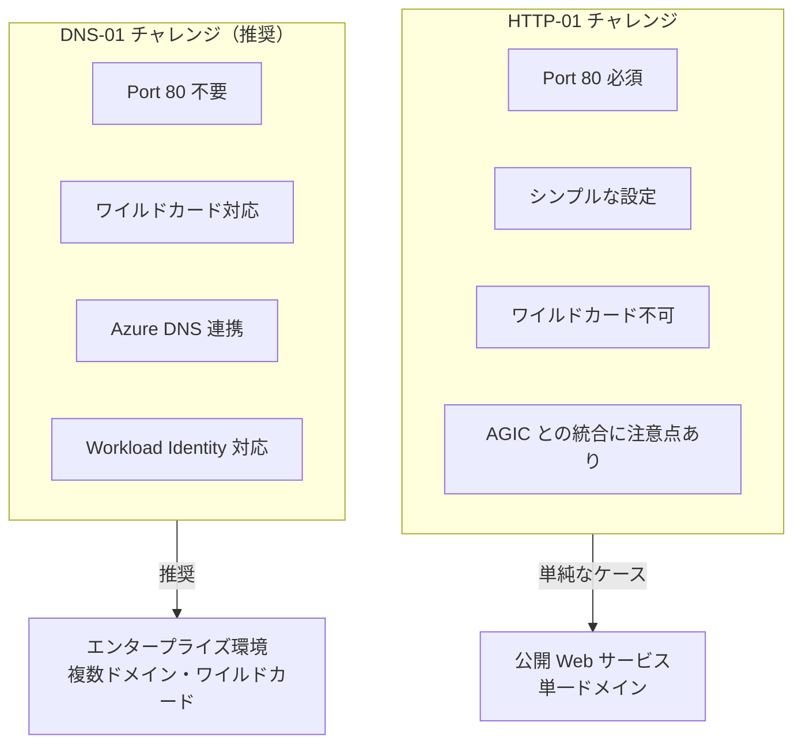

### AGIC + HTTP-01 の注意点と解決策

HTTP-01 チャレンジを AGIC と併用する場合、Application Gateway が Let's Encrypt の検証リクエストを正しくルーティングできない問題が発生することがあります。

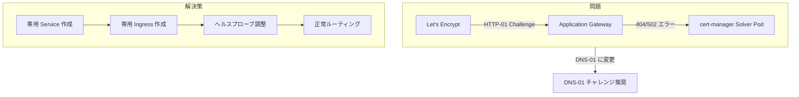

**推奨**: エンタープライズ環境では **DNS-01 チャレンジ** を使用することで、この問題を回避できます。

---

## Azure Key Vault + CSI Driver

### 概要

Azure Key Vault と CSI Secrets Store Driver を使用して、エンタープライズ CA から発行された証明書や購入した証明書を安全に管理します。

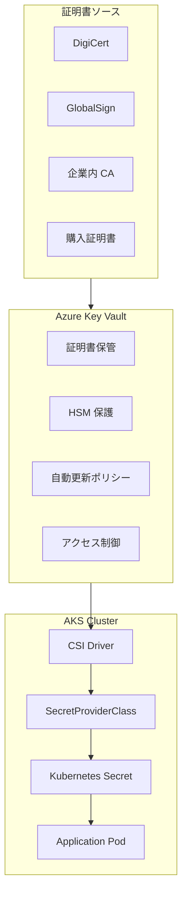

### インストール手順

#### Step 1: CSI Secrets Store Driver の有効化

```bash
# 既存 AKS クラスターに CSI Driver を追加
az aks enable-addons \
  --addons azure-keyvault-secrets-provider \
  --name $CLUSTER_NAME \
  --resource-group $RESOURCE_GROUP

# Workload Identity も有効化（推奨）
az aks update \
  --name $CLUSTER_NAME \
  --resource-group $RESOURCE_GROUP \
  --enable-oidc-issuer \
  --enable-workload-identity

# 自動ローテーションを有効化
az aks addon update \
  --addon azure-keyvault-secrets-provider \
  --name $CLUSTER_NAME \
  --resource-group $RESOURCE_GROUP \
  --enable-secret-rotation \
  --rotation-poll-interval 2m

# インストール確認
kubectl get pods -n kube-system -l 'app in (secrets-store-csi-driver,secrets-store-provider-azure)'
```

#### Step 2: Key Vault の作成と証明書インポート

```bash
# Key Vault 作成（RBAC 有効化）
export KEYVAULT_NAME="my-ssl-keyvault"

az keyvault create \
  --name $KEYVAULT_NAME \
  --resource-group $RESOURCE_GROUP \
  --location $LOCATION \
  --enable-rbac-authorization

# 証明書インポート
az keyvault certificate import \
  --vault-name $KEYVAULT_NAME \
  --name "app-ssl-certificate" \
  --file /path/to/certificate.pfx \
  --password "<PFX_PASSWORD>"

# または Key Vault で証明書を生成
az keyvault certificate create \
  --vault-name $KEYVAULT_NAME \
  --name "app-ssl-certificate" \
  --policy "$(az keyvault certificate get-default-policy)"
```

#### Step 3: Workload Identity の設定

```bash
# Managed Identity 作成
export CSI_IDENTITY_NAME="csi-secrets-identity"

az identity create \
  --name $CSI_IDENTITY_NAME \
  --resource-group $RESOURCE_GROUP \
  --location $LOCATION

export CSI_IDENTITY_CLIENT_ID=$(az identity show \
  --name $CSI_IDENTITY_NAME \
  --resource-group $RESOURCE_GROUP \
  --query 'clientId' -o tsv)

# Key Vault への権限付与
az role assignment create \
  --role "Key Vault Secrets User" \
  --assignee $CSI_IDENTITY_CLIENT_ID \
  --scope $(az keyvault show --name $KEYVAULT_NAME --query id -o tsv)

az role assignment create \
  --role "Key Vault Certificate User" \
  --assignee $CSI_IDENTITY_CLIENT_ID \
  --scope $(az keyvault show --name $KEYVAULT_NAME --query id -o tsv)

# Federated Credential 作成
az identity federated-credential create \
  --name "csi-secrets" \
  --identity-name $CSI_IDENTITY_NAME \
  --resource-group $RESOURCE_GROUP \
  --issuer $OIDC_ISSUER \
  --subject "system:serviceaccount:default:csi-secrets-sa" \
  --audiences "api://AzureADTokenExchange"
```

#### Step 4: SecretProviderClass と ServiceAccount の作成

```yaml
# secret-provider-class.yaml
apiVersion: secrets-store.csi.x-k8s.io/v1
kind: SecretProviderClass
metadata:
  name: azure-keyvault-tls
  namespace: default
spec:
  provider: azure
  parameters:
    usePodIdentity: "false"
    clientID: "<CSI_IDENTITY_CLIENT_ID>"
    keyvaultName: "<KEYVAULT_NAME>"
    tenantId: "<TENANT_ID>"
    objects: |
      array:
        - |
          objectName: app-ssl-certificate
          objectType: secret
          objectAlias: tls.crt
        - |
          objectName: app-ssl-certificate
          objectType: secret
          objectAlias: tls.key
  secretObjects:
    - secretName: app-tls-secret
      type: kubernetes.io/tls
      data:
        - objectName: app-ssl-certificate
          key: tls.crt
        - objectName: app-ssl-certificate
          key: tls.key
---
# ServiceAccount
apiVersion: v1
kind: ServiceAccount
metadata:
  name: csi-secrets-sa
  namespace: default
  annotations:
    azure.workload.identity/client-id: "<CSI_IDENTITY_CLIENT_ID>"
  labels:
    azure.workload.identity/use: "true"
```

```bash
kubectl apply -f secret-provider-class.yaml
```

#### Step 5: Pod での証明書マウント

```yaml
# deployment-with-csi.yaml
apiVersion: apps/v1
kind: Deployment
metadata:
  name: my-app
  namespace: default
spec:
  replicas: 2
  selector:
    matchLabels:
      app: my-app
  template:
    metadata:
      labels:
        app: my-app
    spec:
      serviceAccountName: csi-secrets-sa
      containers:
        - name: my-app
          image: my-registry/my-app:v1.0
          ports:
            - containerPort: 8080
          volumeMounts:
            - name: secrets-store
              mountPath: "/mnt/secrets"
              readOnly: true
      volumes:
        - name: secrets-store
          csi:
            driver: secrets-store.csi.k8s.io
            readOnly: true
            volumeAttributes:
              secretProviderClass: azure-keyvault-tls
```

### 自動ローテーションの仕組み

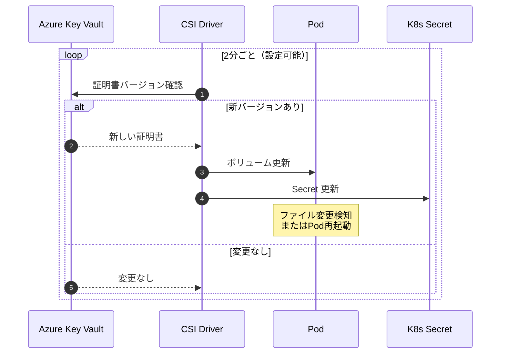

### 制限事項

| 制限                 | 説明                       | 回避策                            |
| -------------------- | -------------------------- | --------------------------------- |
| subPath マウント     | 自動更新が効かない         | Pod 再起動またはファイル監視実装  |
| シークレット同期遅延 | 最大ポーリング間隔分の遅延 | rotation-poll-interval を短く設定 |
| ネットワーク要件     | Key Vault への接続必須     | Private Endpoint 設定             |

---

## Application Gateway for Containers

### 概要

Application Gateway for Containers は、Microsoft が推奨する次世代の Kubernetes Ingress ソリューションです。cert-manager との統合がよりスムーズです。

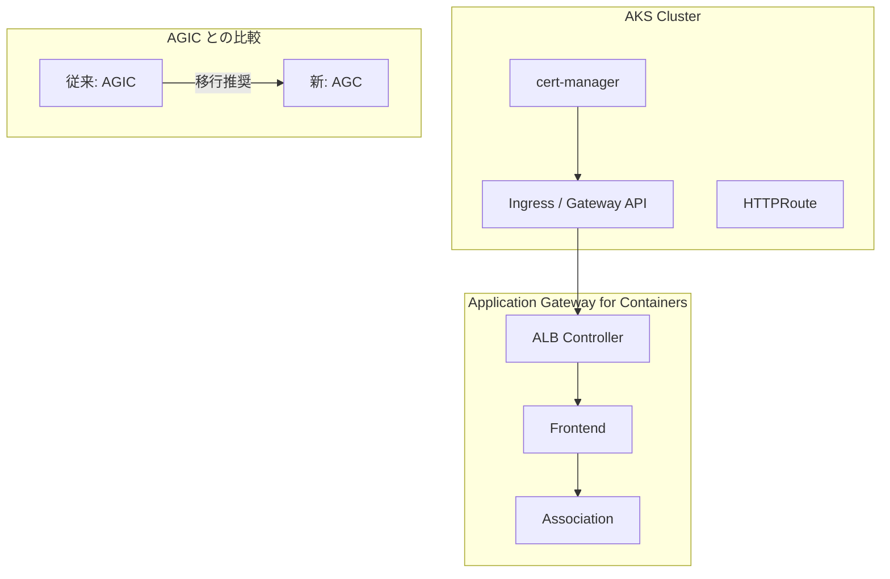

### AGIC vs Application Gateway for Containers

| 観点                  | AGIC                | Application Gateway for Containers |
| --------------------- | ------------------- | ---------------------------------- |
| **アーキテクチャ**    | 既存 App GW を制御  | クラウドネイティブ設計             |
| **API サポート**      | Ingress API         | Ingress API + Gateway API          |
| **cert-manager 統合** | 一部制限あり        | ネイティブ対応                     |
| **スケーラビリティ**  | App GW の制限に依存 | より柔軟                           |
| **推奨シーン**        | 既存環境            | 新規構築                           |

### セットアップ例

```yaml
# ClusterIssuer（Application Gateway for Containers 用）
apiVersion: cert-manager.io/v1
kind: ClusterIssuer
metadata:
  name: letsencrypt-prod
spec:
  acme:
    server: https://acme-v02.api.letsencrypt.org/directory
    email: admin@example.com
    privateKeySecretRef:
      name: letsencrypt-prod-key
    solvers:
      - http01:
          ingress:
            ingressClassName: azure-alb-external
            ingressTemplate:
              metadata:
                annotations:
                  alb.networking.azure.io/alb-name: my-alb
                  alb.networking.azure.io/alb-namespace: alb-infra
---
# Ingress
apiVersion: networking.k8s.io/v1
kind: Ingress
metadata:
  name: my-app
  annotations:
    alb.networking.azure.io/alb-name: my-alb
    alb.networking.azure.io/alb-namespace: alb-infra
    cert-manager.io/cluster-issuer: letsencrypt-prod
spec:
  ingressClassName: azure-alb-external
  tls:
    - hosts:
        - app.example.com
      secretName: app-tls-secret
  rules:
    - host: app.example.com
      http:
        paths:
          - path: /
            pathType: Prefix
            backend:
              service:
                name: my-app
                port:
                  number: 80
```

---

## エンタープライズ向けベストプラクティス

### セキュリティ設計

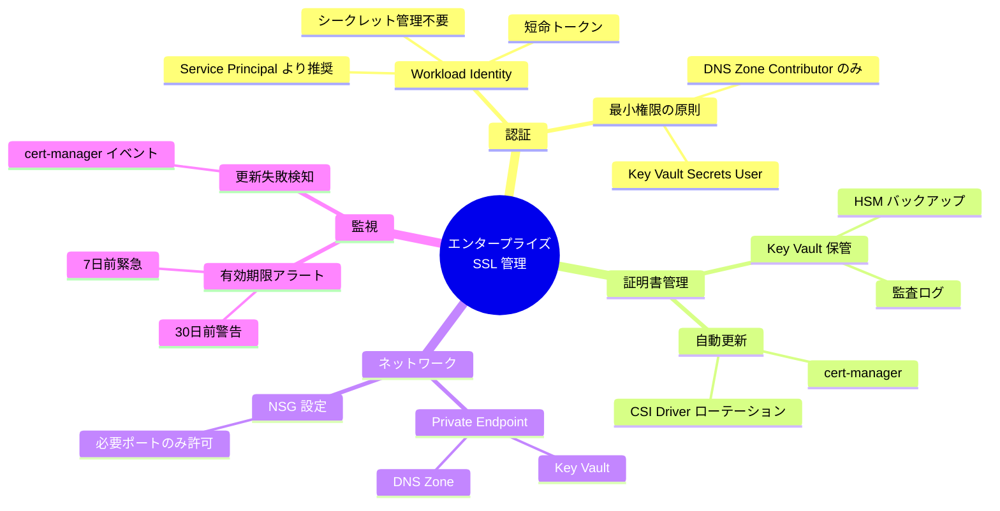

### 推奨構成パターン

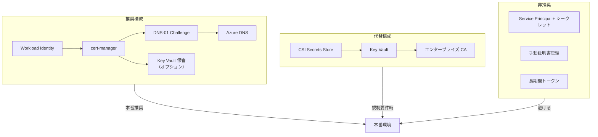

### RBAC 設定例

```bash
# cert-manager 用（DNS Zone のみ）
az role assignment create \
  --role "DNS Zone Contributor" \
  --assignee $CERT_MANAGER_IDENTITY_ID \
  --scope "/subscriptions/$SUBSCRIPTION_ID/resourceGroups/$DNS_RG/providers/Microsoft.Network/dnszones/$DOMAIN"

# CSI Driver 用（Key Vault のみ）
az role assignment create \
  --role "Key Vault Secrets User" \
  --assignee $CSI_IDENTITY_ID \
  --scope "/subscriptions/$SUBSCRIPTION_ID/resourceGroups/$RG/providers/Microsoft.KeyVault/vaults/$KEYVAULT"

# 監査用（読み取りのみ）
az role assignment create \
  --role "Key Vault Reader" \
  --assignee $AUDIT_IDENTITY_ID \
  --scope "/subscriptions/$SUBSCRIPTION_ID/resourceGroups/$RG/providers/Microsoft.KeyVault/vaults/$KEYVAULT"
```

---

## 監視・アラート設定

### 監視アーキテクチャ

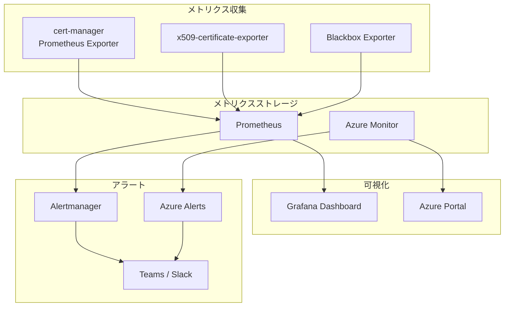

### Prometheus アラートルール

```yaml
# prometheus-rules.yaml
apiVersion: monitoring.coreos.com/v1
kind: PrometheusRule
metadata:
  name: certificate-alerts
  namespace: monitoring
spec:
  groups:
    - name: certificates
      rules:
        # 30日前警告
        - alert: CertificateExpiringIn30Days
          expr: |
            (
              x509_cert_not_after - time() < 30 * 24 * 60 * 60
              and
              x509_cert_not_after - time() > 0
            )
          for: 1h
          labels:
            severity: warning
          annotations:
            summary: "証明書の有効期限が30日以内です"
            description: "証明書 {{ $labels.subject_CN }} は {{ $value | humanizeDuration }} 後に期限切れになります"

        # 7日前緊急
        - alert: CertificateExpiringIn7Days
          expr: |
            (
              x509_cert_not_after - time() < 7 * 24 * 60 * 60
              and
              x509_cert_not_after - time() > 0
            )
          for: 1h
          labels:
            severity: critical
          annotations:
            summary: "証明書の有効期限が7日以内です - 緊急対応必要"
            description: "証明書 {{ $labels.subject_CN }} は {{ $value | humanizeDuration }} 後に期限切れになります"

        # 証明書期限切れ
        - alert: CertificateExpired
          expr: x509_cert_not_after - time() <= 0
          for: 5m
          labels:
            severity: critical
          annotations:
            summary: "証明書が期限切れです"
            description: "証明書 {{ $labels.subject_CN }} は期限切れです。即時対応が必要です。"

        # cert-manager 更新失敗
        - alert: CertManagerCertificateNotReady
          expr: |
            certmanager_certificate_ready_status{condition="False"} == 1
          for: 30m
          labels:
            severity: warning
          annotations:
            summary: "cert-manager 証明書が Ready 状態ではありません"
            description: "Certificate {{ $labels.name }} in namespace {{ $labels.namespace }} is not ready"

        # cert-manager 更新リクエスト失敗
        - alert: CertManagerCertificateRequestFailed
          expr: |
            increase(certmanager_certificate_expiration_timestamp_seconds{} [1h]) == 0
            and
            certmanager_certificate_ready_status{condition="False"} == 1
          for: 1h
          labels:
            severity: critical
          annotations:
            summary: "cert-manager 証明書更新が失敗しています"
            description: "Certificate {{ $labels.name }} の更新に失敗しています。手動確認が必要です。"
```

### x509-certificate-exporter のデプロイ

```yaml
# x509-certificate-exporter.yaml
apiVersion: apps/v1
kind: DaemonSet
metadata:
  name: x509-certificate-exporter
  namespace: monitoring
spec:
  selector:
    matchLabels:
      app: x509-certificate-exporter
  template:
    metadata:
      labels:
        app: x509-certificate-exporter
      annotations:
        prometheus.io/scrape: "true"
        prometheus.io/port: "9793"
    spec:
      containers:
        - name: x509-certificate-exporter
          image: enix/x509-certificate-exporter:3.6.0
          args:
            - --watch-kube-secrets
            - --secret-type=kubernetes.io/tls
            - --include-namespace=default
            - --include-namespace=app
          ports:
            - containerPort: 9793
              name: metrics
          resources:
            limits:
              memory: 128Mi
              cpu: 100m
            requests:
              memory: 64Mi
              cpu: 50m
---
apiVersion: v1
kind: Service
metadata:
  name: x509-certificate-exporter
  namespace: monitoring
  labels:
    app: x509-certificate-exporter
spec:
  ports:
    - port: 9793
      name: metrics
  selector:
    app: x509-certificate-exporter
```

### Grafana ダッシュボード

```json
{
  "dashboard": {
    "title": "SSL Certificate Monitoring",
    "panels": [
      {
        "title": "Certificate Expiry Timeline",
        "type": "timeseries",
        "targets": [
          {
            "expr": "(x509_cert_not_after - time()) / 86400",
            "legendFormat": "{{ subject_CN }}"
          }
        ]
      },
      {
        "title": "Certificates Expiring Soon",
        "type": "table",
        "targets": [
          {
            "expr": "sort_desc((x509_cert_not_after - time()) / 86400 < 30)",
            "format": "table"
          }
        ]
      },
      {
        "title": "cert-manager Certificate Status",
        "type": "stat",
        "targets": [
          {
            "expr": "sum(certmanager_certificate_ready_status{condition=\"True\"})",
            "legendFormat": "Ready"
          },
          {
            "expr": "sum(certmanager_certificate_ready_status{condition=\"False\"})",
            "legendFormat": "Not Ready"
          }
        ]
      }
    ]
  }
}
```

---

## 高可用性・災害復旧

### バックアップ戦略

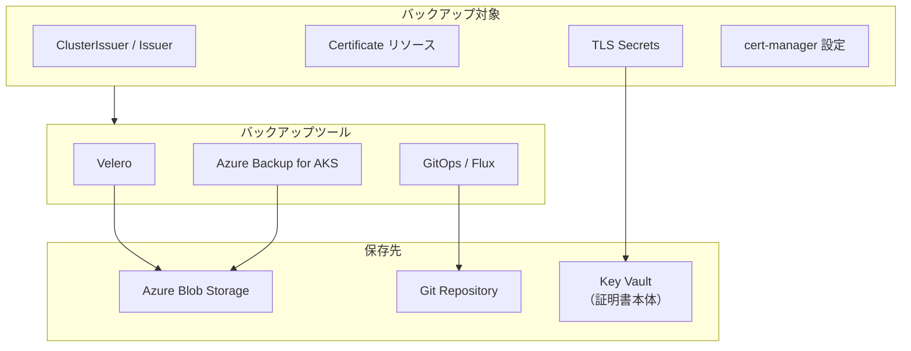

### Velero バックアップ設定

```yaml
# velero-schedule.yaml
apiVersion: velero.io/v1
kind: Schedule
metadata:
  name: cert-manager-backup
  namespace: velero
spec:
  schedule: "0 2 * * *" # 毎日 2:00
  template:
    includedNamespaces:
      - cert-manager
      - default
    includedResources:
      - secrets
      - certificates.cert-manager.io
      - clusterissuers.cert-manager.io
      - issuers.cert-manager.io
      - certificaterequests.cert-manager.io
    labelSelector:
      matchLabels:
        backup: "true"
    ttl: 720h # 30日間保持
    storageLocation: azure-backup
```

### マルチリージョン構成

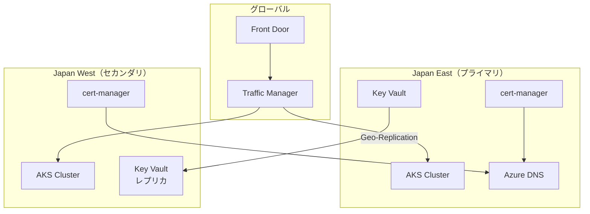

### DR テスト手順

```bash
# 1. 証明書バックアップの確認
velero backup get

# 2. テスト用名前空間でリストアテスト
velero restore create --from-backup cert-manager-backup-xxxx \
  --namespace-mappings default:dr-test

# 3. 証明書の有効性確認
kubectl get certificates -n dr-test
kubectl describe certificate <name> -n dr-test

# 4. テスト環境のクリーンアップ
kubectl delete namespace dr-test
```

---

## トラブルシューティング

### トラブルシューティングフロー

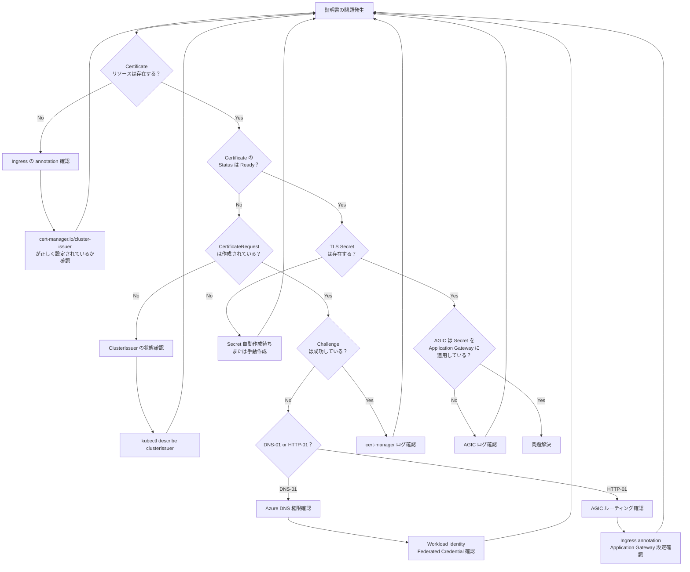

### よくある問題と解決策

#### 1. ClusterIssuer が Ready にならない

```bash
# 状態確認
kubectl describe clusterissuer letsencrypt-prod

# よくあるエラーと解決策
```

| エラーメッセージ                   | 原因                         | 解決策                                            |
| ---------------------------------- | ---------------------------- | ------------------------------------------------- |
| `Failed to get Azure authorizer`   | Workload Identity 設定不備   | Federated Credential と ServiceAccount ラベル確認 |
| `ACME account registration failed` | Let's Encrypt との通信エラー | ネットワーク接続、メールアドレス確認              |
| `Error initializing DNS provider`  | Azure DNS 権限不足           | DNS Zone Contributor ロール確認                   |

#### 2. Challenge が失敗する

```bash
# Challenge 状態確認
kubectl get challenges -A
kubectl describe challenge <challenge-name>

# DNS レコード確認
nslookup -type=TXT _acme-challenge.example.com

# Azure DNS レコード確認
az network dns record-set txt list \
  --resource-group $DNS_RG \
  --zone-name $DOMAIN
```

| 問題                               | 原因                  | 解決策                           |
| ---------------------------------- | --------------------- | -------------------------------- |
| DNS-01: TXT レコードが作成されない | 権限不足              | Managed Identity の RBAC 確認    |
| DNS-01: 検証タイムアウト           | DNS 伝播遅延          | TTL 設定確認、時間をおいて再試行 |
| HTTP-01: 404 エラー                | AGIC ルーティング問題 | DNS-01 への切り替え推奨          |

#### 3. Secret が作成されない

```bash
# Certificate と CertificateRequest 確認
kubectl get certificates,certificaterequests -A

# cert-manager ログ確認
kubectl logs -n cert-manager -l app=cert-manager --tail=100
```

#### 4. AGIC が証明書を適用しない

```bash
# AGIC ログ確認
kubectl logs -n kube-system -l app=ingress-appgw-deployment --tail=100

# Application Gateway の証明書確認
az network application-gateway ssl-cert list \
  --gateway-name $APPGW_NAME \
  --resource-group $RG

# Ingress イベント確認
kubectl describe ingress <ingress-name>
```

### ログ収集コマンド

```bash
# ========================================
# cert-manager ログ
# ========================================
kubectl logs -n cert-manager -l app=cert-manager --tail=200
kubectl logs -n cert-manager -l app=webhook --tail=100
kubectl logs -n cert-manager -l app=cainjector --tail=100

# ========================================
# CSI Driver ログ
# ========================================
kubectl logs -n kube-system -l app=secrets-store-csi-driver --tail=100
kubectl logs -n kube-system -l app=secrets-store-provider-azure --tail=100

# ========================================
# AGIC ログ
# ========================================
kubectl logs -n kube-system -l app=ingress-appgw-deployment --tail=200

# ========================================
# イベント確認
# ========================================
kubectl get events --sort-by='.lastTimestamp' -A | grep -E "cert|tls|secret"

# ========================================
# リソース状態一括確認
# ========================================
echo "=== ClusterIssuers ==="
kubectl get clusterissuers

echo "=== Certificates ==="
kubectl get certificates -A

echo "=== CertificateRequests ==="
kubectl get certificaterequests -A

echo "=== Challenges ==="
kubectl get challenges -A

echo "=== TLS Secrets ==="
kubectl get secrets -A | grep tls
```

---

## 確認コマンド集

### クイックリファレンス

```bash
# ========================================
# cert-manager 状態確認
# ========================================

# cert-manager Pod 状態
kubectl get pods -n cert-manager

# ClusterIssuer 状態
kubectl get clusterissuers
kubectl describe clusterissuer letsencrypt-prod

# Certificate 状態
kubectl get certificates -A
kubectl describe certificate <name> -n <namespace>

# CertificateRequest 状態
kubectl get certificaterequests -A

# Challenge 状態（発行中のみ表示）
kubectl get challenges -A

# ========================================
# TLS Secret 確認
# ========================================

# Secret 一覧
kubectl get secrets -A | grep tls

# 証明書内容確認
kubectl get secret <secret-name> -o jsonpath='{.data.tls\.crt}' | base64 -d | openssl x509 -text -noout

# 有効期限確認
kubectl get secret <secret-name> -o jsonpath='{.data.tls\.crt}' | base64 -d | openssl x509 -enddate -noout

# ========================================
# CSI Secrets Store 確認
# ========================================

# CSI Driver Pod 状態
kubectl get pods -n kube-system -l 'app in (secrets-store-csi-driver,secrets-store-provider-azure)'

# SecretProviderClass 確認
kubectl get secretproviderclass -A

# ========================================
# Azure リソース確認
# ========================================

# Managed Identity 確認
az identity list -g $RESOURCE_GROUP -o table

# Federated Credential 確認
az identity federated-credential list \
  --identity-name $IDENTITY_NAME \
  --resource-group $RESOURCE_GROUP

# Key Vault 証明書確認
az keyvault certificate list --vault-name $KEYVAULT_NAME -o table

# DNS Zone 確認
az network dns record-set list \
  --resource-group $DNS_RG \
  --zone-name $DOMAIN \
  --query "[?type=='Microsoft.Network/dnszones/TXT']"

# ========================================
# 接続テスト
# ========================================

# HTTPS 接続テスト
curl -v https://app.example.com 2>&1 | grep -E "issuer|expire|subject"

# 証明書チェーン確認
echo | openssl s_client -connect app.example.com:443 -servername app.example.com 2>/dev/null | openssl x509 -text -noout

# ========================================
# 更新シミュレーション
# ========================================

# 証明書の強制更新（テスト用）
kubectl delete certificate <certificate-name>
# または
cmctl renew <certificate-name>
```

---

## 参考リンク

### 公式ドキュメント

| トピック                           | URL                                                                                                                  |
| ---------------------------------- | -------------------------------------------------------------------------------------------------------------------- |
| cert-manager AKS チュートリアル    | https://cert-manager.io/docs/tutorials/getting-started-aks-letsencrypt/                                              |
| cert-manager Azure DNS 設定        | https://cert-manager.io/docs/configuration/acme/dns01/azuredns/                                                      |
| AGIC Let's Encrypt 設定            | https://learn.microsoft.com/azure/application-gateway/ingress-controller-letsencrypt-certificate-application-gateway |
| Azure Key Vault CSI Driver         | https://learn.microsoft.com/azure/aks/csi-secrets-store-driver                                                       |
| Application Gateway for Containers | https://learn.microsoft.com/azure/application-gateway/for-containers/how-to-cert-manager-lets-encrypt-ingress-api    |
| AKS Workload Identity              | https://learn.microsoft.com/azure/aks/workload-identity-overview                                                     |

### コミュニティリソース

| トピック                       | URL                                                                                                 |
| ------------------------------ | --------------------------------------------------------------------------------------------------- |
| AGIC GitHub ドキュメント       | https://azure.github.io/application-gateway-kubernetes-ingress/how-tos/lets-encrypt/                |
| AGIC + cert-manager 統合ガイド | https://dev.to/adzhydra/solving-cert-manager-and-azure-application-gateway-integration-for-aks-5239 |
| AKS 本番チェックリスト         | https://www.the-aks-checklist.com/                                                                  |
| x509-certificate-exporter      | https://github.com/enix/x509-certificate-exporter                                                   |
| Grafana 証明書ダッシュボード   | https://grafana.com/grafana/dashboards/13922                                                        |

### 関連ドキュメント

| トピック                 | URL                                                                                        |
| ------------------------ | ------------------------------------------------------------------------------------------ |
| AKS 証明書ローテーション | https://learn.microsoft.com/azure/aks/certificate-rotation                                 |
| Azure DNS Private Zone   | https://learn.microsoft.com/azure/dns/private-dns-overview                                 |
| AKS バックアップと復旧   | https://learn.microsoft.com/azure/architecture/operator-guides/aks/aks-backup-and-recovery |
| Velero for AKS           | https://learn.microsoft.com/azure/aks/hybrid/backup-workload-cluster                       |

---

## 変更履歴

| 日付       | バージョン | 変更内容 |
| ---------- | ---------- | -------- |
| 2026-01-31 | 1.0.0      | 初版作成 |
