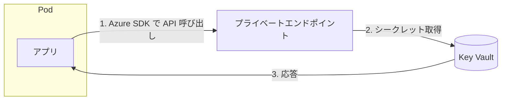
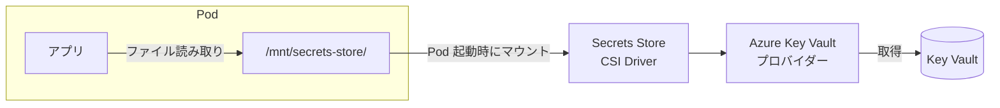
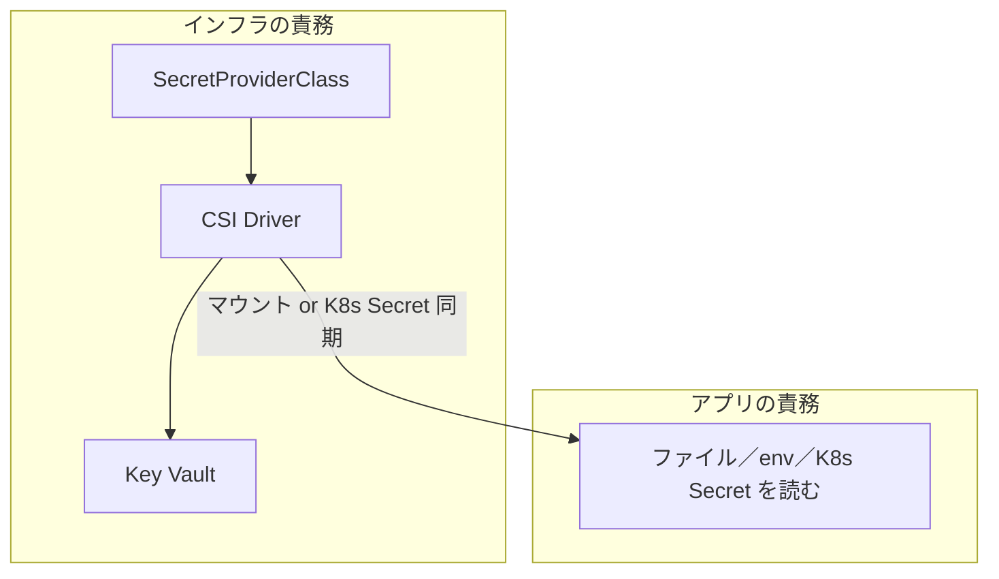
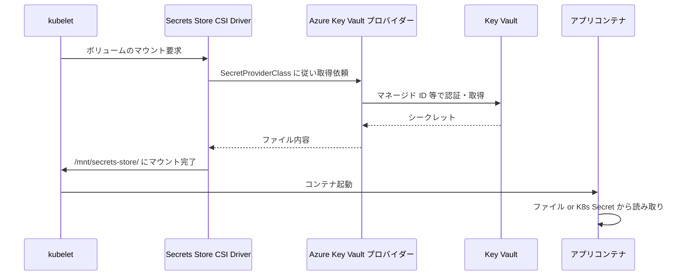
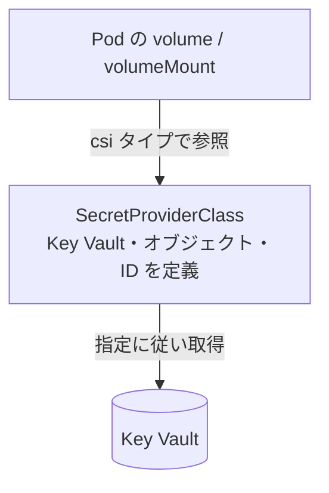
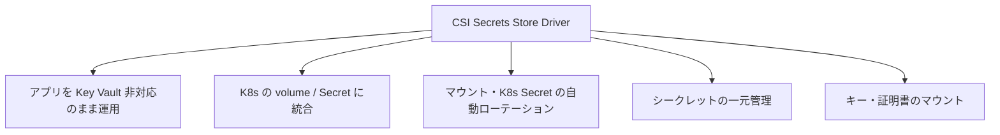
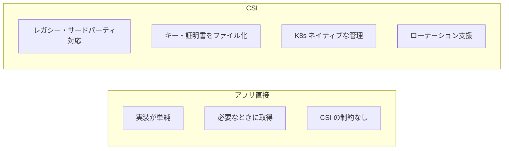
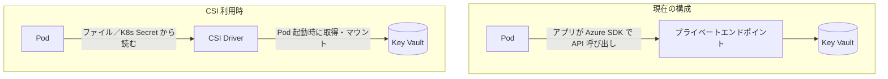

# CSI Secrets Store ドライバーの用途・仕組み・メリット

AKS で Key Vault のシークレットを Pod に渡す 2 通りの方法と、Secrets Store CSI Driver の役割を整理する。

---

## 1. 2 つの方式の違い

### 方式の概要

| 観点                         | アプリが Key Vault に直接アクセス          | CSI Secrets Store ドライバー                    |
| ---------------------------- | ------------------------------------------ | ----------------------------------------------- |
| Key Vault にアクセスする主体 | アプリ（Azure SDK）                        | CSI ドライバー＋ Azure Key Vault プロバイダー   |
| シークレットの渡し方         | アプリが API で取得                        | ファイルとしてマウント または K8s Secret に同期 |
| アプリの責務                 | Key Vault の URL・認証・リトライなどを実装 | ファイル／環境変数／K8s Secret を読むだけ       |

### アプリ直接アクセス（CSI なし）

アプリがプライベートエンドポイント経由で Key Vault API を呼ぶ構成。CSI がなくてもシークレットを参照できる。

### CSI ドライバー方式

Pod 起動時に CSI ドライバーが Key Vault から取得し、ファイルとしてマウントする。アプリは Key Vault を呼ばない。

---

## 2. CSI ドライバーの用途

**「アプリを Key Vault 非対応のまま、Key Vault の値を安全に渡したい」**ための仕組み。

- アプリはファイル・環境変数・Kubernetes Secret だけを扱う
- シークレットの取得とマウントはインフラ（CSI ドライバー）が担当

---

## 3. 仕組み（処理の流れ）

### 3.1 Pod 起動時の流れ

### 3.2 主なリソースの関係

### 3.3 認証

- **ノード**: アドオンが `azurekeyvaultsecretsprovider-xxx` のマネージド ID を VMSS に割り当て
- **Pod**: Workload Identity やユーザー割り当てマネージド ID を SecretProviderClass で指定

CSI を使う場合も、プライベートエンドポイント経由で Key Vault に到達する構成にできる。

---

## 4. CSI ドライバーのメリット

| メリット                            | 説明                                                                      |
| ----------------------------------- | ------------------------------------------------------------------------- |
| アプリを Key Vault 非対応のまま運用 | 既存の「ファイル・環境変数・K8s Secret を読む」アプリをそのまま利用可能   |
| K8s の volume / Secret に統合       | volume / volumeMount / env などの標準パターンで注入できる                 |
| 自動ローテーション                  | Key Vault の更新をマウント内容・K8s Secret に反映できる（制約あり）       |
| シークレットの一元管理              | SecretProviderClass でどの Key Vault のどのオブジェクトを参照するかを集約 |
| キー・証明書のマウント              | シークレットに加え、キーや証明書もファイルとしてマウント可能              |

---

## 5. 方式の比較（アプリ直接 vs CSI）

---

## 6. どちらを選ぶかの目安

| 向いているケース                                    | アプリ直接アクセス | CSI ドライバー |
| --------------------------------------------------- | ------------------ | -------------- |
| すでにアプリで Key Vault SDK を使っている           | ◎                  | △              |
| レガシー／サードパーティで Key Vault 対応が難しい   | △                  | ◎              |
| キー・証明書をファイルとして使いたい                | △                  | ◎              |
| K8s の volume / Secret / env に寄せたい             | △                  | ◎              |
| シークレットの自動ローテーションを K8s 側で扱いたい | △                  | ◎              |
| 構成をできるだけシンプルにしたい                    | ◎                  | △              |

---

## 7. まとめ

- **現在の構成**: アプリがプライベートエンドポイント経由で Key Vault API を直接呼ぶため、CSI がなくてもシークレットを参照できる。
- **CSI の役割**: アプリを Key Vault 非対応のまま、**Pod 起動時に** CSI が Key Vault から取得し、ファイルまたは K8s Secret として渡す。
- **違い**: Key Vault への経路（プライベートエンドポイント）は共通。「誰が・いつ・どの形で」シークレットを取得してアプリに渡すかが、アプリ直接と CSI で異なる。

---

## 参考

- [AKS で Secrets Store CSI Driver 用 Azure Key Vault プロバイダーを使う \| Microsoft Learn](https://learn.microsoft.com/ja-jp/azure/aks/csi-secrets-store-driver)
- [AKS で Secrets Store CSI Driver 用 Azure Key Vault プロバイダーにアクセスする ID を提供する \| Microsoft Learn](https://learn.microsoft.com/ja-jp/azure/aks/csi-secrets-store-identity-access)
