# Application Gateway Ingress Controller (AGIC) 設定ガイド

Azure Kubernetes Service (AKS) で Application Gateway Ingress Controller (AGIC) を使用するための包括的なガイドです。

## 目次

1. [概要](#概要)
2. [アーキテクチャ](#アーキテクチャ)
3. [前提条件](#前提条件)
4. [有効化手順](#有効化手順)
5. [紐づけの仕組み](#紐づけの仕組み)
6. [必要なマニフェスト](#必要なマニフェスト)
7. [Annotations リファレンス](#annotations-リファレンス)
8. [TLS/HTTPS 設定](#tlshttps-設定)
9. [トラブルシューティング](#トラブルシューティング)
10. [確認コマンド集](#確認コマンド集)
11. [ベストプラクティス](#ベストプラクティス)

---

## 概要

### AGIC とは

Application Gateway Ingress Controller (AGIC) は、AKS クラスター内で動作する Kubernetes アプリケーションで、Azure Application Gateway L7 ロードバランサーを使用してクラウドソフトウェアをインターネットに公開します。

### 用語の整理

| 用語                    | 説明                                             | 実体                        |
| ----------------------- | ------------------------------------------------ | --------------------------- |
| **Ingress リソース**    | ルーティングルールの宣言（YAML で定義）          | Kubernetes API オブジェクト |
| **Ingress Controller**  | Ingress を監視し、LB を設定するプログラム        | AGIC Pod                    |
| **Application Gateway** | 実際にトラフィックを処理する L7 ロードバランサー | Azure PaaS リソース         |

### デプロイ方式の比較

| 項目             | AKS アドオン（推奨）   | Helm デプロイ    |
| ---------------- | ---------------------- | ---------------- |
| 管理             | フルマネージド         | 手動管理         |
| 更新             | 自動更新               | 手動更新         |
| 設定の柔軟性     | 制限あり               | カスタマイズ可能 |
| サポート         | Microsoft サポート対象 | コミュニティ     |
| 複数クラスタ対応 | 1 クラスタ = 1 App GW  | 柔軟に設定可能   |

---

## アーキテクチャ

### 全体構成図

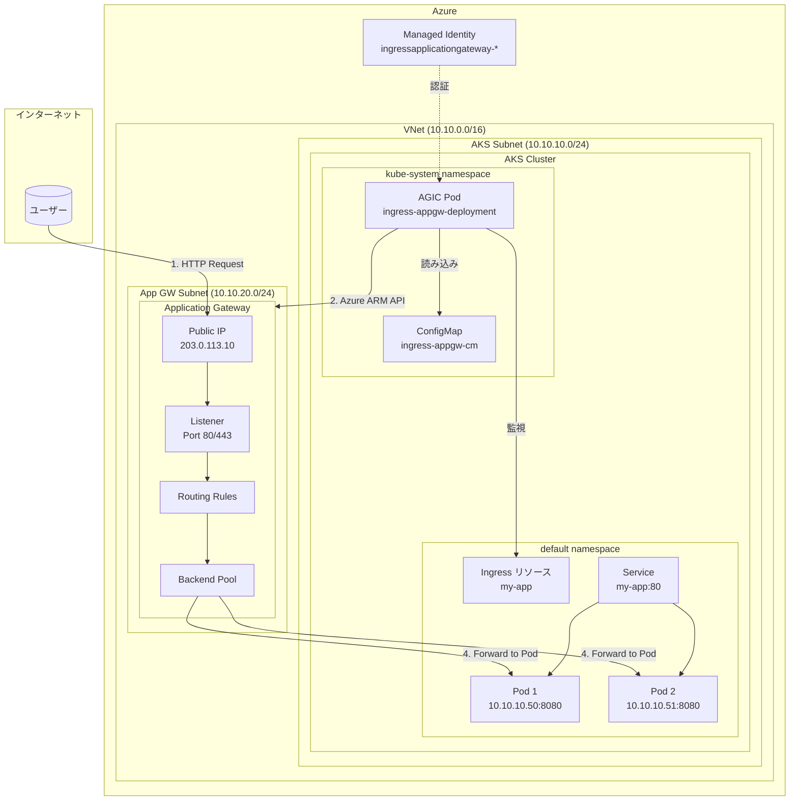

### トラフィックフロー

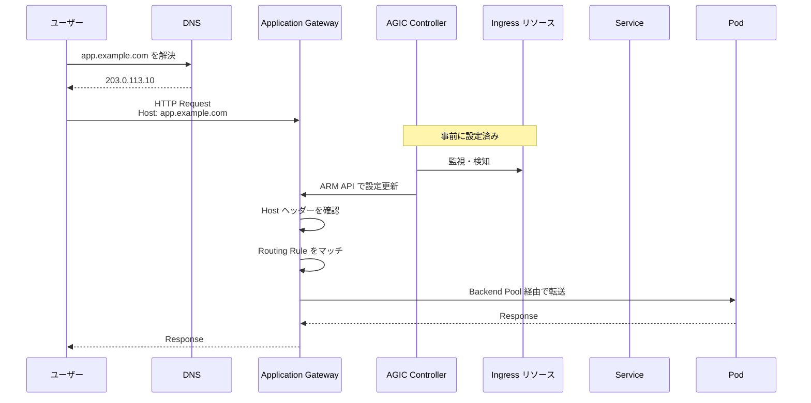

### 紐づけの仕組み

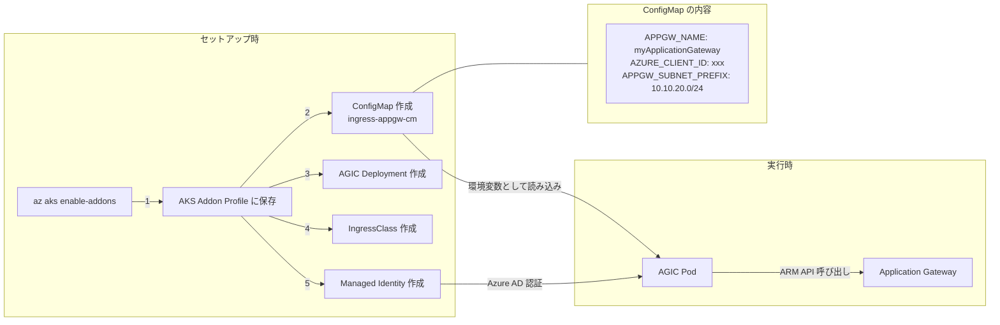

---

## 前提条件

### 必須要件

| 要件                       | 詳細                                                  |
| -------------------------- | ----------------------------------------------------- |
| Application Gateway SKU    | **Standard_v2** または **WAF_v2** のみ（v1 は非対応） |
| AKS ネットワークプラグイン | Azure CNI、Azure CNI Overlay、または Kubenet          |
| Managed Identity           | AKS で Managed Identity が有効であること              |
| サブネット                 | Application Gateway 用のサブネット（最大 /24）        |

### ネットワーク構成（同一 VNet 内）

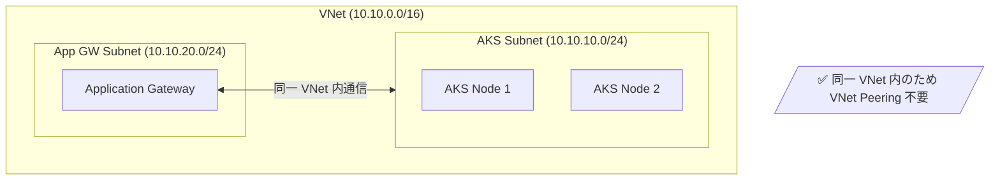

### サブネット設計例

| サブネット    | CIDR          | 用途                     |
| ------------- | ------------- | ------------------------ |
| AKS Subnet    | 10.10.10.0/24 | AKS ノードと Pod         |
| App GW Subnet | 10.10.20.0/24 | Application Gateway 専用 |
| （予備）      | 10.10.30.0/24 | 将来の拡張用             |

### CNI プラグイン比較

| CNI プラグイン            | ネットワークモデル | AGIC 対応                  | 特徴                   |
| ------------------------- | ------------------ | -------------------------- | ---------------------- |
| **Azure CNI Overlay**     | Overlay            | ✅（v1.9.1+）              | VNet IP 節約、推奨     |
| **Azure CNI Pod Subnet**  | Flat               | ✅                         | Pod に直接 VNet IP     |
| **Azure CNI Node Subnet** | Flat               | ✅                         | シンプル、スケール制限 |
| **Kubenet**               | Overlay            | ✅（要ルートテーブル設定） | レガシー               |

---

## 有効化手順

### パターン 1: 新規 AKS クラスタ + 新規 Application Gateway（同一 VNet）

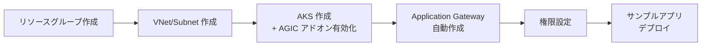

#### 手順

```bash
# 1. リソースグループ作成
az group create --name myResourceGroup --location japaneast

# 2. VNet とサブネットを作成
az network vnet create \
  --name myVNet \
  --resource-group myResourceGroup \
  --address-prefix 10.10.0.0/16 \
  --subnet-name aks-subnet \
  --subnet-prefix 10.10.10.0/24

# App GW 用サブネットを追加
az network vnet subnet create \
  --name appgw-subnet \
  --resource-group myResourceGroup \
  --vnet-name myVNet \
  --address-prefix 10.10.20.0/24

# 3. サブネット ID を取得
AKS_SUBNET_ID=$(az network vnet subnet show \
  --name aks-subnet \
  --resource-group myResourceGroup \
  --vnet-name myVNet \
  --query id -o tsv)

# 4. AKS クラスタ作成（AGIC アドオン有効化 + Application Gateway 自動作成）
az aks create \
  --name myCluster \
  --resource-group myResourceGroup \
  --network-plugin azure \
  --vnet-subnet-id $AKS_SUBNET_ID \
  --enable-managed-identity \
  --addons ingress-appgw \
  --appgw-name myApplicationGateway \
  --appgw-subnet-cidr "10.10.20.0/24" \
  --generate-ssh-keys

# 5. AGIC Identity に権限付与
appGatewayId=$(az aks show -n myCluster -g myResourceGroup -o tsv \
  --query "addonProfiles.ingressApplicationGateway.config.effectiveApplicationGatewayId")

appGatewaySubnetId=$(az network application-gateway show --ids $appGatewayId -o tsv \
  --query "gatewayIPConfigurations[0].subnet.id")

agicAddonIdentity=$(az aks show -n myCluster -g myResourceGroup -o tsv \
  --query "addonProfiles.ingressApplicationGateway.identity.clientId")

az role assignment create \
  --assignee $agicAddonIdentity \
  --scope $appGatewaySubnetId \
  --role "Network Contributor"

# 6. クラスタ認証情報取得
az aks get-credentials --name myCluster --resource-group myResourceGroup

# 7. サンプルアプリデプロイ
kubectl apply -f https://raw.githubusercontent.com/Azure/application-gateway-kubernetes-ingress/master/docs/examples/aspnetapp.yaml
```

### パターン 2: 既存 AKS クラスタ + 既存 Application Gateway（同一 VNet）

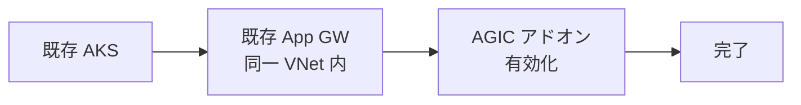

#### 手順

```bash
# 1. Application Gateway ID を取得
appgwId=$(az network application-gateway show \
  --name myApplicationGateway \
  --resource-group myResourceGroup \
  -o tsv --query "id")

# 2. AGIC アドオンを有効化
az aks enable-addons \
  --name myCluster \
  --resource-group myResourceGroup \
  --addons ingress-appgw \
  --appgw-id $appgwId

# 3. クラスタ認証情報取得
az aks get-credentials --name myCluster --resource-group myResourceGroup
```

### パターン 3: Azure Portal から有効化

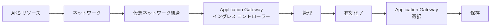

---

## 紐づけの仕組み

### 設定の保存場所

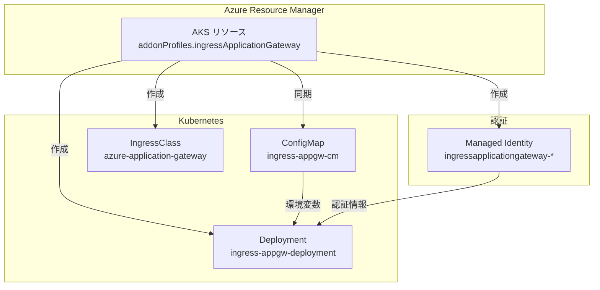

### ConfigMap の内容

```yaml
# kubectl get configmap ingress-appgw-cm -n kube-system -o yaml
apiVersion: v1
kind: ConfigMap
data:
  APPGW_NAME: myApplicationGateway # Application Gateway 名
  APPGW_SUBNET_NAME: appgw-subnet
  APPGW_SUBNET_PREFIX: 10.10.20.0/24
  AZURE_CLIENT_ID: a906ed9c-xxxx-xxxx # Managed Identity の Client ID
  INGRESS_CLASS_RESOURCE_NAME: azure-application-gateway
  USE_MANAGED_IDENTITY_FOR_POD: "true"
  APPGW_VERBOSITY_LEVEL: "5" # ログレベル
```

### AKS Addon Profile の内容

```bash
# 確認コマンド
az aks show --name myCluster --resource-group myResourceGroup \
  --query "addonProfiles.ingressApplicationGateway" -o json
```

```json
{
  "config": {
    "applicationGatewayName": "myApplicationGateway",
    "effectiveApplicationGatewayId": "/subscriptions/.../applicationGateways/myApplicationGateway",
    "subnetPrefix": "10.10.20.0/24"
  },
  "enabled": true,
  "identity": {
    "clientId": "a906ed9c-xxxx-xxxx",
    "objectId": "e9a23e3a-xxxx-xxxx",
    "resourceId": "/subscriptions/.../userAssignedIdentities/ingressapplicationgateway-*"
  }
}
```

---

## 必要なマニフェスト

### Ingress リソース

```yaml
apiVersion: networking.k8s.io/v1
kind: Ingress
metadata:
  name: my-app
  labels:
    app: my-app
  annotations:
    # AGIC 固有の annotations（必要に応じて追加）
    appgw.ingress.kubernetes.io/backend-protocol: "http"
    appgw.ingress.kubernetes.io/request-timeout: "60"
    appgw.ingress.kubernetes.io/health-probe-path: "/healthz"
spec:
  ingressClassName: azure-application-gateway # 必須
  rules:
    - host: app.example.com
      http:
        paths:
          - path: /
            pathType: Prefix
            backend:
              service:
                name: my-app
                port:
                  number: 80
  # TLS 設定（オプション）
  tls:
    - hosts:
        - app.example.com
      secretName: my-app-tls
```

### Service リソース

```yaml
apiVersion: v1
kind: Service
metadata:
  name: my-app
  labels:
    app: my-app
spec:
  type: ClusterIP # AGIC では ClusterIP で OK
  selector:
    app: my-app
  ports:
    - protocol: TCP
      port: 80
      targetPort: 8080
```

### Deployment リソース

```yaml
apiVersion: apps/v1
kind: Deployment
metadata:
  name: my-app
  labels:
    app: my-app
spec:
  replicas: 2
  selector:
    matchLabels:
      app: my-app
  template:
    metadata:
      labels:
        app: my-app
    spec:
      containers:
        - name: my-app
          image: my-registry/my-app:v1.0
          ports:
            - containerPort: 8080
          livenessProbe:
            httpGet:
              path: /healthz
              port: 8080
          readinessProbe:
            httpGet:
              path: /healthz
              port: 8080
```

### Ingress 指定方式の比較

| 方式                       | 設定方法                                                 | 推奨 |
| -------------------------- | -------------------------------------------------------- | ---- |
| **IngressClass（推奨）**   | `spec.ingressClassName: azure-application-gateway`       | ✅   |
| **Annotation（従来方式）** | `kubernetes.io/ingress.class: azure/application-gateway` | △    |

---

## Annotations リファレンス

### 基本設定

| Annotation                                                | 説明                         | デフォルト |
| --------------------------------------------------------- | ---------------------------- | ---------- |
| `appgw.ingress.kubernetes.io/backend-protocol`            | バックエンドプロトコル       | `http`     |
| `appgw.ingress.kubernetes.io/backend-hostname`            | バックエンドホスト名         | -          |
| `appgw.ingress.kubernetes.io/request-timeout`             | リクエストタイムアウト（秒） | `30`       |
| `appgw.ingress.kubernetes.io/connection-draining`         | 接続ドレイン有効化           | `false`    |
| `appgw.ingress.kubernetes.io/connection-draining-timeout` | ドレインタイムアウト（秒）   | `30`       |

### ヘルスプローブ設定

| Annotation                                                     | 説明                       | デフォルト  |
| -------------------------------------------------------------- | -------------------------- | ----------- |
| `appgw.ingress.kubernetes.io/health-probe-hostname`            | プローブホスト名           | `127.0.0.1` |
| `appgw.ingress.kubernetes.io/health-probe-port`                | プローブポート             | `80`        |
| `appgw.ingress.kubernetes.io/health-probe-path`                | プローブパス               | `/`         |
| `appgw.ingress.kubernetes.io/health-probe-status-codes`        | 正常ステータスコード       | `200-399`   |
| `appgw.ingress.kubernetes.io/health-probe-interval`            | プローブ間隔（秒）         | `30`        |
| `appgw.ingress.kubernetes.io/health-probe-timeout`             | プローブタイムアウト（秒） | `30`        |
| `appgw.ingress.kubernetes.io/health-probe-unhealthy-threshold` | 異常判定回数               | `3`         |

### SSL/TLS 設定

| Annotation                                                   | 説明                    | デフォルト |
| ------------------------------------------------------------ | ----------------------- | ---------- |
| `appgw.ingress.kubernetes.io/ssl-redirect`                   | HTTP→HTTPS リダイレクト | `false`    |
| `appgw.ingress.kubernetes.io/appgw-ssl-certificate`          | App GW の SSL 証明書名  | -          |
| `appgw.ingress.kubernetes.io/appgw-ssl-profile`              | SSL プロファイル名      | -          |
| `appgw.ingress.kubernetes.io/appgw-trusted-root-certificate` | 信頼されたルート証明書  | -          |

### その他

| Annotation                                           | 説明                       | デフォルト |
| ---------------------------------------------------- | -------------------------- | ---------- |
| `appgw.ingress.kubernetes.io/cookie-based-affinity`  | セッションアフィニティ     | `false`    |
| `appgw.ingress.kubernetes.io/use-private-ip`         | プライベート IP 使用       | `false`    |
| `appgw.ingress.kubernetes.io/override-frontend-port` | フロントエンドポート上書き | -          |
| `appgw.ingress.kubernetes.io/waf-policy-for-path`    | WAF ポリシー               | -          |
| `appgw.ingress.kubernetes.io/rewrite-rule-set`       | Rewrite ルールセット       | -          |
| `appgw.ingress.kubernetes.io/rule-priority`          | ルール優先度               | -          |

---

## TLS/HTTPS 設定

### 方法 1: Kubernetes Secret を使用

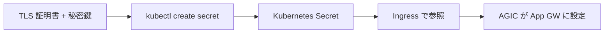

```bash
# Secret 作成
kubectl create secret tls my-app-tls \
  --key path/to/tls.key \
  --cert path/to/tls.crt
```

```yaml
# Ingress で参照
apiVersion: networking.k8s.io/v1
kind: Ingress
metadata:
  name: my-app
  annotations:
    appgw.ingress.kubernetes.io/ssl-redirect: "true"
spec:
  ingressClassName: azure-application-gateway
  tls:
    - hosts:
        - app.example.com
      secretName: my-app-tls
  rules:
    - host: app.example.com
      http:
        paths:
          - path: /
            pathType: Prefix
            backend:
              service:
                name: my-app
                port:
                  number: 80
```

### 方法 2: Application Gateway に事前登録した証明書を使用

```yaml
apiVersion: networking.k8s.io/v1
kind: Ingress
metadata:
  name: my-app
  annotations:
    appgw.ingress.kubernetes.io/appgw-ssl-certificate: "my-cert-name"
    appgw.ingress.kubernetes.io/ssl-redirect: "true"
spec:
  ingressClassName: azure-application-gateway
  rules:
    - host: app.example.com
      http:
        paths:
          - path: /
            pathType: Prefix
            backend:
              service:
                name: my-app
                port:
                  number: 80
```

---

## トラブルシューティング

### トラブルシューティングフロー

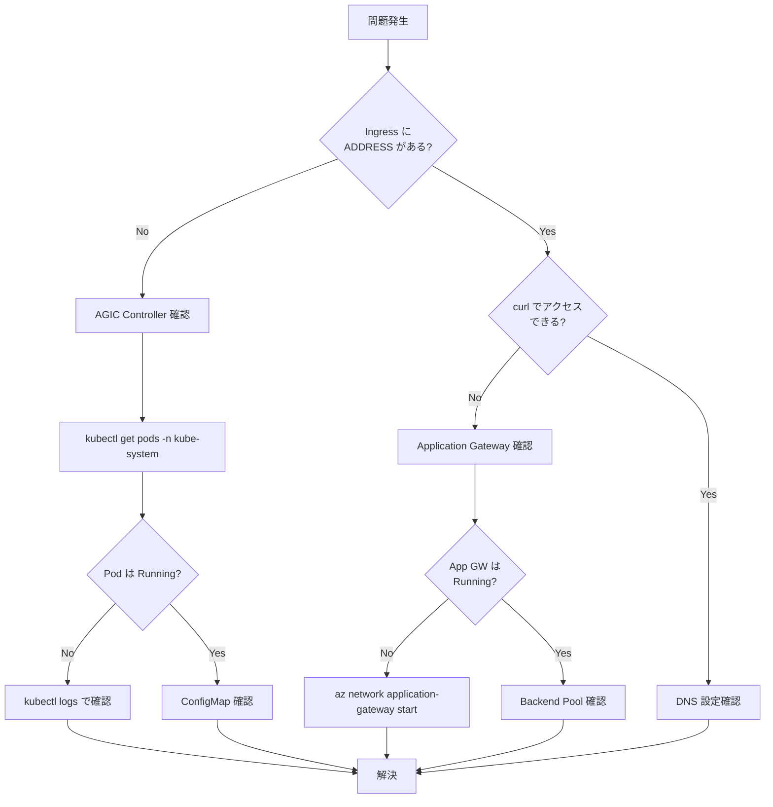

### よくある問題と解決策

#### 1. Ingress の ADDRESS が空

```bash
# 確認
kubectl get ingress

# 原因: AGIC が動作していない
# 解決: AGIC Pod の状態確認
kubectl get pods -n kube-system | grep ingress
kubectl logs -n kube-system -l app=ingress-appgw-deployment
```

#### 2. Application Gateway が停止状態

```bash
# 確認
az network application-gateway show \
  --name <APP_GW_NAME> \
  --resource-group <RG_NAME> \
  --query operationalState

# 解決: Application Gateway を起動
az network application-gateway start \
  --name <APP_GW_NAME> \
  --resource-group <RG_NAME>
```

#### 3. Backend Pool が空

```bash
# Pod IP と Backend Pool の比較
kubectl get pods -o wide
az network application-gateway show \
  --name <APP_GW_NAME> \
  --resource-group <RG_NAME> \
  --query backendAddressPools
```

### ログ確認

```bash
# AGIC Pod のログ（詳細）
kubectl logs -n kube-system -l app=ingress-appgw-deployment --tail=100

# Kubernetes イベント確認
kubectl get events --sort-by='.lastTimestamp'

# 特定の Ingress のイベント
kubectl describe ingress <INGRESS_NAME>
```

### ログレベル変更

ConfigMap で `APPGW_VERBOSITY_LEVEL` を変更:

| レベル | 説明                                       |
| ------ | ------------------------------------------ |
| 1      | デフォルト。起動情報、警告、エラー         |
| 3      | イベントと変更の詳細情報                   |
| 5      | 最大詳細。ARM に送信される JSON 設定を含む |

---

## 確認コマンド集

### クイックリファレンス

```bash
# ========================================
# AKS / AGIC 状態確認
# ========================================

# AGIC アドオンの設定確認
az aks show --name <CLUSTER> --resource-group <RG> \
  --query "addonProfiles.ingressApplicationGateway"

# AGIC Pod の状態確認
kubectl get pods -n kube-system | grep ingress

# AGIC ConfigMap 確認
kubectl get configmap ingress-appgw-cm -n kube-system -o yaml

# IngressClass 確認
kubectl get ingressclass

# ========================================
# Ingress リソース確認
# ========================================

# 全 Ingress 一覧（ADDRESS 確認）
kubectl get ingress -A

# Ingress 詳細
kubectl describe ingress <INGRESS_NAME>

# Ingress YAML 出力
kubectl get ingress <INGRESS_NAME> -o yaml

# ========================================
# Application Gateway 確認
# ========================================

# 運用状態確認
az network application-gateway show \
  --name <APP_GW_NAME> \
  --resource-group <RG> \
  --query "{name:name, state:operationalState, sku:sku.name}"

# Public IP 確認
az network public-ip list \
  --resource-group <MC_RG> \
  --query "[?contains(name,'appgw')].{name:name, ip:ipAddress}" -o table

# Backend Pool 確認
az network application-gateway show \
  --name <APP_GW_NAME> \
  --resource-group <RG> \
  --query "backendAddressPools[].backendAddresses[].ipAddress"

# ========================================
# 接続テスト
# ========================================

# Host ヘッダー付きでアクセス
curl -H "Host: <HOSTNAME>" http://<PUBLIC_IP>/

# ヘルスエンドポイント確認
curl -H "Host: <HOSTNAME>" http://<PUBLIC_IP>/healthz

# 詳細な接続情報
curl -v -H "Host: <HOSTNAME>" http://<PUBLIC_IP>/

# ========================================
# ログ確認
# ========================================

# AGIC ログ
kubectl logs -n kube-system -l app=ingress-appgw-deployment --tail=100

# イベント確認
kubectl get events --sort-by='.lastTimestamp' | head -20

# Activity Log（Azure Portal で確認推奨）
az monitor activity-log list \
  --resource-group <RG> \
  --query "[?contains(operationName.value,'applicationGateways')]"
```

---

## ベストプラクティス

### 設計

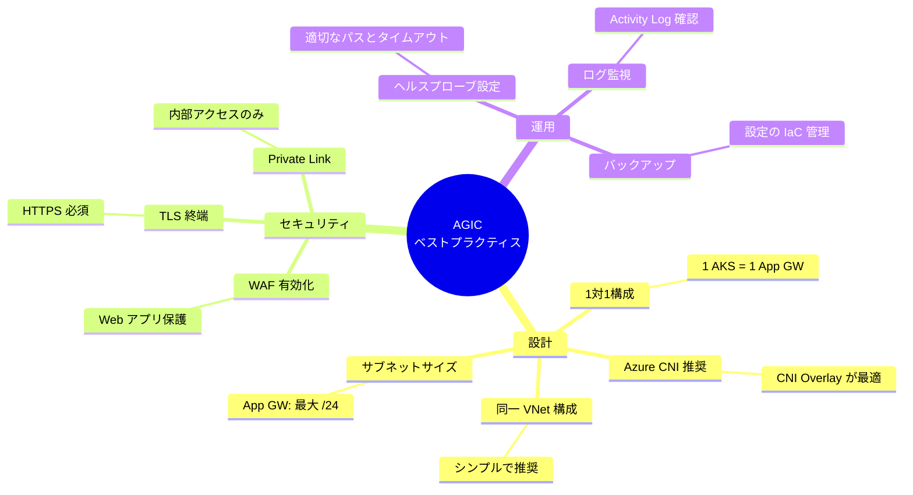

### 推奨事項

| カテゴリ         | 推奨事項                                                |
| ---------------- | ------------------------------------------------------- |
| **構成**         | 1 つの AKS クラスタに 1 つの Application Gateway を使用 |
| **ネットワーク** | Azure CNI Overlay を使用（IP アドレス節約）             |
| **配置**         | AKS と App GW は同一 VNet 内に配置                      |
| **セキュリティ** | インターネット向けアプリには WAF を有効化               |
| **可用性**       | 複数の Pod レプリカを使用                               |
| **監視**         | Application Gateway の Activity Log を監視              |
| **IaC**          | Terraform/Bicep で設定を管理                            |

### 非推奨事項

| 項目                                   | 理由                       |
| -------------------------------------- | -------------------------- |
| 複数 AKS で 1 つの App GW を共有       | 構成の競合が発生する可能性 |
| App GW v1 SKU                          | AGIC 非対応                |
| 大きすぎるサブネット（CNI Overlay 時） | /24 より大きいと問題発生   |
| Kubenet + Route Table 未設定           | Pod への通信が失敗         |

---

## 参考リンク

### 公式ドキュメント

| トピック                 | URL                                                                                                     |
| ------------------------ | ------------------------------------------------------------------------------------------------------- |
| AGIC 概要                | https://learn.microsoft.com/azure/application-gateway/ingress-controller-overview                       |
| 新規クラスタでの有効化   | https://learn.microsoft.com/azure/application-gateway/tutorial-ingress-controller-add-on-new            |
| 既存クラスタでの有効化   | https://learn.microsoft.com/azure/application-gateway/tutorial-ingress-controller-add-on-existing       |
| Annotations リファレンス | https://learn.microsoft.com/azure/application-gateway/ingress-controller-annotations                    |
| トラブルシューティング   | https://learn.microsoft.com/azure/application-gateway/ingress-controller-troubleshoot                   |
| HTTP/HTTPS 公開          | https://learn.microsoft.com/azure/application-gateway/ingress-controller-expose-service-over-http-https |

### 関連ドキュメント

| トピック                                     | URL                                                                           |
| -------------------------------------------- | ----------------------------------------------------------------------------- |
| AKS ネットワーク概要                         | https://learn.microsoft.com/azure/aks/concepts-network                        |
| Azure CNI Overlay                            | https://learn.microsoft.com/azure/aks/concepts-network-azure-cni-overlay      |
| Application Gateway for Containers（次世代） | https://learn.microsoft.com/azure/application-gateway/for-containers/overview |
