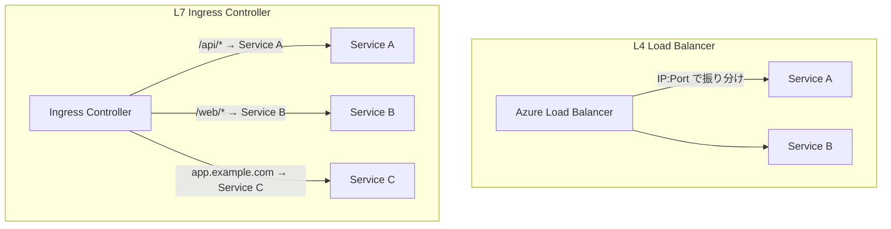
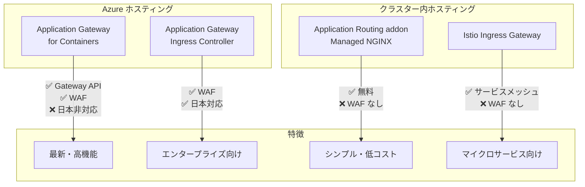
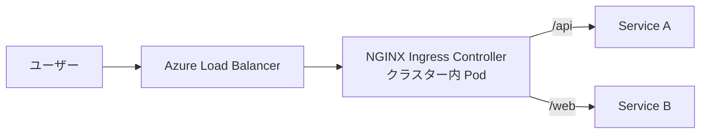
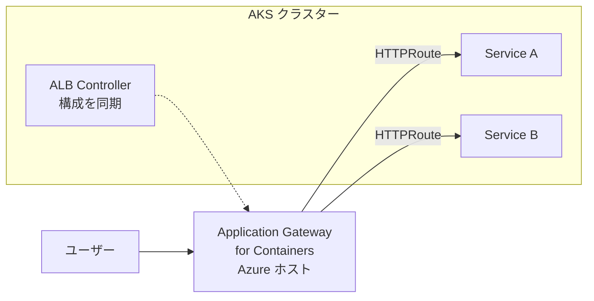
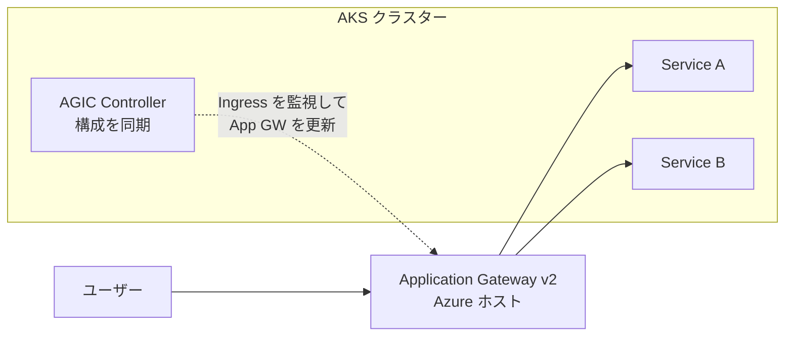
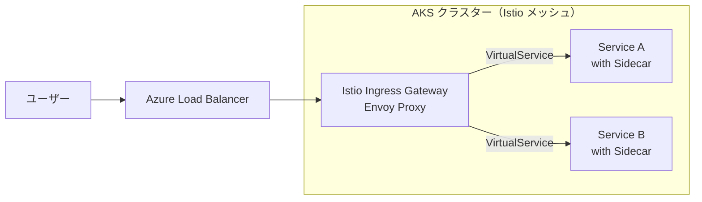
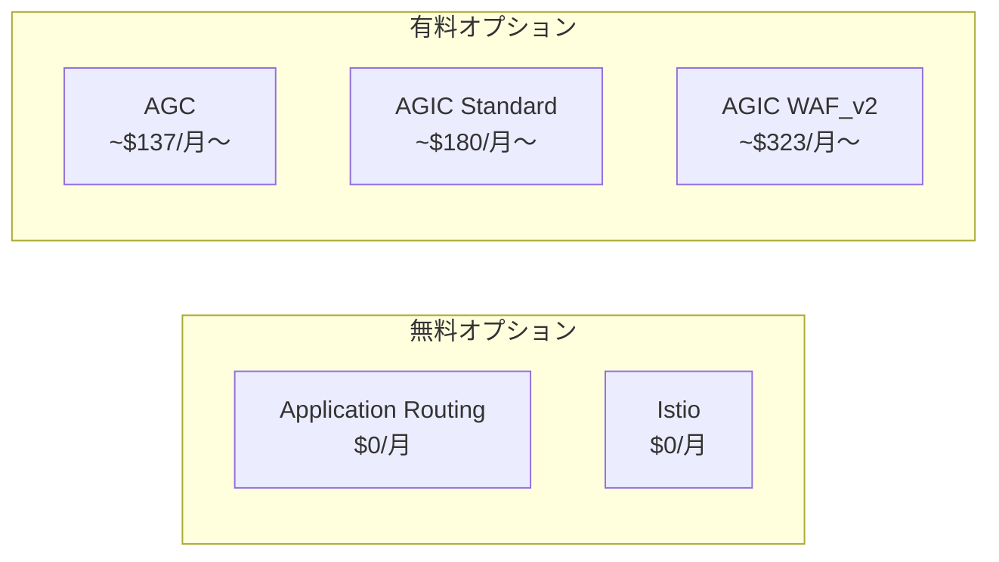
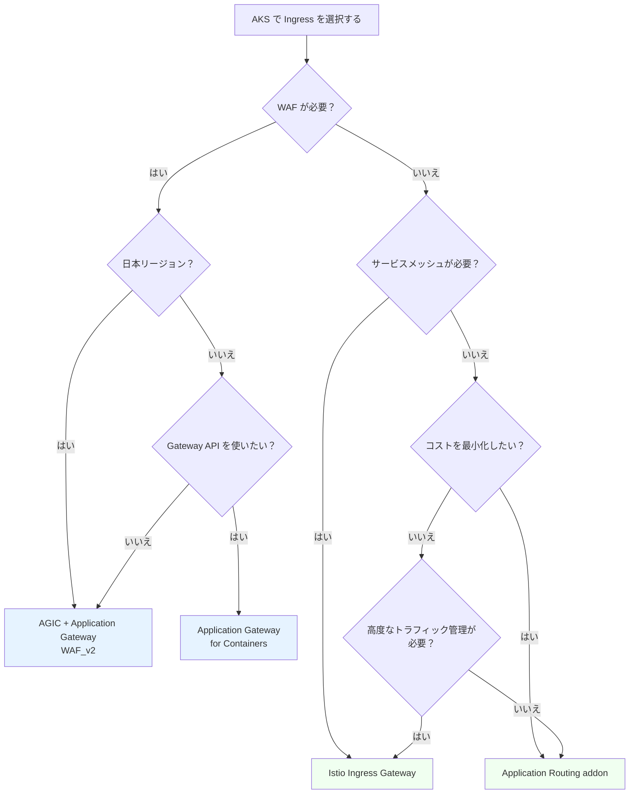
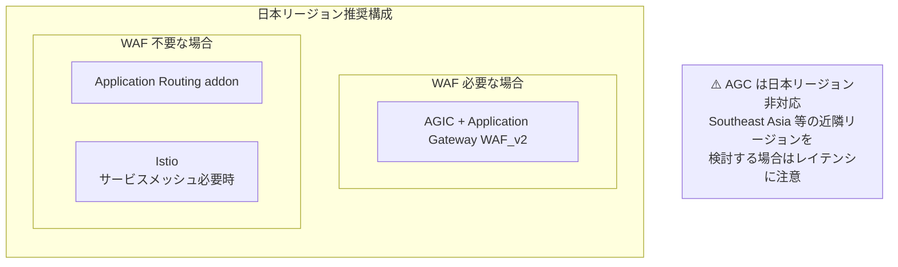

# AKS の Ingress オプション比較

Azure Kubernetes Service (AKS) では、外部からのトラフィックをクラスター内のサービスにルーティングするために複数の **Ingress オプション**が用意されています。このドキュメントでは、各オプションの特徴、コスト、実装方法、ベストプラクティスを比較し、要件に応じた選定ができるようにまとめます。

## 目次

1. [前提知識](#前提知識)
2. [Ingress オプションの全体像](#ingress-オプションの全体像)
3. [各オプションの詳細](#各オプションの詳細)
4. [機能比較表](#機能比較表)
5. [コスト比較](#コスト比較)
6. [実装方法](#実装方法)
7. [どれを選ぶか（選定フロー）](#どれを選ぶか選定フロー)
8. [ベストプラクティス](#ベストプラクティス)
9. [参考リンク](#参考リンク)

---

## 前提知識

AKS の Ingress を理解するために、次の用語を押さえておくと理解しやすくなります。

| 用語                               | 意味                                                                                                   |
| ---------------------------------- | ------------------------------------------------------------------------------------------------------ |
| **Ingress**                        | Kubernetes の L7 ロードバランサー。HTTP/HTTPS トラフィックをパスやホスト名に基づいてルーティングする。 |
| **Ingress Controller**             | Ingress リソースを実際に処理するコンポーネント。NGINX、Envoy など様々な実装がある。                    |
| **Gateway API**                    | Kubernetes の次世代トラフィック管理 API。Ingress よりも柔軟で拡張性が高い。                            |
| **WAF (Web Application Firewall)** | SQL インジェクションや XSS などの攻撃からアプリを保護するファイアウォール。                            |
| **TLS 終端**                       | HTTPS の暗号化/復号化を行う場所。Ingress Controller で終端するか、バックエンドまで通すかを選択できる。 |

### Load Balancer (L4) vs Ingress Controller (L7)



| 観点             | L4 Load Balancer         | L7 Ingress Controller                       |
| ---------------- | ------------------------ | ------------------------------------------- |
| **ルーティング** | IP とポートのみ          | パス、ホスト名、ヘッダーなど                |
| **TLS 終端**     | パススルーのみ           | Ingress で終端可能                          |
| **コスト**       | サービスごとに LB が必要 | 1 つの Ingress で複数サービスをルーティング |
| **プロトコル**   | TCP/UDP                  | HTTP/HTTPS                                  |

---

## Ingress オプションの全体像

AKS では主に 4 つの Ingress オプションが利用できます。



### 重要: 日本リージョンでの制約

**Application Gateway for Containers (AGC) は日本リージョン非対応**です（2025年5月時点）。

サポートリージョン:

- Australia East, Brazil South, Canada Central, Central India, Central US
- East Asia, East US, East US2, France Central, Germany West Central
- Korea Central, North Central US, North Europe, Norway East, South Central US
- Southeast Asia, Switzerland North, UAE North, UK South
- West US, West US 2, West US 3, West Europe

**日本リージョンで WAF が必要な場合は、AGIC + Application Gateway v2 WAF を使用してください。**

---

## 各オプションの詳細

### 1. Application Routing addon (Managed NGINX)

AKS のアドオンとして提供される **マネージド NGINX Ingress Controller** です。



| 項目               | 内容                                      |
| ------------------ | ----------------------------------------- |
| **ホスティング**   | クラスター内（Pod として動作）            |
| **API サポート**   | Kubernetes Ingress API                    |
| **WAF**            | ❌ 組み込みなし（ModSecurity で代替可能） |
| **TLS 管理**       | Azure Key Vault 統合、cert-manager 連携   |
| **コスト**         | 無料（クラスターリソースのみ消費）        |
| **日本リージョン** | ✅ 対応                                   |

**メリット**:

- 追加コストなし
- シンプルな設定
- NGINX の豊富なカスタマイズオプション

**デメリット**:

- クラスターリソースを消費
- WAF 機能がない（ModSecurity 設定が必要）
- スケーリングは手動設定

### 2. Application Gateway for Containers (AGC)

Azure の次世代 Ingress ソリューション。**Gateway API** をネイティブサポートします。



| 項目               | 内容                                             |
| ------------------ | ------------------------------------------------ |
| **ホスティング**   | Azure ホスト（クラスター外）                     |
| **API サポート**   | Kubernetes Ingress API + **Gateway API**         |
| **WAF**            | ✅ Azure WAF 統合                                |
| **TLS 管理**       | Azure Key Vault 統合                             |
| **コスト**         | 従量課金（フロントエンド、アソシエーション、CU） |
| **日本リージョン** | ❌ **非対応**                                    |

**メリット**:

- Gateway API のネイティブサポート
- Azure WAF による高度なセキュリティ
- クラスターリソースを消費しない
- 高いスケーラビリティ

**デメリット**:

- **日本リージョン非対応**
- 比較的新しいサービス（2024年GA）
- 従量課金でコストがかかる

### 3. Application Gateway Ingress Controller (AGIC)

Azure Application Gateway を Ingress Controller として使用します。



| 項目               | 内容                                             |
| ------------------ | ------------------------------------------------ |
| **ホスティング**   | Azure ホスト（Application Gateway）              |
| **API サポート**   | Kubernetes Ingress API                           |
| **WAF**            | ✅ WAF_v2 SKU で利用可能                         |
| **TLS 管理**       | Application Gateway で終端、Azure Key Vault 統合 |
| **コスト**         | Application Gateway の固定費 + 従量課金          |
| **日本リージョン** | ✅ 対応                                          |

**メリット**:

- WAF_v2 による OWASP 対応
- Azure ネイティブ統合
- 日本リージョン対応
- 高い可用性と自動スケーリング

**デメリット**:

- Application Gateway の固定コストが高い
- 設定変更の反映に時間がかかる（数十秒〜数分）
- Gateway API 非対応

### 4. Istio Ingress Gateway

Istio サービスメッシュの Ingress Gateway を使用します。



| 項目               | 内容                                              |
| ------------------ | ------------------------------------------------- |
| **ホスティング**   | クラスター内（Envoy Proxy）                       |
| **API サポート**   | Istio API（VirtualService, Gateway）+ Gateway API |
| **WAF**            | ❌ 組み込みなし                                   |
| **TLS 管理**       | Istio の証明書管理、mTLS 対応                     |
| **コスト**         | 無料（クラスターリソースのみ消費）                |
| **日本リージョン** | ✅ 対応                                           |

**メリット**:

- サービスメッシュとの統合
- 高度なトラフィック管理（カナリア、A/B テスト）
- mTLS による暗号化通信
- 可観測性の向上（トレーシング、メトリクス）

**デメリット**:

- 学習コストが高い
- サイドカーによるリソース消費
- WAF 機能がない
- Istio 自体の運用負荷

---

## 機能比較表

| 機能                           | Application Routing | AGC        | AGIC        | Istio        |
| ------------------------------ | ------------------- | ---------- | ----------- | ------------ |
| **ホスティング**               | クラスター内        | Azure      | Azure       | クラスター内 |
| **Ingress API**                | ✅                  | ✅         | ✅          | ❌           |
| **Gateway API**                | ❌                  | ✅         | ❌          | ✅           |
| **WAF**                        | ❌ (ModSecurity)    | ✅         | ✅ (WAF_v2) | ❌           |
| **mTLS**                       | ❌                  | ❌         | ❌          | ✅           |
| **カナリアリリース**           | 基本のみ            | ✅         | 基本のみ    | ✅           |
| **ヘッダーベースルーティング** | ✅                  | ✅         | ✅          | ✅           |
| **レート制限**                 | Annotation          | ✅         | ✅          | ✅           |
| **Key Vault 統合**             | ✅                  | ✅         | ✅          | 要設定       |
| **自動スケーリング**           | HPA                 | ネイティブ | ネイティブ  | HPA          |
| **日本リージョン**             | ✅                  | ❌         | ✅          | ✅           |
| **AKS アドオン**               | ✅                  | ✅         | ✅          | ✅           |

---

## コスト比較

### 月額コスト概算（East US 基準）



| オプション                          | 固定費（月額） | 変動費               | 最小月額概算 |
| ----------------------------------- | -------------- | -------------------- | ------------ |
| **Application Routing addon**       | $0             | クラスター内リソース | $0           |
| **AGC** (1 frontend, 1 assoc, 5 CU) | ~$107          | $0.008/CU-hour       | ~$137        |
| **Application Gateway v2 Standard** | ~$180          | $0.008/CU-hour       | ~$180        |
| **Application Gateway v2 WAF**      | ~$323          | $0.0144/CU-hour      | ~$323        |
| **Istio Ingress Gateway**           | $0             | クラスター内リソース | $0           |

### コスト計算の考慮点

**Application Gateway for Containers (AGC)**:

- フロントエンド: $0.012/時間（~$9/月）
- アソシエーション: $0.004/時間（~$3/月）
- Capacity Unit (CU): $0.008/CU-時間
  - 1 CU = 2,500 持続接続、2.22 Mbps、1 RPS (RSA 2048) or 10 RPS (ECC)

**Application Gateway v2**:

- Standard_v2 固定費: ~$0.246/時間
- WAF_v2 固定費: ~$0.443/時間
- Capacity Unit: $0.008/CU-時間（WAF: $0.0144/CU-時間）

**クラスター内オプション（Application Routing, Istio）**:

- 追加の Azure サービス料金なし
- ただし、Pod として動作するためノードのリソース（CPU、メモリ）を消費
- 高可用性のためにレプリカを増やすとその分リソース消費が増加

---

## 実装方法

### 1. Application Routing addon の有効化

```bash
# 新規クラスター作成時
az aks create \
  --resource-group myResourceGroup \
  --name myAKSCluster \
  --enable-app-routing

# 既存クラスターへの追加
az aks approuting enable \
  --resource-group myResourceGroup \
  --name myAKSCluster
```

**Ingress リソースの例**:

```yaml
apiVersion: networking.k8s.io/v1
kind: Ingress
metadata:
  name: my-ingress
  annotations:
    # Application Routing addon 用
    kubernetes.azure.com/use-osm-mtls: "false"
spec:
  ingressClassName: webapprouting.kubernetes.azure.com
  rules:
    - host: myapp.example.com
      http:
        paths:
          - path: /
            pathType: Prefix
            backend:
              service:
                name: my-service
                port:
                  number: 80
  tls:
    - hosts:
        - myapp.example.com
      secretName: my-tls-secret
```

### 2. Application Gateway Ingress Controller (AGIC)

**方法1: AKS アドオンとして有効化（推奨）**

```bash
# Application Gateway の作成
az network application-gateway create \
  --name myAppGateway \
  --resource-group myResourceGroup \
  --sku WAF_v2 \
  --public-ip-address myAppGatewayPublicIP \
  --vnet-name myVNet \
  --subnet myAppGatewaySubnet \
  --priority 100

# AKS クラスターに AGIC アドオンを有効化
az aks enable-addons \
  --resource-group myResourceGroup \
  --name myAKSCluster \
  --addons ingress-appgw \
  --appgw-id $(az network application-gateway show \
    --name myAppGateway \
    --resource-group myResourceGroup \
    --query id -o tsv)
```

**方法2: Helm でインストール**

```bash
# Helm repo 追加
helm repo add application-gateway-kubernetes-ingress \
  https://appgwingress.blob.core.windows.net/ingress-azure-helm-package/
helm repo update

# インストール
helm install ingress-azure \
  application-gateway-kubernetes-ingress/ingress-azure \
  --namespace kube-system \
  --set appgw.subscriptionId=<subscription-id> \
  --set appgw.resourceGroup=<resource-group> \
  --set appgw.name=<app-gateway-name> \
  --set armAuth.type=workloadIdentity \
  --set armAuth.identityClientID=<identity-client-id>
```

**Ingress リソースの例**:

```yaml
apiVersion: networking.k8s.io/v1
kind: Ingress
metadata:
  name: my-ingress
  annotations:
    kubernetes.io/ingress.class: azure/application-gateway
    appgw.ingress.kubernetes.io/ssl-redirect: "true"
    appgw.ingress.kubernetes.io/waf-policy-for-path: "/subscriptions/.../wafPolicies/myWAFPolicy"
spec:
  rules:
    - host: myapp.example.com
      http:
        paths:
          - path: /
            pathType: Prefix
            backend:
              service:
                name: my-service
                port:
                  number: 80
  tls:
    - hosts:
        - myapp.example.com
      secretName: my-tls-secret
```

### 3. Istio Ingress Gateway

**Istio アドオンの有効化**:

```bash
# Istio アドオンを有効化
az aks mesh enable \
  --resource-group myResourceGroup \
  --name myAKSCluster

# Ingress Gateway を有効化
az aks mesh enable-ingress-gateway \
  --resource-group myResourceGroup \
  --name myAKSCluster \
  --ingress-gateway-type external
```

**Gateway と VirtualService の例**:

```yaml
apiVersion: networking.istio.io/v1beta1
kind: Gateway
metadata:
  name: my-gateway
  namespace: istio-system
spec:
  selector:
    istio: aks-istio-ingressgateway-external
  servers:
    - port:
        number: 80
        name: http
        protocol: HTTP
      hosts:
        - "myapp.example.com"
    - port:
        number: 443
        name: https
        protocol: HTTPS
      tls:
        mode: SIMPLE
        credentialName: my-tls-secret
      hosts:
        - "myapp.example.com"
---
apiVersion: networking.istio.io/v1beta1
kind: VirtualService
metadata:
  name: my-virtualservice
spec:
  hosts:
    - "myapp.example.com"
  gateways:
    - istio-system/my-gateway
  http:
    - match:
        - uri:
            prefix: /api
      route:
        - destination:
            host: api-service
            port:
              number: 80
    - match:
        - uri:
            prefix: /
      route:
        - destination:
            host: web-service
            port:
              number: 80
```

---

## どれを選ぶか（選定フロー）



### 選定のポイント

| ユースケース                      | 推奨オプション      | 理由                                 |
| --------------------------------- | ------------------- | ------------------------------------ |
| **シンプルな Web アプリ**         | Application Routing | コストゼロ、簡単な設定               |
| **日本リージョン + WAF 必須**     | AGIC + WAF_v2       | 唯一の選択肢                         |
| **最新の Gateway API を使いたい** | AGC                 | ネイティブサポート（日本非対応注意） |
| **マイクロサービス + mTLS**       | Istio               | サービスメッシュ機能                 |
| **カナリアリリース重視**          | Istio or AGC        | 高度なトラフィック分割               |
| **エンタープライズ + 高可用性**   | AGIC                | Azure ネイティブ、SLA あり           |

---

## ベストプラクティス

### 1. WAF によるセキュリティ強化

WAF を使用する場合の推奨設定:

```bash
# WAF ポリシーの作成（OWASP 3.2 ルールセット）
az network application-gateway waf-policy create \
  --name myWAFPolicy \
  --resource-group myResourceGroup \
  --type OWASP \
  --version 3.2

# 防止モードで有効化
az network application-gateway waf-policy policy-setting update \
  --policy-name myWAFPolicy \
  --resource-group myResourceGroup \
  --mode Prevention \
  --state Enabled
```

### 2. TLS 証明書の管理

**Azure Key Vault 統合（Application Routing）**:

```bash
# Key Vault へのアクセス許可
az aks approuting update \
  --resource-group myResourceGroup \
  --name myAKSCluster \
  --enable-kv \
  --attach-kv /subscriptions/.../resourceGroups/.../providers/Microsoft.KeyVault/vaults/myKeyVault
```

```yaml
apiVersion: networking.k8s.io/v1
kind: Ingress
metadata:
  name: my-ingress
  annotations:
    kubernetes.azure.com/tls-cert-keyvault-uri: "https://mykv.vault.azure.net/certificates/mycert"
spec:
  ingressClassName: webapprouting.kubernetes.azure.com
  tls:
    - hosts:
        - myapp.example.com
```

### 3. 日本リージョンでの推奨構成



### 4. 高可用性の確保

**Application Routing の場合**:

```yaml
# HPA で自動スケーリング
apiVersion: autoscaling/v2
kind: HorizontalPodAutoscaler
metadata:
  name: nginx-ingress-hpa
  namespace: app-routing-system
spec:
  scaleTargetRef:
    apiVersion: apps/v1
    kind: Deployment
    name: nginx
  minReplicas: 2
  maxReplicas: 10
  metrics:
    - type: Resource
      resource:
        name: cpu
        target:
          type: Utilization
          averageUtilization: 70
```

**AGIC の場合**:

- Application Gateway は自動スケーリングをネイティブサポート
- 最小/最大容量ユニットを設定

```bash
az network application-gateway update \
  --name myAppGateway \
  --resource-group myResourceGroup \
  --min-capacity 2 \
  --max-capacity 10
```

### 5. 監視とログ

```bash
# Application Gateway の診断ログ有効化
az monitor diagnostic-settings create \
  --name myDiagSettings \
  --resource $(az network application-gateway show \
    --name myAppGateway \
    --resource-group myResourceGroup \
    --query id -o tsv) \
  --logs '[{"category": "ApplicationGatewayAccessLog", "enabled": true},
          {"category": "ApplicationGatewayPerformanceLog", "enabled": true},
          {"category": "ApplicationGatewayFirewallLog", "enabled": true}]' \
  --workspace $(az monitor log-analytics workspace show \
    --name myWorkspace \
    --resource-group myResourceGroup \
    --query id -o tsv)
```

---

## 参考リンク

### 公式ドキュメント

- [AKS のアプリケーション ルーティング アドオン](https://learn.microsoft.com/ja-jp/azure/aks/app-routing)
- [Application Gateway for Containers の概要](https://learn.microsoft.com/ja-jp/azure/application-gateway/for-containers/overview)
- [Application Gateway Ingress Controller とは](https://learn.microsoft.com/ja-jp/azure/application-gateway/ingress-controller-overview)
- [AKS 用の Istio ベースのサービス メッシュ アドオン](https://learn.microsoft.com/ja-jp/azure/aks/istio-about)

### 料金

- [Application Gateway の価格](https://azure.microsoft.com/ja-jp/pricing/details/application-gateway/)
- [Application Gateway for Containers の価格](https://azure.microsoft.com/ja-jp/pricing/details/application-gateway/containers/)

### リージョン対応状況

- [Application Gateway for Containers のリージョン対応](https://learn.microsoft.com/ja-jp/azure/application-gateway/for-containers/overview#supported-regions)
