# AKS によって使用されるマネージド ID の概要

Azure Kubernetes Service (AKS) では、**コントロールプレーン**、**Kubelet**、各種**アドオン**、**ワークロード ID** に複数のマネージド ID が使われます。本ドキュメントでは、[Microsoft Learn「AKS のマネージド ID の概要」](https://learn.microsoft.com/ja-jp/azure/aks/managed-identity-overview#summary-of-managed-identities-used-by-aks)を基に、それらの役割・利用シーン・既定のアクセス許可・BYOK（Bring Your Own ID）可否を Mermaid 図で視覚的に整理します。

## 目次

1. [前提：マネージド ID とは](#1-前提マネージド-id-とは)
   - [1.2 コントロールプレーンと Kubelet の実態](#12-コントロールプレーンと-kubelet-の実態)
2. [事前に作成した kubelet マネージド ID](#2-事前に作成した-kubelet-マネージド-id)
3. [AKS で使われるマネージド ID 一覧（概要図）](#3-aks-で使われるマネージド-id-一覧概要図)
4. [各 ID の役割と BYOK](#4-各-id-の役割と-byok)
5. [ロール割り当ての考え方](#5-ロール割り当ての考え方)
6. [まとめと参照](#6-まとめと参照)

---

## 1. 前提：マネージド ID とは

**マネージド ID** は、Azure が管理する認証用の ID です。パスワードやクライアントシークレットを自分で持たずに、Microsoft Entra（旧 Azure AD）からトークンを取得して Azure リソースへアクセスできます。

| 用語                 | 意味                                                                                                                                               |
| -------------------- | -------------------------------------------------------------------------------------------------------------------------------------------------- |
| **システム割り当て** | AKS クラスターなどリソースの一部として作成され、そのリソースのライフサイクルに紐づく。1 リソースに 1 つ。                                          |
| **ユーザー割り当て** | スタンドアロンの Azure リソースとして事前に作成し、複数リソースで共有できる。                                                                      |
| **ワークロード ID**  | ポッド内アプリがクラウドリソースへアクセスするための ID。本ドキュメントで扱う「コントロールプレーン／Kubelet／アドオン」のマネージド ID とは別物。 |

### 1.1 ノード リソース グループ（ノード RG）とは

本ドキュメントでは「**ノード リソース グループ**」（略して**ノード RG**）という用語が出てきます。コントロールプレーンの既定のアクセス許可や、kubelet 用マネージド ID の自動作成場所などに関わるため、前提として押さえておきます。

**ノード リソース グループ**とは、AKS クラスター作成時に **AKS リソース プロバイダーが自動作成する 2 つ目のリソース グループ**です。ユーザーが作成する 1 つ目のリソース グループには AKS サービス リソース（クラスター本体）のみが含まれ、**ノード RG** にはクラスターのインフラストラクチャ一式が集約されます。

2 つのリソース グループの関係を次の図に示します。

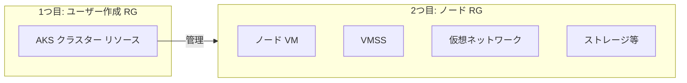

表に、ノード RG の主な属性をまとめます。

| 項目                     | 内容                                                                                                                                                                                    |
| ------------------------ | --------------------------------------------------------------------------------------------------------------------------------------------------------------------------------------- |
| **既定の名前**           | `MC_<リソースグループ名>_<クラスター名>_<リージョン>`（例: `MC_myResourceGroup_myAKSCluster_eastus`）                                                                                   |
| **含まれるリソース**     | ノード用 VM、仮想マシン スケール セット、仮想ネットワーク、ストレージ（マネージド ディスク）など、クラスターに紐づくインフラ一式                                                        |
| **作成・ライフサイクル** | クラスター作成時に AKS が自動作成。**クラスター削除時にノード RG も自動削除**される。クラスターのライフサイクルと一体のリソースだけを格納する想定                                       |
| **カスタム名**           | `az aks create` の `--node-resource-group`（または ARM の `nodeResourceGroup`）で**クラスター作成時のみ**指定可能。既存 RG の流用・作成後の名前変更・他サブスクリプションへの配置は不可 |

**なぜ 2 つのリソース グループに分かれるか**

AKS は仮想マシン スケール セット、VNet、マネージド ディスクなど多くの Azure インフラを利用します。クラスターの「メタデータ」を扱う 1 つ目の RG と、実インフラをまとめるノード RG を分けることで、Azure VM タイプや Azure 予約の割引などをそのまま活用しやすくする構成です。

**運用上の注意**

ノード RG 内のリソースを**直接変更するとクラスターの動作に支障**が出る場合があります。スケールやストレージ・ネットワークの変更は、Kubernetes API や AKS の管理操作経由で行うことが推奨されます。詳細は [AKS と一緒にリソース グループが 2 つ作成されるのはなぜでしょうか?](https://learn.microsoft.com/ja-jp/azure/aks/faq)、[AKS の中心概念](https://learn.microsoft.com/ja-jp/azure/aks/core-aks-concepts)（「ノード リソース グループ」の節）を参照してください。

<a id="12-コントロールプレーンと-kubelet-の実態"></a>

### 1.2 コントロールプレーンと Kubelet の実態

本ドキュメントでは「コントロールプレーン用マネージド ID」「Kubelet 用マネージド ID」という語が出てきます。これらが**何に対して**割り当てられているかを正確に理解するため、**コントロールプレーン**と **Kubelet** の実態を整理します。

#### 用語の明確化（よくある誤解への回答）

| 用語                     | 実態                                                                                                                                                                                                                               | よくある誤解                                                                    |
| ------------------------ | ---------------------------------------------------------------------------------------------------------------------------------------------------------------------------------------------------------------------------------- | ------------------------------------------------------------------------------- |
| **コントロールプレーン** | Azure が管理する **Kubernetes のコントロールプレーン全体**（API サーバー・etcd・スケジューラー・コントローラーマネージャー・クラウドコントローラーマネージャーをひっくるめたもの）。ユーザーは直接触れず、AKS がまとめて運用する。 | ❌ 「API サーバーだけ」ではない。API サーバーはコントロールプレーンの**一部**。 |
| **Kubelet**              | **各ノード（各 VM）上で動作するエージェント（プロセス）**。コントロールプレーンと通信し、そのノード上のコンテナ（Pod）の起動・停止・監視を行う。                                                                                   | ❌ ノードプールや VMSS ではない。**ノード上で動くソフトウェア**。               |
| **ノード**               | 1 台の **Azure VM**。アプリの Pod を動かすワーカーマシン。                                                                                                                                                                         | —                                                                               |
| **ノードプール**         | 同じ構成の **ノードのグループ**。AKS では 1 ノードプールが 1 つの **VMSS（仮想マシン スケール セット）** でバックされる。                                                                                                          | —                                                                               |

**なぜこの区別が重要か**
「コントロールプレーン用 ID」は、**API サーバーをはじめとするコントロールプレーン全体が Azure リソースを操作するとき**に使います。
「Kubelet 用 ID」は、**各ノードで動いている kubelet が**（例: ACR からイメージを pull するときに）使います。kubelet は「ノードプール」そのものではなく、**各ノード内のエージェント**なので、ID は「ノード（VM）に割り当てられ、その VM 上で動く kubelet が利用する」形になります。

---

#### 図解 1：コントロールプレーンの実態

**コントロールプレーン**は、Kubernetes クラスターの「頭脳」にあたる**一連のコンポーネント全体**です。AKS ではこれらすべてを **Azure がマネージド**で運用するため、ユーザーは VM やプロセスを直接見ることはできません。下図は、その内訳と「コントロールプレーン用マネージド ID」がどこで使われるかを示します。

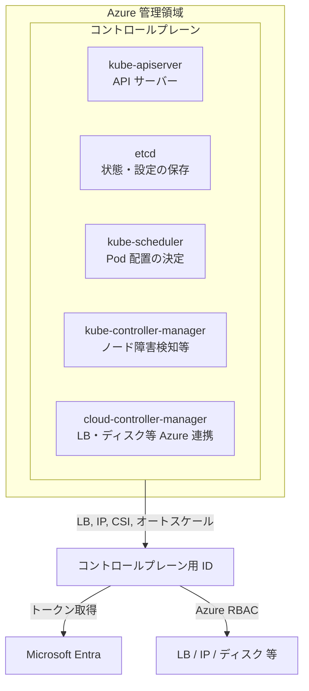

**補足**

- **kube-apiserver** はコントロールプレーンの**一部**です。「コントロールプレーン ≒ API サーバーだけ」ではなく、上記 5 コンポーネント全体を指します。
- 「コントロールプレーン用マネージド ID」は、**このコントロールプレーン全体**が Azure リソース（LB、IP、CSI ドライバー経由のディスクなど）を操作する際に使われます。

---

#### 図解 2：Kubelet の実態とノード・ノードプールの関係

**Kubelet** は、**ノードプールや VMSS のことではなく**、**各ノード（各 VM）の上で動くエージェント**です。ノードプールは「ノードの集まり」、VMSS はその実体である Azure のスケールセット、ノードは 1 台の VM、その VM 内で kubelet が動作します。

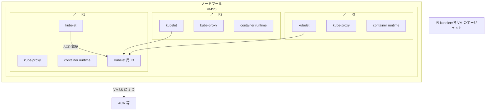

**階層の整理**

| 階層             | 実態                                                           | 備考                                                                                                          |
| ---------------- | -------------------------------------------------------------- | ------------------------------------------------------------------------------------------------------------- |
| **ノードプール** | ノードのグループ                                               | 1 ノードプール ≒ 1 VMSS                                                                                       |
| **VMSS**         | ノードプールを構成する Azure の仮想マシン スケール セット      | ノードの「型」と台数管理                                                                                      |
| **ノード**       | 1 台の Azure VM                                                | ワーカーとして Pod を実行                                                                                     |
| **Kubelet**      | 各ノード（各 VM）上で動作する **エージェント（ソフトウェア）** | コントロールプレーンと通信し、そのノード上のコンテナを管理。ACR 認証などに **Kubelet 用マネージド ID** を使用 |

**Kubelet 用マネージド ID の割り当て**

Kubelet 用のマネージド ID は、**ノードプールをバックする VMSS（あるいはそのノード）に Azure 側で割り当て**られ、その VM 上で動く **kubelet プロセス**が ACR などへアクセスするときに利用します。つまり「ノードプール（VMSS）に ID を付与し、その中の全ノードの kubelet がそれを共用する」形です。

---

<a id="2-事前に作成した-kubelet-マネージド-id"></a>

## 2. 事前に作成した kubelet マネージド ID

kubelet 用に**ユーザー割り当てマネージド ID を事前に作成**しておくことで、クラスター作成直後から ACR などへアクセスする構成にできます。指定しない場合は、AKS が**ノード RG 内**に kubelet 用のユーザー割り当て ID を自動作成します。

2 つのパターンを次の図に示します。

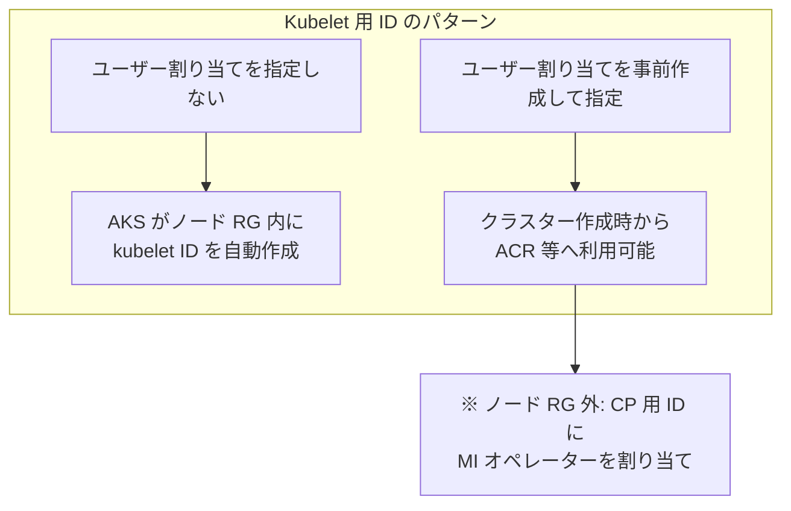

### 2.1 ノード RG 外の kubelet ID の場合のロール割り当て（具体的な指定）

ノード RG の**外**に作成した kubelet 用ユーザー割り当てマネージド ID を使う場合、コントロールプレーンがその ID をノードに紐づけるために、**コントロールプレーンのマネージド ID** に次のロール割り当てが必要です。

| 項目                       | 内容                                                                                                                                                                                                                                                                      |
| -------------------------- | ------------------------------------------------------------------------------------------------------------------------------------------------------------------------------------------------------------------------------------------------------------------------- |
| **ロール名**               | **マネージド ID オペレーター**（Built-in ロール。英: Managed Identity Operator）                                                                                                                                                                                          |
| **割り当て先（assignee）** | **コントロールプレーンのマネージド ID** の principal ID（オブジェクト ID）                                                                                                                                                                                                |
| **スコープ（scope）**      | **kubelet 用ユーザー割り当てマネージド ID のリソース**。つまり、ノード RG 外に作成したそのマネージド ID の **Azure リソース ID**（例: `/subscriptions/<sub>/resourceGroups/<kubelet の RG>/providers/Microsoft.ManagedIdentity/userAssignedIdentities/<kubelet の名前>`） |

**なぜこのロールとスコープか**

マネージド ID オペレーターは「ユーザー割り当て ID の読み取りと割り当て」ができ、`Microsoft.ManagedIdentity/userAssignedIdentities/*/assign/action` を含みます。コントロールプレーンが、ノード RG 外にある kubelet 用 ID を VMSS／ノードに割り当て（利用）するために、**その kubelet ID リソースをスコープに**このロールを付与する必要があります。ノード RG 内の kubelet ID の場合は AKS が自ら管理するため不要です。

**実施方法**

- **Azure CLI でクラスター作成するとき**
  `--assign-kubelet-identity` にノード RG 外の kubelet ID のリソース ID を指定すると、**上記ロール割り当ては Azure CLI が自動作成**します。
- **ARM テンプレートや Terraform など他手段のとき**
  コントロールプレーンの principal ID を assignee、ロール名 `Managed Identity Operator`、スコープに kubelet 用マネージド ID のリソース ID を指定して、手動でロール割り当てを追加してください。

手動で割り当てる場合の `az role assignment create` の例（英ロール名を使用）:

```bash
# コントロールプレーンの principal ID を取得（ユーザー割り当ての例）
CP_PRINCIPAL_ID=$(az aks show --resource-group <RG> --name <AKS 名> \
  --query "identity.userAssignedIdentities.\"<コントロールプレーン ID のリソース ID>\".principalId" -o tsv)

# ロール割り当て: スコープ = kubelet 用マネージド ID のリソース ID
az role assignment create \
  --assignee $CP_PRINCIPAL_ID \
  --role "Managed Identity Operator" \
  --scope "/subscriptions/<sub>/resourceGroups/<kubelet の RG>/providers/Microsoft.ManagedIdentity/userAssignedIdentities/<kubelet の名前>"
```

参照: [AKS のマネージド ID の概要 - 事前に作成された kubelet マネージド ID](https://learn.microsoft.com/ja-jp/azure/aks/managed-identity-overview)、[マネージド ID オペレーター（組み込みロール）](https://learn.microsoft.com/ja-jp/azure/role-based-access-control/built-in-roles#managed-identity-operator)。

---

## 3. AKS で使われるマネージド ID 一覧（概要図）

AKS の組み込みサービス・アドオンが使うマネージド ID を、**種別**と **BYOK 可否**で整理しました。次の図に一覧を示し、詳細はセクション 4 の表を参照してください。

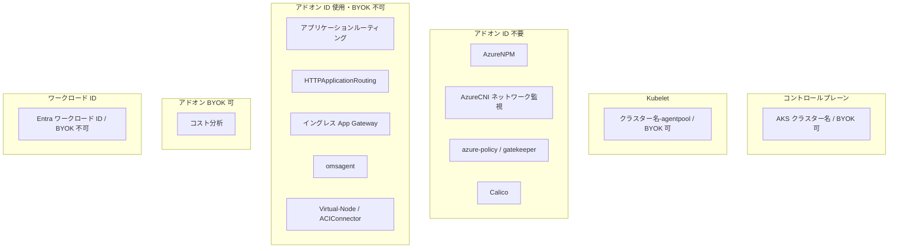

---

## 4. 各 ID の役割と BYOK

### 4.1 コントロールプレーン

利用シーンを次の図に示します。

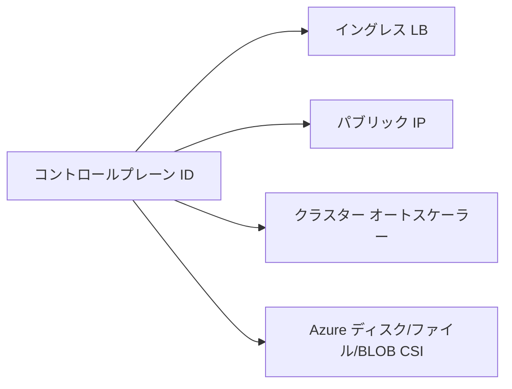

表に、コントロールプレーン ID の詳細をまとめます。

| 項目                     | 内容                                                                                                                                                               |
| ------------------------ | ------------------------------------------------------------------------------------------------------------------------------------------------------------------ |
| **名前**                 | AKS クラスター名                                                                                                                                                   |
| **利用シーン**           | イングレス ロードバランサー、AKS 管理のパブリック IP、クラスター オートスケーラー、Azure ディスク／ファイル／BLOB の CSI ドライバーなど、クラスター リソースの管理 |
| **既定のアクセス許可**   | ノード リソース グループに対する **Contributor（共同作成者）**                                                                                                     |
| **独自の ID を持ち込む** | **可**                                                                                                                                                             |

---

### 4.2 Kubelet

利用シーンを次の図に示します。

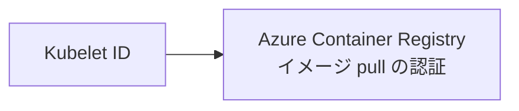

表に、Kubelet ID の詳細をまとめます。

| 項目                     | 内容                                                               |
| ------------------------ | ------------------------------------------------------------------ |
| **名前**                 | AKS クラスター名 - agentpool                                       |
| **利用シーン**           | **Azure Container Registry (ACR)** 認証                            |
| **既定のアクセス許可**   | Kubernetes 1.15 以降は **N/A**（ACR 連携の仕組みが変更されたため） |
| **独自の ID を持ち込む** | **可**                                                             |

---

### 4.3 アドオン（ID 不要）

次のアドオンは**マネージド ID を使いません**。BYOK の対象外です。

| アドオン                  | 備考    |
| ------------------------- | ------- |
| AzureNPM                  | ID 不要 |
| AzureCNI ネットワーク監視 | ID 不要 |
| azure-policy (gatekeeper) | ID 不要 |
| Calico                    | ID 不要 |

---

### 4.4 アドオン（ID 使用・BYOK 不可）

次のアドオンは内部的に ID を使用しますが、**ユーザーが独自の ID を持ち込むことはできません**。

| 観点             | 内容                                                                                                                                                                                                                                                |
| ---------------- | --------------------------------------------------------------------------------------------------------------------------------------------------------------------------------------------------------------------------------------------------- |
| **実態**         | 各アドオン（アプリケーションルーティング、HTTPApplicationRouting、イングレス App GW、omsagent、Virtual-Node）が、**内部的に**マネージド ID またはサービスプリンシパルを使用。AKS がアドオン有効化時に自動作成し、ユーザーは ID を差し替えられない。 |
| **用途**         | 下記のとおり（Key Vault／DNS、ネットワーク、Azure Monitor、ACI など）。                                                                                                                                                                             |
| **必要なロール** | 下表「既定のアクセス許可」。AKS が各アドオンの ID に**自動で**付与する。ユーザーが追加でロールを付与する必要は通常ない。                                                                                                                            |
| **管理**         | **マネージド**。ID の作成・ロール割り当て・ライフサイクルは AKS が行う。ユーザーはアドオンの有効／無効の操作のみ。                                                                                                                                  |

各アドオンとアクセス先の関係を次の図に示します。

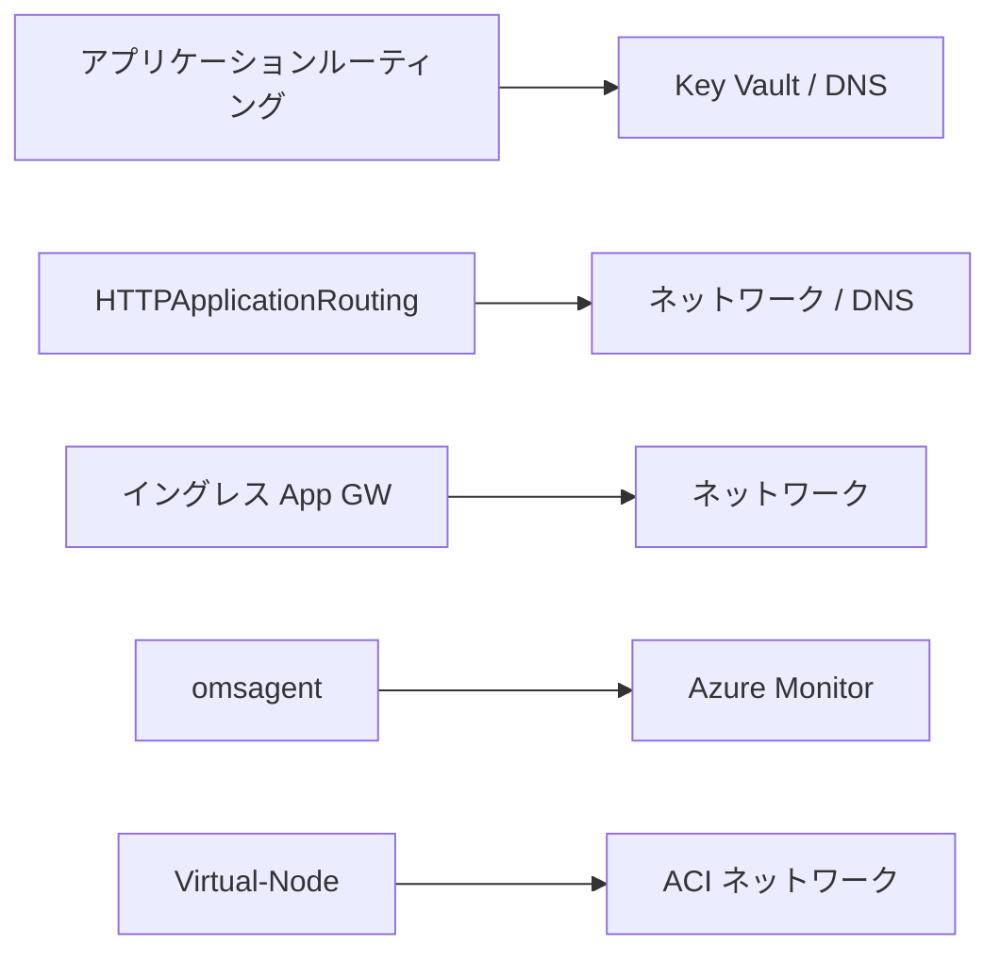

表に、各アドオンの利用シーンと既定のアクセス許可をまとめます。

| アドオン                                    | 利用シーン                                              | 既定のアクセス許可                                                                                                                             |
| ------------------------------------------- | ------------------------------------------------------- | ---------------------------------------------------------------------------------------------------------------------------------------------- |
| **アプリケーションルーティング**            | Azure DNS 証明書、Azure Key Vault 証明書の管理          | Key Vault: キー コンテナ シークレット ユーザー / DNS ゾーン: DNS ゾーン共同作成者 / プライベート DNS ゾーン: プライベート DNS ゾーン共同作成者 |
| **HTTPApplicationRouting**                  | 必要なネットワーク リソースの管理                       | ノード リソース グループ: 閲覧者 / DNS ゾーン: 共同作成者                                                                                      |
| **イングレス アプリケーションゲートウェイ** | 必要なネットワーク リソースの管理                       | ノード リソース グループ: 共同作成者                                                                                                           |
| **omsagent**                                | AKS メトリックを Azure Monitor に送信                   | 監視メトリック パブリッシャー                                                                                                                  |
| **Virtual-Node (ACIConnector)**             | Azure Container Instances 用のネットワーク リソース管理 | ノード リソース グループ: 共同作成者                                                                                                           |

---

### 4.5 アドオン（BYOK 可）

| 観点             | 内容                                                                                                                                                                          |
| ---------------- | ----------------------------------------------------------------------------------------------------------------------------------------------------------------------------- |
| **実態**         | コスト分析アドオンが、**ユーザーが指定したユーザー割り当てマネージド ID** を使って Cost Management にデータを送信。ID を「持込み」できる（BYOK 可）。                         |
| **用途**         | コスト配賦データの収集（Azure Cost Management）。                                                                                                                             |
| **必要なロール** | ユーザーが持込む ID に、**ユーザー自身が** Cost Management 用のロール（例: コスト管理閲覧者、課金データの読み取り など）を付与。AKS が自動付与する既定のロールはない（N/A）。 |
| **管理**         | **ユーザー管理**。持込む ID の作成・ロール割り当てはユーザー。アドオン有効化時に「どの ID を使うか」をユーザーが指定する。                                                    |

| アドオン       | 利用シーン             | 既定のアクセス許可 | 独自の ID を持ち込む |
| -------------- | ---------------------- | ------------------ | -------------------- |
| **コスト分析** | コスト配賦データの収集 | N/A                | **可**               |

---

### 4.6 ワークロード ID

※ コントロールプレーン／Kubelet／アドオンのマネージド ID とは**別の仕組み**です。

ポッドが Azure リソース（Key Vault、Storage など）にアクセスするには、**コントロールプレーン用・Kubelet 用とは別に**、**ユーザー割り当てマネージド ID** をユーザーが作成し、Kubernetes の Service Account と紐づける必要があります。紐づけ手順は [4.6.1](#461-ユーザー割り当てマネージド-id-と-kubernetes-service-account-の紐づけ) を参照してください。

| 観点             | 内容                                                                                                                                                                                                                                                                                                                                                                                                                                                                                  |
| ---------------- | ------------------------------------------------------------------------------------------------------------------------------------------------------------------------------------------------------------------------------------------------------------------------------------------------------------------------------------------------------------------------------------------------------------------------------------------------------------------------------------- |
| **実態**         | マネージド ID やアドオン用 ID とは別物。**Kubernetes の Service Account** と **ユーザー割り当てマネージド ID** を **OIDC フェデレーション**で紐づけ、ポッドが K8s のサービスアカウントトークンを Entra トークンと交換して Azure リソースにアクセスする。AKS で「ワークロード ID を有効化」すると **OIDC 発行者**が有効になり、トークン発行・検証の基盤が用意される（OIDC は有効化後の無効化は非サポート）。ID の実体は **ユーザー割り当てマネージド ID** で、**ユーザーが作成**する。 |
| **用途**         | ポッド内アプリが Key Vault、Storage、Microsoft Graph など **Entra で保護された Azure リソース**に、**シークレットや K8s Secret を使わず**安全にアクセスするため。                                                                                                                                                                                                                                                                                                                     |
| **必要なロール** | ユーザーが、フェデレーション先の **ユーザー割り当てマネージド ID** に、アクセスさせたい Azure リソース用の **Azure RBAC ロール**を付与。最少権限の原則。AKS やワークロード ID が自動付与する既定のロールはない（N/A）。                                                                                                                                                                                                                                                               |
| **管理**         | **ハイブリッド**。（**Azure/AKS がマネージド**）OIDC 発行者、トークン発行、フェデレーション検証、ワークロード ID 用 Webhook（Service Account トークン投影・環境変数注入）。（**ユーザー管理**）ユーザー割り当てマネージド ID の作成、フェデレーション資格情報の追加、K8s の Service Account への注釈、Pod への `azure.workload.identity/use: "true"` ラベル、**Azure RBAC のロール割り当て**。接続の認証には Service Connector の利用も可能。                                         |

#### 4.6.1 ユーザー割り当てマネージド ID と Kubernetes Service Account の紐づけ

ワークロード ID を使うには、**コントロールプレーン用・Kubelet 用とは別の**ユーザー割り当てマネージド ID を用意し、Kubernetes の Service Account と **2 段階**で紐づけます。

**（1）ユーザー割り当てマネージド ID の作成**

```bash
# ユーザー割り当てマネージド ID を新規作成（az identity create）
az identity create \
  --name "<ワークロード用の名前>" \
  --resource-group "<RG>" \
  --location "<リージョン>"

# clientId を取得し環境変数へ（後述の Service Account 注釈とフェデレーション資格情報で使用）
export USER_ASSIGNED_CLIENT_ID="$(az identity show --resource-group "<RG>" --name "<ワークロード用の名前>" --query clientId -o tsv)"
```

**（2）Kubernetes サービスアカウントを作成する**

[Microsoft Learn「Kubernetes サービスアカウントを作成する」](https://learn.microsoft.com/ja-jp/azure/aks/workload-identity-deploy-cluster?tabs=new-cluster#create-a-kubernetes-service-account)に従い、次の 2 ステップで行います。

1. **AKS クラスターに接続**（[`az aks get-credentials`](https://learn.microsoft.com/ja-jp/cli/azure/aks#az-aks-get-credentials)）

   ```bash
   az aks get-credentials --name "<AKS 名>" --resource-group "<RG>"
   ```

2. **サービスアカウントを作成し、マネージド ID の clientId で注釈を付けて `kubectl apply` でマニフェストを適用**

   `azure.workload.identity/client-id` に（1）で取得した **clientId** を指定します。Webhook がこの注釈から「どのマネージド ID のトークンを取得するか」を判断し、環境変数などを注入します。

   ```bash
   # （1）で export した USER_ASSIGNED_CLIENT_ID に加え、SA 名・namespace を設定
   export SERVICE_ACCOUNT_NAME="<SA 名>"
   export SERVICE_ACCOUNT_NAMESPACE="<namespace>"

   cat <<EOF | kubectl apply -f -
   apiVersion: v1
   kind: ServiceAccount
   metadata:
     annotations:
       azure.workload.identity/client-id: "${USER_ASSIGNED_CLIENT_ID}"
     name: "${SERVICE_ACCOUNT_NAME}"
     namespace: "${SERVICE_ACCOUNT_NAMESPACE}"
   EOF
   ```

   成功時は `serviceaccount/<SA 名> created` と表示されます。

**（3）Azure 側：フェデレーション資格情報の追加**

マネージド ID に **フェデレーション資格情報** を追加します。これで「**issuer**（AKS の OIDC 発行者）が一致し、トークンの **subject** が `system:serviceaccount:<namespace>:<SA名>` である K8s の Service Account トークン」を、このマネージド ID の Entra トークンに交換してよい、という信頼関係を Microsoft Entra に登録します。

```bash
# AKS の OIDC 発行者 URL を取得
AKS_OIDC_ISSUER=$(az aks show --resource-group "<RG>" --name "<AKS 名>" \
  --query "oidcIssuerProfile.issuerUrl" -o tsv)

# フェデレーション資格情報を作成
az identity federated-credential create \
  --name "<フェデレーション資格情報の名前>" \
  --identity-name "<ユーザー割り当てマネージド ID の名前>" \
  --resource-group "<RG>" \
  --issuer "${AKS_OIDC_ISSUER}" \
  --subject "system:serviceaccount:<namespace>:<SA名>" \
  --audience "api://AzureADTokenExchange"
```

| パラメータ   | 意味                                                                                                                                                                |
| ------------ | ------------------------------------------------------------------------------------------------------------------------------------------------------------------- |
| `--issuer`   | AKS クラスターの OIDC 発行者 URL。K8s が発行する Service Account トークンの `iss` クレームと一致させる。                                                            |
| `--subject`  | `system:serviceaccount:<namespace>:<ServiceAccount名>`。K8s の SA トークンの `sub` クレームと一致する。この SA のトークンだけがこのマネージド ID に交換可能になる。 |
| `--audience` | `api://AzureADTokenExchange`（ Entra のトークン交換で用いられる固定値）。                                                                                           |

**（4）Pod での利用**

Pod の `spec` に `azure.workload.identity/use: "true"` ラベルと、上記の Service Account を指定します。Webhook がプロジェクションされた Service Account トークンと環境変数（`AZURE_CLIENT_ID` など）を注入し、アプリは Azure Identity の `DefaultAzureCredential` 等で Key Vault などにアクセスできます。

```yaml
metadata:
  labels:
    azure.workload.identity/use: "true"
spec:
  serviceAccountName: "<上記の SA 名>"
  # ...
```

参照: [AKS クラスターでの Microsoft Entra ワークロード ID のデプロイと構成](https://learn.microsoft.com/ja-jp/azure/aks/workload-identity-deploy-cluster)、[az identity federated-credential create](https://learn.microsoft.com/ja-jp/cli/azure/identity/federated-credential#az-identity-federated-credential-create)。

---

次の 2 つの図は、[Microsoft Learn「しくみ」](https://learn.microsoft.com/ja-jp/azure/aks/workload-identity-overview?tabs=dotnet#how-it-works)のワークロード ID セキュリティモデルと OIDC 認証シーケンスを Mermaid で表現したものです。

**図 1：ワークロード ID セキュリティモデル（全体フロー）**

Kubelet が Service Account トークンをポッドに投影し、ワークロードがそれを Microsoft Entra ID に送って Entra トークンに交換し、Azure リソースにアクセスする流れです。Entra ID は OIDC 発行者（AKS クラスター）から公開鍵を取得して SA トークンを検証します。

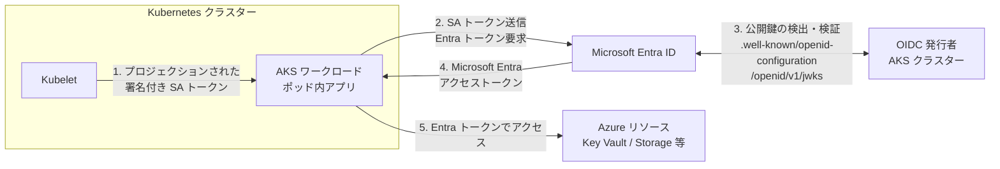

**図 2：OIDC 認証シーケンス（詳細）**

ワークロードが SA トークンを Entra ID に送ってから、Entra ID が OIDC 発行者で署名を検証し、Entra トークンを返すまでの詳細な手順です。

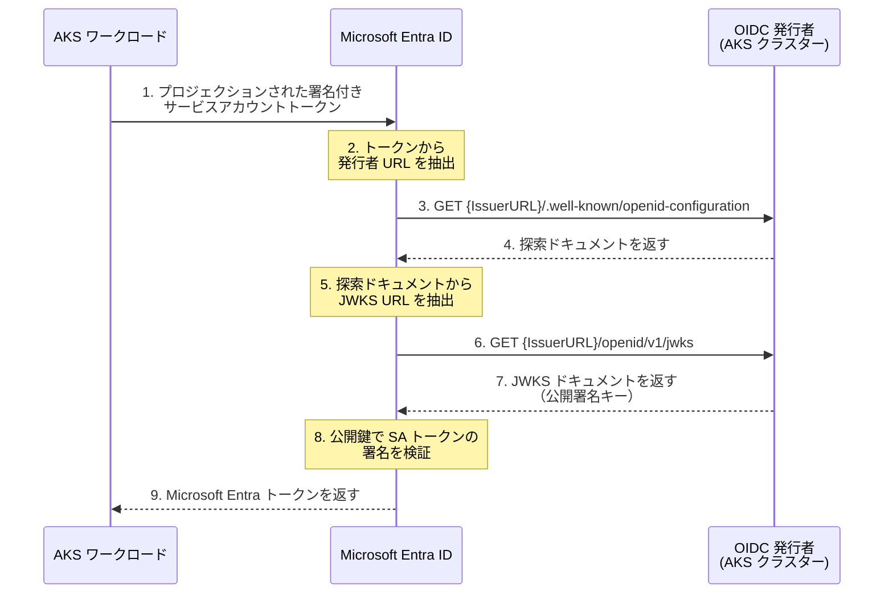

| 項目                     | 内容                                                                                                 |
| ------------------------ | ---------------------------------------------------------------------------------------------------- |
| **名前**                 | Microsoft Entra ワークロード ID                                                                      |
| **利用シーン**           | ポッド内アプリが Microsoft Entra Workload ID でクラウド リソースに安全にアクセスするため             |
| **既定のアクセス許可**   | N/A                                                                                                  |
| **独自の ID を持ち込む** | **不可**（ユーザー割り当てマネージド ID をユーザーが作成し、Kubernetes SA とフェデレーションする形） |

---

## 5. ロール割り当ての考え方

マネージド ID に **Azure RBAC ロール** を割り当てることで、Key Vault、ストレージ、ACR などへのアクセス権を付与します。**スコープは必要な最小限**にすることが推奨されます。

ロールのスコープ（狭いほど安全）を、次の図に示します。

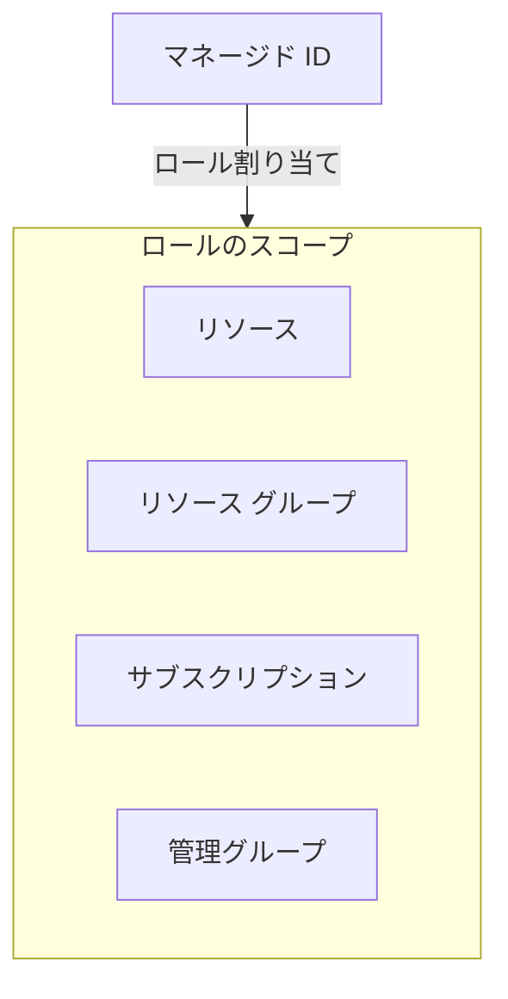

### 5.1 コントロールプレーンのロール割り当て

コントロールプレーンのマネージド ID について、ロール割り当ての注意点は以下のとおりです。

- **Azure CLI でクラスター作成する場合**
  独自 VNet、Azure ディスク、静的 IP、ルート テーブル、または**ノード リソース グループ外**のユーザー割り当て kubelet ID を使うと、必要なロール割り当てが **Azure CLI によって自動で追加**されます。
- **ARM テンプレートなど他手段の場合**
  マネージド ID の **プリンシパル ID** を使って、手動でロール割り当てを行います。
- **システム割り当てを使う場合**
  ID はクラスターと同時に作成されるため、**ロール割り当てはクラスター作成後にしか行えません**。独自 VNet など先行設定が必要な場合は、**コントロールプレーンにユーザー割り当てマネージド ID を使う**と、事前にロールを割り当てられるため設計しやすくなります。

---

## 6. まとめと参照

### 6.1 一覧表（AKS によって使用されるマネージド ID）

| 種別                 | 名前                                    | 利用シーン                                                                              | 既定のアクセス許可                          | 独自の ID を持ち込む                                   |
| -------------------- | --------------------------------------- | --------------------------------------------------------------------------------------- | ------------------------------------------- | ------------------------------------------------------ |
| コントロールプレーン | AKS クラスター名                        | イングレス LB、パブリック IP、オートスケーラー、Azure ディスク／ファイル／BLOB CSI など | ノード リソース グループ: Contributor       | 可                                                     |
| Kubelet              | AKS クラスター名 - agentpool            | ACR 認証                                                                                | 1.15 以降 N/A                               | 可                                                     |
| アドオン             | AzureNPM                                | なし                                                                                    | N/A                                         | 不可                                                   |
| アドオン             | AzureCNI ネットワーク監視               | なし                                                                                    | N/A                                         | 不可                                                   |
| アドオン             | azure-policy (gatekeeper)               | なし                                                                                    | N/A                                         | 不可                                                   |
| アドオン             | Calico                                  | なし                                                                                    | N/A                                         | 不可                                                   |
| アドオン             | アプリケーションルーティング            | Azure DNS / Key Vault 証明書管理                                                        | Key Vault / DNS / プライベート DNS 各ロール | 不可                                                   |
| アドオン             | HTTPApplicationRouting                  | ネットワーク リソース                                                                   | ノード RG: Reader、DNS ゾーン: Contributor  | 不可                                                   |
| アドオン             | イングレス アプリケーションゲートウェイ | ネットワーク リソース                                                                   | ノード リソース グループ: Contributor       | 不可                                                   |
| アドオン             | omsagent                                | Azure Monitor へメトリック送信                                                          | 監視メトリック パブリッシャー               | 不可                                                   |
| アドオン             | Virtual-Node (ACIConnector)             | ACI 用ネットワーク リソース                                                             | ノード リソース グループ: Contributor       | 不可                                                   |
| アドオン             | コスト分析                              | コスト配賦データ収集                                                                    | N/A                                         | 可                                                     |
| ワークロード ID      | Microsoft Entra ワークロード ID         | ポッド内アプリのクラウド リソース アクセス                                              | N/A                                         | ユーザー割り当て MI を作成し K8s SA とフェデレーション |

### 6.2 参照

- [Azure Kubernetes Service (AKS) のマネージド ID の概要](https://learn.microsoft.com/ja-jp/azure/aks/managed-identity-overview)
- [Azure Kubernetes Service (AKS) でマネージド ID を使用する](https://learn.microsoft.com/ja-jp/azure/aks/use-managed-identity)
- [AKS で Microsoft Entra ワークロード ID を使用する](https://learn.microsoft.com/ja-jp/azure/aks/workload-identity-overview)
- [Azure リソースのマネージド ID](https://learn.microsoft.com/ja-jp/entra/identity/managed-identities-azure-resources/)
- [Azure ロールを割り当てる手順](https://learn.microsoft.com/ja-jp/azure/role-based-access-control/role-assignments-steps)
- [Azure RBAC のスコープ](https://learn.microsoft.com/ja-jp/azure/role-based-access-control/scope-overview)
