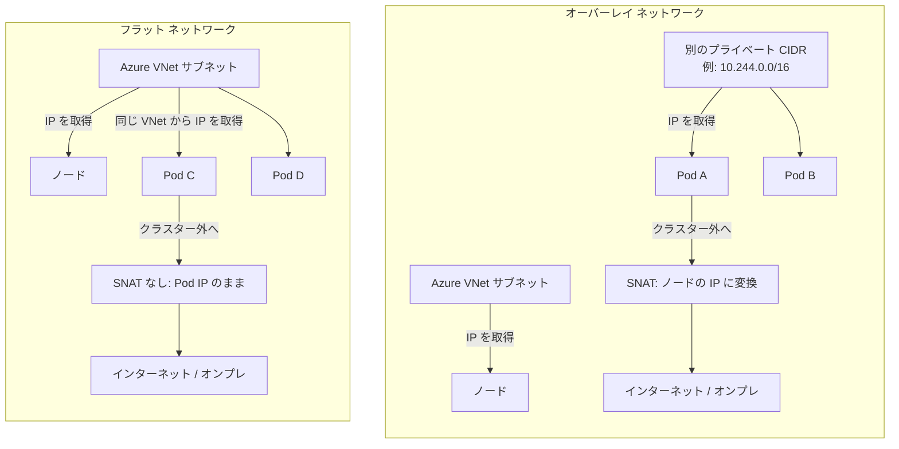
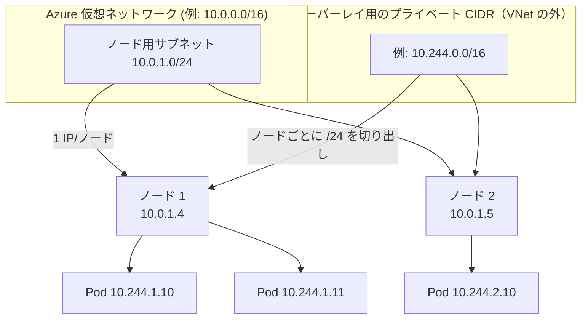
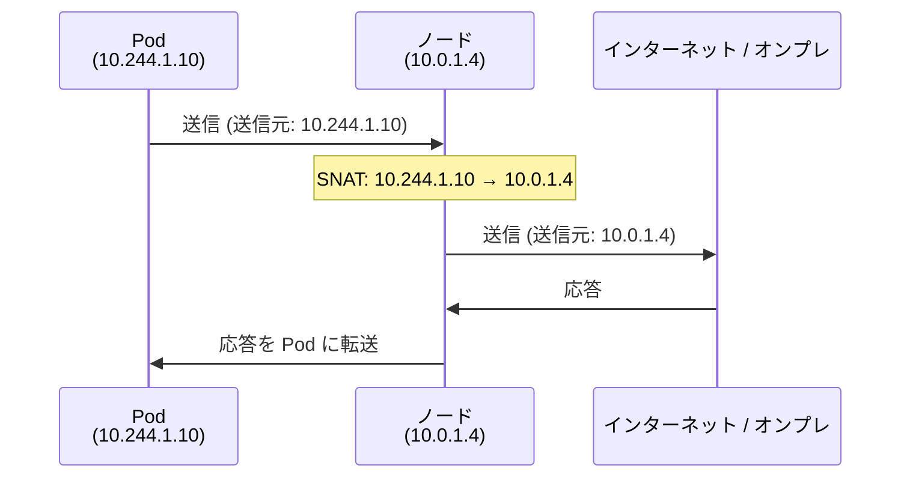
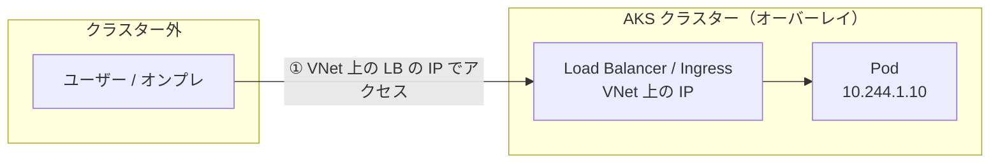
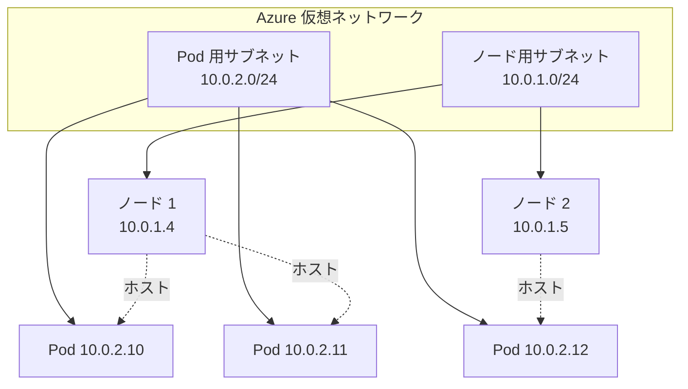
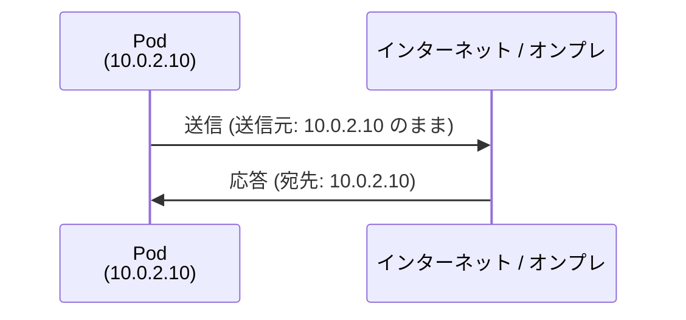
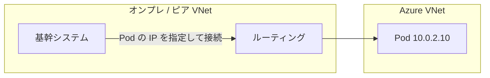
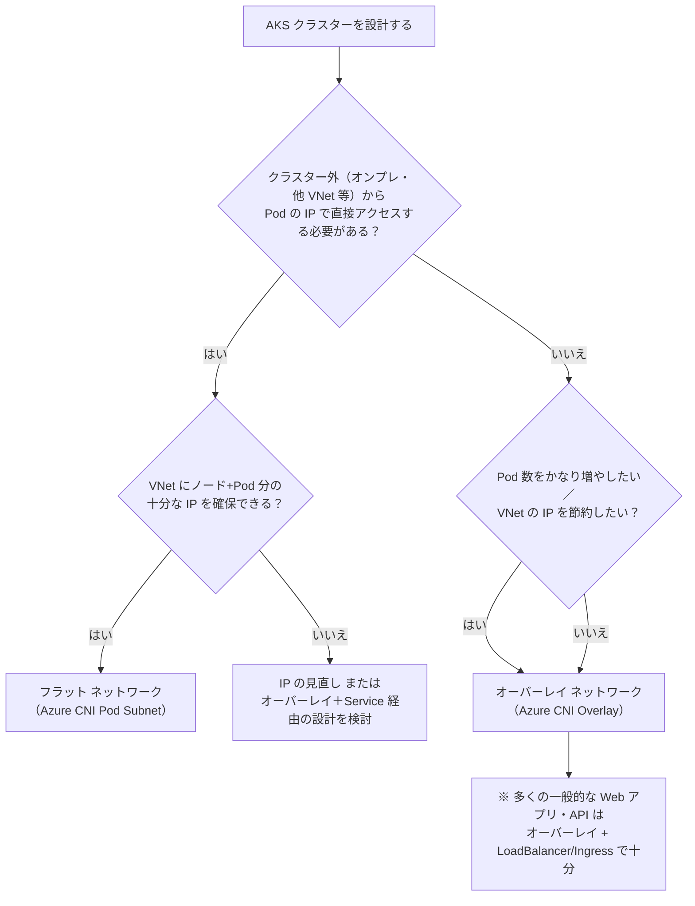

# AKS のネットワークモデル（オーバーレイ vs フラット）

Azure Kubernetes Service (AKS) では、**オーバーレイ ネットワーク**と**フラット ネットワーク**の 2 つのモデルから選択してクラスターを構築します。このドキュメントでは、インフラの基礎知識を前提に、両者の違いを Mermaid 図で視覚的に理解できるようにまとめます。

## 目次

1. [前提知識](#前提知識)
2. [2 つのモデルの全体像](#2-つのモデルの全体像)
3. [オーバーレイ ネットワーク](#3-オーバーレイ-ネットワーク)
4. [フラット ネットワーク](#4-フラット-ネットワーク)
5. [比較表](#5-比較表)
6. [どちらを選ぶか（選定フロー）](#6-どちらを選ぶか選定フロー)
7. [まとめ](#7-まとめ)

---

## 前提知識

AKS のネットワークを理解するために、次の用語を押さえておくと理解しやすくなります。

| 用語                                   | 意味（インフラ視点で）                                                                                                  |
| -------------------------------------- | ----------------------------------------------------------------------------------------------------------------------- |
| **VNet（仮想ネットワーク）**           | Azure 上の論理的なネットワーク。オンプレの「拠点ネットワーク」に近い。サブネットで分割する。                            |
| **サブネット**                         | VNet 内の IP アドレス範囲。例: `10.0.1.0/24`。VM や AKS ノードに IP を割り当てる単位。                                  |
| **Pod（ポッド）**                      | Kubernetes でアプリが動く最小単位。1 つ以上のコンテナのまとまり。**1 つの Pod = 1 つの IP アドレス**を持つ。            |
| **ノード**                             | Kubernetes のワーカーとなる VM。複数の Pod を載せる。VNet のサブネットから 1 つ IP をもらう。                           |
| **CNI（Container Network Interface）** | Pod に IP を割り振り、Pod 間・外部との通信を担う「ネットワーク プラグイン」。AKS では Azure が提供する CNI を利用する。 |
| **SNAT**                               | 送信元 IP を別の IP に書き換えること。例: Pod の IP をノードの IP に変えてクラスター外に送る。                          |

**なぜモデルを選ぶ必要があるか**

- Pod は**数が多く、増減も激しい**。そのすべてに VNet の IP をそのまま割り当てると、**VNet の IP が足りなくなる**ケースがある。
- 一方で、**オンプレや他システムから「Pod の IP を直接指定して」アクセスしたい**要件もあり、その場合は VNet 上の IP が前提になる。
- **オーバーレイ**は「VNet の IP を節約し、大規模化しやすい」モデル、**フラット**は「Pod を VNet 上にそのまま並べ、直接アクセスしやすい」モデル、と考えるとイメージしやすいです。

---

## 2 つのモデルの全体像

次の図は、**ポッドの IP がどこから来るか**と**クラスター外への出方**の違いを模式化したものです。

| 観点                 | オーバーレイ                        | フラット                                   |
| -------------------- | ----------------------------------- | ------------------------------------------ |
| Pod の IP の出所     | **VNet とは別**のプライベート CIDR  | **VNet のサブネット**（ノードと同じ VNet） |
| クラスター外への送信 | **SNAT あり**（ノードの IP になる） | **SNAT なし**（Pod の IP のまま）          |

---

## 3. オーバーレイ ネットワーク

### 3.1 概念図

**ノードだけが VNet のサブネットから IP をもらい、Pod は「VNet と分離した別のアドレス空間」から IP をもらう**構成です。

- **VNet が使う IP**: ノード数ぶんだけ（例: ノード 100 台 → 100 個程度）。
- **Pod の IP**: 10.244.x.x のような**別の CIDR**から割り当て。VNet の 10.0.x.x とは被らない。
- **Pod CIDR の既定値**: Azure CNI オーバーレイでは **`10.244.0.0/16`**。`--pod-cidr` を指定しない場合に使用される。カスタムする場合は `az aks create` の `--pod-cidr` で指定する（[AKS で Azure CNI オーバーレイ ネットワークを構成する](https://learn.microsoft.com/ja-jp/azure/aks/azure-cni-overlay?tabs=kubectl&pivots=aks-cni-overlay-cluster)）。

### 3.2 クラスター外への通信（SNAT）

オーバーレイでは、**クラスターの外へ出るトラフィックの送信元は、ノードの IP に書き換え（SNAT）**されます。

- **なぜ SNAT するか**
  - オーバーレイの Pod の IP（10.244.x.x）は **VNet やオンプレのルーティングには存在しない**。そのまま送ると戻りパケットが届かない。
  - ノードの IP（VNet 上の 10.0.x.x）に変えることで、Azure / オンプレの経路で正しく往復する。

### 3.3 クラスター外から Pod へのアクセス

オーバーレイの **Pod の IP は、クラスター外からは直接ルーティングできません**。外部に公開するには、**Service（LoadBalancer / Ingress 等）** を必ず経由します。

- 外部から見えるのは「Load Balancer や Ingress が持つ VNet 上の IP」だけ。Pod の 10.244.x.x は非公開。

### 3.4 特徴まとめ

| 項目                 | 内容                                                                                  |
| -------------------- | ------------------------------------------------------------------------------------- |
| **Pod の IP の出所** | VNet と分離したプライベート CIDR。**既定値は 10.244.0.0/16**（`--pod-cidr` で変更可） |
| **VNet の IP 消費**  | ノード分のみ。少ない。                                                                |
| **送信（エグレス）** | SNAT によりノードの IP に変換                                                         |
| **外部から Pod へ**  | 不可。Service（LB / Ingress）経由が必須。                                             |
| **スケール**         | 最大 5,000 ノード × 250 Pod/ノード（Azure CNI Overlay の例）                          |
| **推奨 CNI**         | **Azure CNI Overlay**                                                                 |

---

## 4. フラット ネットワーク

### 4.1 概念図

**ノードも Pod も、同じ Azure VNet のサブネット（またはポッド専用サブネット）から IP をもらう**構成です。いわば「VNet 上に Pod がそのまま並ぶ」イメージです。

- ノード用と Pod 用でサブネットを分ける（**Azure CNI Pod Subnet**）構成が一般的。
- いずれにせよ **Pod の IP は VNet のアドレス空間**なので、同じ VNet やピア VNet、VPN/ExpressRoute から直接アクセス可能。

### 4.2 クラスター外への通信（SNAT なし）

フラットでは、**クラスター外への送信でも SNAT されず、送信元は Pod の IP のまま**です。

- **なぜ SNAT しないか**
  - Pod の IP がもともと VNet 上にあるため、Azure やオンプレの経路で 10.0.2.10 宛にルーティングできる。
  - 宛先から見ると「どの Pod から来たか」が IP で分かるため、ファイアウォールやオンプレ側の許可設定と相性が良い。

### 4.3 クラスター外から Pod へのアクセス

**同じ VNet・ピア VNet・VPN/ExpressRoute 上から、Pod のプライベート IP で直接アクセス**できます。

- 例: オンプレの DB クライアントが「10.0.2.10 の 1433 番」のように、Pod の IP を宛先に指定するような構成がしやすい。

### 4.4 特徴まとめ

| 項目                 | 内容                                                      |
| -------------------- | --------------------------------------------------------- |
| **Pod の IP の出所** | VNet のサブネット（ノードと同じ VNet）                    |
| **VNet の IP 消費**  | ノード + Pod 分。大きめのアドレス空間が必要。             |
| **送信（エグレス）** | SNAT なし。Pod の IP のまま。                             |
| **外部から Pod へ**  | 可能。同じ VNet / ピア / VPN / ExpressRoute から直接。    |
| **スケール**         | 利用する CNI による（例: 64,000 IP 制約など）。           |
| **推奨 CNI**         | **Azure CNI Pod Subnet**（レガシ: Azure CNI Node Subnet） |

### 4.5 フラット ネットワークの制限・デメリット

Microsoft のドキュメントでは**一般的な推奨は Azure CNI オーバーレイ**であり、フラットは「Pod の IP を外部から直接使う」要件がはっきりしている場合に検討する、とされています。フラット モデルには次のような制限・デメリットがあります。

#### 共通のデメリット

| 項目                               | 内容                                                                                                                                                                                                                                                                                                                                                                                                                    |
| ---------------------------------- | ----------------------------------------------------------------------------------------------------------------------------------------------------------------------------------------------------------------------------------------------------------------------------------------------------------------------------------------------------------------------------------------------------------------------- |
| **VNet の IP を大量に消費**        | ノードと Pod の両方が VNet のアドレス空間を使う。オーバーレイはノード分のみのため、同じ規模でもフラットのほうが VNet の CIDR を多く使う。                                                                                                                                                                                                                                                                               |
| **大きな連続した VNet 空間が必須** | ノード用・Pod 用のサブネットを事前に確保する必要があり、**断片化のない十分なアドレス空間**が求められる（[IP address planning](https://learn.microsoft.com/ja-jp/azure/aks/concepts-network-ip-address-planning)）。                                                                                                                                                                                                     |
| **IP 設計・運用の複雑さ**          | ノードと Pod の両方のサブネットを委任し、スケールに合わせて適切に設計する必要がある。設計ミスやスケール増で**IP 枯渇**すると、サブネットの CIDR は変更できないため、**より大きなサブネットを作り直してクラスターを再構築する**といった対応になり得る（[InsufficientSubnetSize](https://learn.microsoft.com/ja-jp/troubleshoot/azure/azure-kubernetes/connectivity/insufficientsubnetsize-error-advanced-networking)）。 |

#### CNI オプション別の制限

| フラット モデルのオプション                      | 主な制限・デメリット                                                                                                                                                                                                                                                                                                                                                                                                                                               |
| ------------------------------------------------ | ------------------------------------------------------------------------------------------------------------------------------------------------------------------------------------------------------------------------------------------------------------------------------------------------------------------------------------------------------------------------------------------------------------------------------------------------------------------ |
| **Azure CNI Pod Subnet（動的 IP 割り当て）**     | ・**64,000 IP の上限**。 ・ノード用・Pod 用のサブネット委任とスコープ設計が必要で、**構成・管理の複雑さ**がある（[plan-pod-networking](https://learn.microsoft.com/ja-jp/azure/aks/plan-pod-networking)）。                                                                                                                                                                                                                                                        |
| **Azure CNI Pod Subnet（静的ブロック割り当て）** | ・最大約 100 万 IP までスケール可能だが、**慎重な IP 計画**（他サブネットとの重複回避など）が必要。 ・**IP を効率的に使わないと無駄が大きくなる**。 ・Kubernetes 1.28 以上、最大 /12、新規クラスターまたは別サブネットのノード プール追加に限定、既存からの移行は非サポートなど、**運用上の制約**がある（[Azure CNI Pod Subnet - Static Block](https://learn.microsoft.com/ja-jp/azure/aks/concepts-network-azure-cni-pod-subnet#static-block-allocation-mode)）。 |
| **Azure CNI Node Subnet（レガシ）**              | ・**64,000 IP の上限**。 ・**VNet の IP を非効率に消費**。ノードごとに「最大 Pod 数」ぶんの IP を**事前に確保**するため、実際の Pod 数が少なくても IP は消費される。 ・スケールが限定的で、Application Gateway for Containers は**非サポート**（[CNI 概要](https://learn.microsoft.com/ja-jp/azure/aks/concepts-network-cni-overview)、[レガシ CNI](https://learn.microsoft.com/ja-jp/azure/aks/concepts-network-legacy-cni#azure-cni-node-subnet)）。             |

#### オーバーレイとの比較（制限の観点）

| 観点                     | オーバーレイ                                                           | フラット                                                                                     |
| ------------------------ | ---------------------------------------------------------------------- | -------------------------------------------------------------------------------------------- |
| **スケール上限（目安）** | 5,000 ノード × 250 Pod/ノード                                          | 動的・Node Subnet: 64,000 IP。静的ブロック: 約 100 万 IP まで可も、VNet の大きさと計画次第。 |
| **VNet IP の効率**       | ノード分のみ。同一 VNet 内の複数クラスターで Pod CIDR の再利用が可能。 | ノード＋ Pod で消費。Node Subnet は事前予約で無駄が多くなりやすい。                          |
| **枯渇時の対応**         | Pod CIDR の拡張が可能なケースあり。                                    | サブネットの CIDR は拡張不可。大きいサブネットを作り、ノード プールの付け替え・移行が必要。  |

---

## 5. 比較表

| 観点                                      | オーバーレイ                      | フラット                       |
| ----------------------------------------- | --------------------------------- | ------------------------------ |
| **Pod の IP の割り当て元**                | VNet と分離したプライベート CIDR  | VNet のサブネット              |
| **VNet の IP 使用量**                     | 少ない（ノード分のみ）            | 多い（ノード + Pod）           |
| **送信時の SNAT**                         | あり（ノード IP に変換）          | なし（Pod IP のまま）          |
| **外部から Pod へ直接アクセス**           | 不可（Service 経由が必要）        | 可能                           |
| **スケール（目安）**                      | 5,000 ノード × 250 Pod/ノードなど | 64,000 IP 制約など、構成に依存 |
| **VM・ピア VNet との双方向通信**          | ポッド起点のみ                    | 双方向                         |
| **VPN / ExpressRoute からのオンプレ接続** | ポッド → オンプレのみ             | 双方向                         |
| **推奨 CNI**                              | Azure CNI Overlay                 | Azure CNI Pod Subnet           |

---

## 6. どちらを選ぶか（選定フロー）

次のフローチャートは、要件に応じたモデルの選び方の目安です。

### 選定のポイント（簡潔）

- **オーバーレイ向き**
  - Pod 数が多い／これから大きく伸ばす想定
  - VNet の IP に余裕がない
  - クラスター外からは **Service（LB / Ingress）経由だけで十分**
- **フラット向き**
  - **オンプレや他システムから、Pod の IP を指定して直接接続したい**
  - ファイアウォール等で「送信元 Pod IP」を識別したい
  - VNet に十分な IP を確保できる

---

## 7. まとめ

| モデル           | 一言で                                                 | 典型的な用途                                            |
| ---------------- | ------------------------------------------------------ | ------------------------------------------------------- |
| **オーバーレイ** | VNet の IP を節約し、Pod をたくさん載せやすい          | 一般的な Web / API。外部は LB や Ingress 経由。         |
| **フラット**     | Pod を VNet 上にそのまま置き、直接アクセスしやすくする | オンプレや他 VNet から Pod の IP で直接接続したい場合。 |

- 多くのケースでは **オーバーレイ（Azure CNI Overlay）** が推奨される。
- **「Pod の IP を外部から直接使う」** 要件がはっきりしているときは、**フラット（Azure CNI Pod Subnet）** を検討する。

詳細は次の公式ドキュメントも参照してください。

- [AKS での CNI ネットワークの概要](https://learn.microsoft.com/ja-jp/azure/aks/concepts-network-cni-overview)
- [AKS でのアプリケーションに対するネットワークの概念](https://learn.microsoft.com/ja-jp/azure/aks/concepts-network)
- [Azure CNI オーバーレイの概要](https://learn.microsoft.com/ja-jp/azure/aks/concepts-network-azure-cni-overlay)
- [AKS で Azure CNI オーバーレイ ネットワークを構成する](https://learn.microsoft.com/ja-jp/azure/aks/azure-cni-overlay?tabs=kubectl&pivots=aks-cni-overlay-cluster)（Pod CIDR の既定値・`--pod-cidr` などのパラメータ）
- [AKS のポッド ネットワークを計画する](https://learn.microsoft.com/ja-jp/azure/aks/plan-pod-networking)（フラット モデル各オプションの考慮事項・推奨）
- [AKS クラスターの IP アドレス計画](https://learn.microsoft.com/ja-jp/azure/aks/concepts-network-ip-address-planning)
- [Azure CNI ポッド サブネット](https://learn.microsoft.com/ja-jp/azure/aks/concepts-network-azure-cni-pod-subnet)（動的・静的ブロック割り当ての仕様と制限）
