# AKS ノードプールの設計と作成

Azure Kubernetes Service (AKS) では、同じ構成のノードを**ノードプール**にまとめて管理します。本ドキュメントでは、**システムノードプールとユーザーノードプールの分離**、**テイント・トレラーション**、**設計と作成の手順**のガイドラインを、Mermaid 図を用いて説明します。

## 目次

1. [前提知識](#1-前提知識)
2. [ノードプールの全体像（システム vs ユーザー）](#2-ノードプールの全体像システム-vs-ユーザー)
3. [システムプールとユーザープールを分けるメリット](#3-システムプールとユーザープールを分けるメリット)
4. [テイントとトレラーションの基礎](#4-テイントとトレラーションの基礎)
5. [ノードプールの設計（いつ・どう分けるか）](#5-ノードプールの設計いつどう分けるか)
6. [ノードプールの作成](#6-ノードプールの作成)
7. [Pod のスケジューリング（kubectl apply での使い分け）](#7-pod-のスケジューリングkubectl-apply-での使い分け)
8. [設計・選定フロー](#8-設計選定フロー)
9. [制限事項と注意点](#9-制限事項と注意点)
10. [まとめと参照](#10-まとめと参照)

---

## 1. 前提知識

### 1.1 用語

| 用語                             | 意味                                                                                                                                  |
| -------------------------------- | ------------------------------------------------------------------------------------------------------------------------------------- |
| **ノードプール**                 | 同じ VM サイズ・OS・設定を持つノードのまとまり。AKS では `az aks nodepool add` などで追加・管理する。                                 |
| **システムノードプール**         | CoreDNS、metrics-server、kube-proxy、Azure CNI など、**クラスターの基盤コンポーネント**を載せるためのプール。`mode: System`。         |
| **ユーザーノードプール**         | **アプリケーション（ワークロード）**を載せるためのプール。`mode: User`。                                                              |
| **テイント（Taint）**            | ノードに付ける「**このノードには、条件を満たした Pod だけ載せてよい**」というルール。スケジューラがそれを参照する。                   |
| **トレラーション（Toleration）** | Pod に書く「**自分はそのテイントの条件を満たしている**」という宣言。テイントと対になる。                                              |
| **スケジューラ**                 | Pod を「どのノードに載せるか」を決める Kubernetes のコンポーネント。テイント・トレラーション・nodeSelector・nodeAffinity を考慮する。 |

### 1.2 なぜノードプールを分けるか

- **システムポッド**（CoreDNS など）はクラスターの動作に必須。これらがアプリと同じノードでリソースを取り合うと、**アプリの暴走や設定ミスでクラスター全体が止まる**リスクがある。
- **ユーザープール**は 0 ノードまでスケールダウン可能で、**コスト最適化や Spot の利用**に有利。システム用は常時確保したい。
- 役割ごとに **VM サイズ・台数・テイント** を最適化し、**運用・アップグレードを分離**できる。

---

## 2. ノードプールの全体像（システム vs ユーザー）

### 2.1 役割の違い

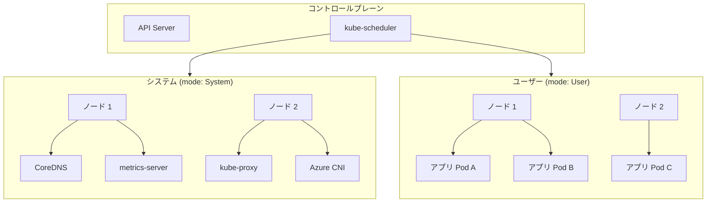

- **システムノードプール**: クラスターの基盤コンポーネント用。AKS は `kubernetes.azure.com/mode: system` を付与し、**システムポッドのスケジューリングを優先**する。専用化する場合は Taint `CriticalAddonsOnly=true:NoSchedule` を付与する。
- **ユーザーノードプール**: アプリ用。`kubernetes.azure.com/mode: user` が付与される。Taint なし、または用途別の Taint を付ける。複数プールを作れば、GPU・Windows・イングレス専用など用途別に分けられる。

### 2.2 クラスター内での構成パターン

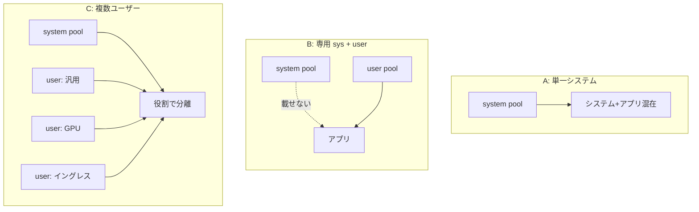

- **パターン A**（開発・小規模）: 1 つのシステムプールにアプリも載せる。本番では**システムプールを 3 ノード以上**推奨。
- **パターン B**（推奨・本番）: システムプールに `CriticalAddonsOnly=true:NoSchedule` を付け、アプリはユーザープールのみ。
- **パターン C**: ユーザーを GPU・Windows・イングレス専用などに分割。テイント・ラベルで制御。

---

## 3. システムプールとユーザープールを分けるメリット

### 3.1 主なメリット

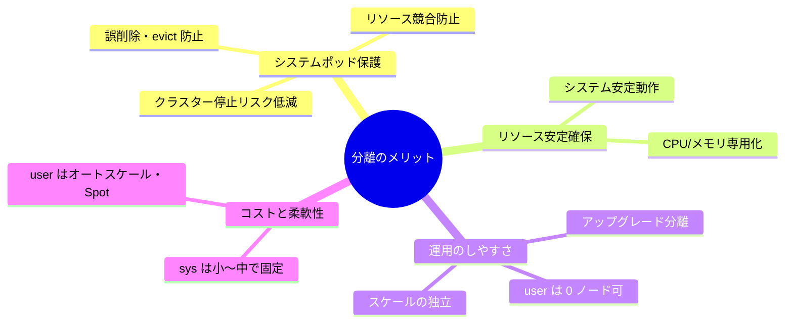

| 観点                     | 内容                                                                                                                                                                                                 |
| ------------------------ | ---------------------------------------------------------------------------------------------------------------------------------------------------------------------------------------------------- |
| **システムポッドの保護** | アプリの設定ミス・暴走で CoreDNS 等が止まったり、リソースを取り合ってクラスターが落ちるのを防ぐ。専用システムプール＋`CriticalAddonsOnly=true:NoSchedule` で、**アプリをシステムノードに載せない**。 |
| **リソースの安定確保**   | システムポッド用の CPU/メモリをシステムプールに確保し、アプリの負荷変動の影響を減らす。                                                                                                              |
| **運用のしやすさ**       | システムプールは 2 ～ 3 ノードで冗長化し、ユーザープールはオートスケール・0 ノード・Spot を組み合わせやすい。                                                                                        |
| **コストと柔軟性**       | システムは小～中 VM を固定、ユーザーは負荷に応じてスケール。開発時はユーザープールを 0 にしてコスト削減できる。                                                                                      |

### 3.2 ベストプラクティス（システムプール）

| 項目               | 推奨                                                                                                                           |
| ------------------ | ------------------------------------------------------------------------------------------------------------------------------ |
| **専用化**         | システムプールに `CriticalAddonsOnly=true:NoSchedule` を付け、アプリを載せない。                                               |
| **ノード数**       | 本番は**少なくとも 3 ノード**。最低 2 ノード（障害・アップグレード耐性）。                                                     |
| **VM サイズ**      | 最小 4 vCPU / 4 GB。大規模では 8 vCPU×3 以上 or 16 vCPU×2 以上（例: Standard_DS4_v2、Standard_D16ds_v5）。B シリーズは非対応。 |
| **オートスケール** | システムプールにもクラスターオートスケーラーを有効にし、min/max を設定。                                                       |

---

## 4. テイントとトレラーションの基礎

### 4.1 イメージ：入店ルール

- **テイント** ＝ ノードに貼る「**このノードには、◯◯ な Pod だけ載せてよい**」という看板。
- **トレラーション** ＝ Pod が持つ「**自分は ◯◯ です**」という宣言。
- **スケジューラ**は「テイントに対応するトレラーションがある Pod だけ、そのノードに載せる」と解釈する。

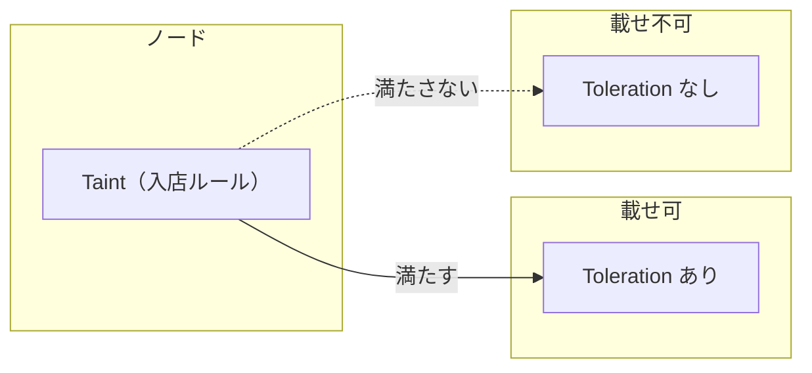

### 4.2 Effect（効果）の 3 種類

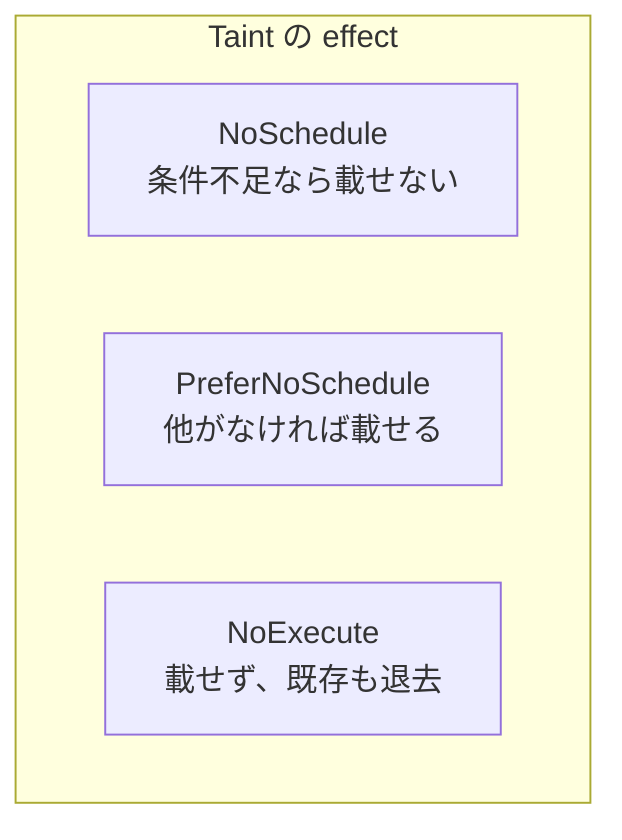

| effect               | 新しい Pod                                       | すでに載っている Pod                   |
| -------------------- | ------------------------------------------------ | -------------------------------------- |
| **NoSchedule**       | Toleration がなければ**載せない**                | そのまま                               |
| **PreferNoSchedule** | 他に良いノードがあれば他へ。なければ載せることも | そのまま                               |
| **NoExecute**        | Toleration がなければ載せない                    | Toleration がなければ**退去（evict）** |

AKS の専用システムプールでは **NoSchedule**（`CriticalAddonsOnly=true:NoSchedule`）が一般的。

### 4.3 スケジューラの判定の流れ（Taint があるノード）

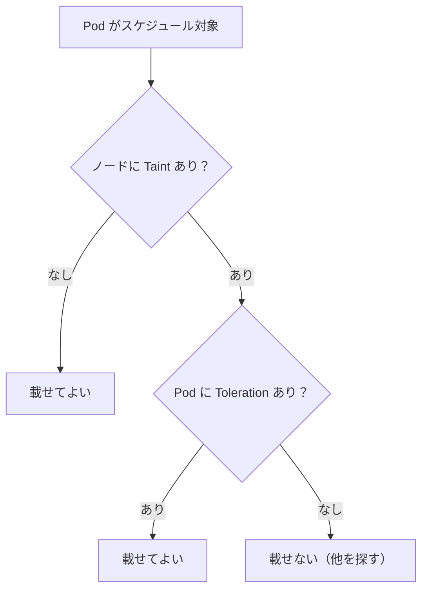

### 4.4 テイント vs nodeSelector / nodeAffinity

| 手段                            | 役割                                                                                            |
| ------------------------------- | ----------------------------------------------------------------------------------------------- |
| **Taints and tolerations**      | **厳格な遮断**。Toleration のない Pod はそのノードに**載らない**。                              |
| **nodeSelector / nodeAffinity** | ラベルに合うノードを**優先または必須**にする。合わない Pod も、**空きがあれば載る**ことがある。 |

- 「**絶対に載せない**」なら **Taint + Toleration**
- 「**できるだけ載せたい／載せたいが、他も許容**」なら **nodeSelector / nodeAffinity**

---

## 5. ノードプールの設計（いつ・どう分けるか）

### 5.1 テイントを活用すべきケース

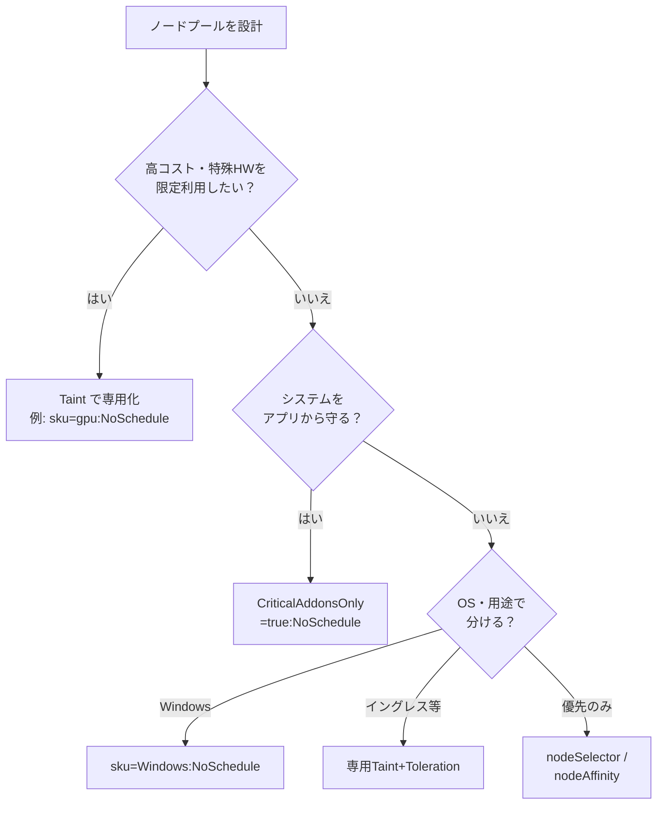

| シナリオ                         | テイント例                           | 目的                                                          |
| -------------------------------- | ------------------------------------ | ------------------------------------------------------------- |
| **GPU ノードの専用化**           | `sku=gpu:NoSchedule`                 | GPU が必要な Pod だけに高価なノードを使わせる。               |
| **専用システムプール**           | `CriticalAddonsOnly=true:NoSchedule` | アプリをシステムノードに載せず、CoreDNS 等を守る。            |
| **Windows ノード**               | `sku=Windows:NoSchedule` など        | Linux 用 Helm チャートが Windows ノードに誤載りするのを防ぐ。 |
| **イングレス・共有リソース専用** | 専用の key=value:effect              | リソースを多く使うコンポーネントを専用ノードに集約。          |

### 5.2 テイントの設計方針

- **ノードプール単位で付ける**: 個々のノードではなく、`az aks nodepool add` / `update` の `--node-taints` で一括設定。ノードプールのプロパティで管理する。
- **分離レベルを段階的に**: 必要に応じて**複数テイントを組み合わせる**（例: Azure ML の amlarc overall + workspace + compute）。要件に合わせて「誰を載せないか」を narrow にする。
- **アプリ開発者と合わせる**: テイントの **key / value / effect** と、それに合わせた **Toleration のルール**を、マニフェストを書く側と事前に共有する。

---

## 6. ノードプールの作成

### 6.1 作成の流れ（概念）

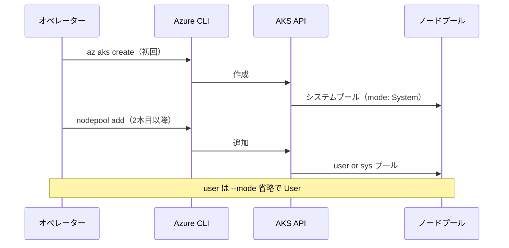

### 6.2 単一ノードプールでクラスターを作成（システムプール 1 つのみ）

初回の `az aks create` で作られる 1 本目のノードプールは、**既定で `mode: System`** になります。

```bash
# リソースグループ
az group create --name my-aks-rg --location eastus

# 単一の Ubuntu システムプール（本番なら --node-count 3 推奨）
az aks create \
  --resource-group my-aks-rg \
  --name my-aks-cluster \
  --vm-set-type VirtualMachineScaleSets \
  --node-count 2 \
  --os-sku Ubuntu \
  --location eastus \
  --load-balancer-sku standard \
  --generate-ssh-keys

# 接続
az aks get-credentials --resource-group my-aks-rg --name my-aks-cluster
```

### 6.3 専用システムノードプールを追加する

既存クラスターに、**アプリを載せない**専用システムプールを追加する例です。`CriticalAddonsOnly=true:NoSchedule` で、Toleration のない通常のアプリ Pod はスケジュールされません。

```bash
az aks nodepool add \
  --resource-group myResourceGroup \
  --cluster-name myAKSCluster \
  --name systempool \
  --node-count 3 \
  --node-taints CriticalAddonsOnly=true:NoSchedule \
  --mode System
```

※ 既存の最初のシステムプールをユーザーに変更するか、このまま 2 系統のシステムプールにするかは、運用方針に合わせて決めます。

### 6.4 ユーザーノードプールを追加する

`--mode` を省略すると **User** になります。ラベルやテイントは用途に応じて追加します。

```bash
# 汎用ユーザープール
az aks nodepool add \
  --resource-group myResourceGroup \
  --cluster-name myAKSCluster \
  --name userpool \
  --node-vm-size Standard_DS2_v2 \
  --node-count 2

# GPU 専用（Taint 付き）
az aks nodepool add \
  --resource-group myResourceGroup \
  --cluster-name myAKSCluster \
  --name gpupool \
  --node-vm-size Standard_NC6s_v3 \
  --node-count 1 \
  --node-taints "sku=gpu:NoSchedule"
```

### 6.5 主なパラメータ

| パラメータ       | 説明                                                                                |
| ---------------- | ----------------------------------------------------------------------------------- |
| `--name`         | ノードプール名。小文字英数字、先頭小文字。Linux 1 ～ 12 文字、Windows 1 ～ 6 文字。 |
| `--node-count`   | ノード数。システムは 1 ～ 1000、ユーザーは 0 ～ 1000。                              |
| `--node-vm-size` | VM SKU。作成後は変更不可。                                                          |
| `--os-type`      | `Linux` または `Windows`。システムプールは **Linux のみ**。                         |
| `--os-sku`       | `Ubuntu`、`AzureLinux`、`Windows2022`、`Windows2025` など。                         |
| `--mode`         | `System` または `User`。省略時は User。                                             |
| `--node-taints`  | 例: `CriticalAddonsOnly=true:NoSchedule`、`sku=gpu:NoSchedule`。                    |
| `--labels`       | 例: `workload=app,env=prod`。Pod の nodeSelector / nodeAffinity で利用。            |

---

## 7. Pod のスケジューリング（kubectl apply での使い分け）

ノードプールを分けても、**`kubectl apply` のコマンドやオプションはそのまま**でよく、**Pod の `spec` に書く nodeSelector / affinity / tolerations** で「どのノードに載せるか」を制御します。適用する YAML を用途ごとに分け、その中身で使い分けます。

### 7.1 全体の対応関係

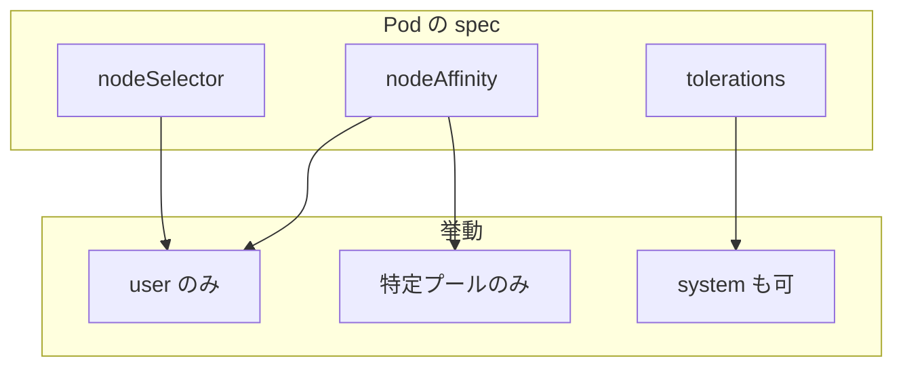

### 7.2 よくあるパターン

#### パターン 1: 何も指定しない（システムプールに Taint あり）

システムプールに `CriticalAddonsOnly=true:NoSchedule` がある場合、**Toleration のないアプリは自動的にユーザープールにのみ**載ります。

```yaml
# 通常のアプリ（tolerations なし）
spec:
  containers:
    - name: app
      image: myapp:latest
  # nodeSelector / affinity / tolerations を書かない
```

→ `kubectl apply -f app.yaml` で、ユーザープールにスケジュールされる。

#### パターン 2: ユーザープールに明示（nodeSelector）

```yaml
spec:
  nodeSelector:
    kubernetes.azure.com/mode: user
  containers:
    - name: app
      image: myapp:latest
```

#### パターン 3: 特定のユーザープール（ラベルで分けている場合）

ノードプール作成時に `--labels workload=app` などを付けておき、Pod で指定します。

```yaml
spec:
  nodeSelector:
    workload: app
  containers:
    - name: app
      image: myapp:latest
```

#### パターン 4: GPU など Taint 付きノードに載せる（Toleration）

```yaml
spec:
  tolerations:
    - key: "sku"
      operator: "Equal"
      value: "gpu"
      effect: "NoSchedule"
  containers:
    - name: train
      image: myai:latest
      resources:
        limits:
          nvidia.com/gpu: 1
```

#### パターン 5: システムプールにも載せたい（独自の重要コンポーネント）

```yaml
spec:
  tolerations:
    - key: CriticalAddonsOnly
      operator: Exists
      effect: NoSchedule
  nodeSelector:
    kubernetes.azure.com/mode: system
  containers:
    - name: my-critical-addon
      image: my-addon:latest
```

### 7.3 使い分けの整理

| 載せたい場所                      | マニフェストに書くもの                                                                          | kubectl apply のしかた          |
| --------------------------------- | ----------------------------------------------------------------------------------------------- | ------------------------------- |
| ユーザープール全般                | 何も書かない（系統に Taint あれば自動で user のみ）                                             | `kubectl apply -f app.yaml`     |
| ユーザーに明示                    | `nodeSelector: kubernetes.azure.com/mode: user` や `nodeAffinity`                               | 同上                            |
| 特定ユーザープール（例: apppool） | `nodeSelector: workload=app` など                                                               | 同上                            |
| GPU など Taint 付き               | `tolerations`（当該 Taint 用）                                                                  | `kubectl apply -f gpu-job.yaml` |
| システムプールにも                | `tolerations`（CriticalAddonsOnly）＋必要なら `nodeSelector: kubernetes.azure.com/mode: system` | `kubectl apply -f addon.yaml`   |

### 7.4 ノードのラベル・テイントの確認

どのノードにどのラベル・テイントが付いているかは、`kubectl` で確認できます。

```bash
# ノード一覧とラベル
kubectl get nodes --show-labels

# ノードの Taint や詳細（ノード名は上記で確認）
kubectl describe node <ノード名>
```

---

## 8. 設計・選定フロー

### 8.1 ノードプール構成の選定

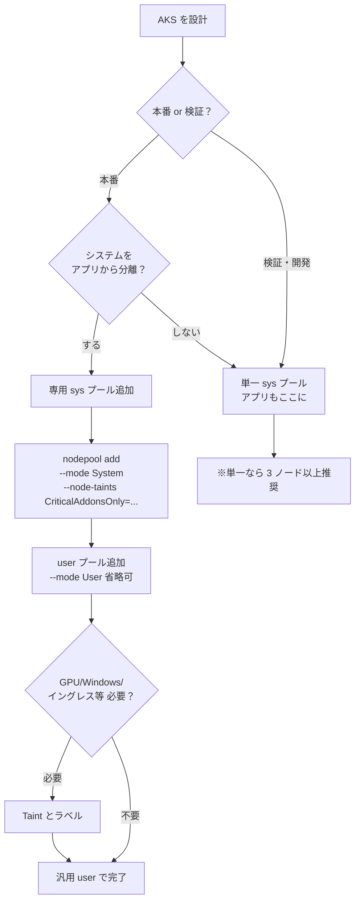

### 8.2 テイントを付けるかどうかの選定

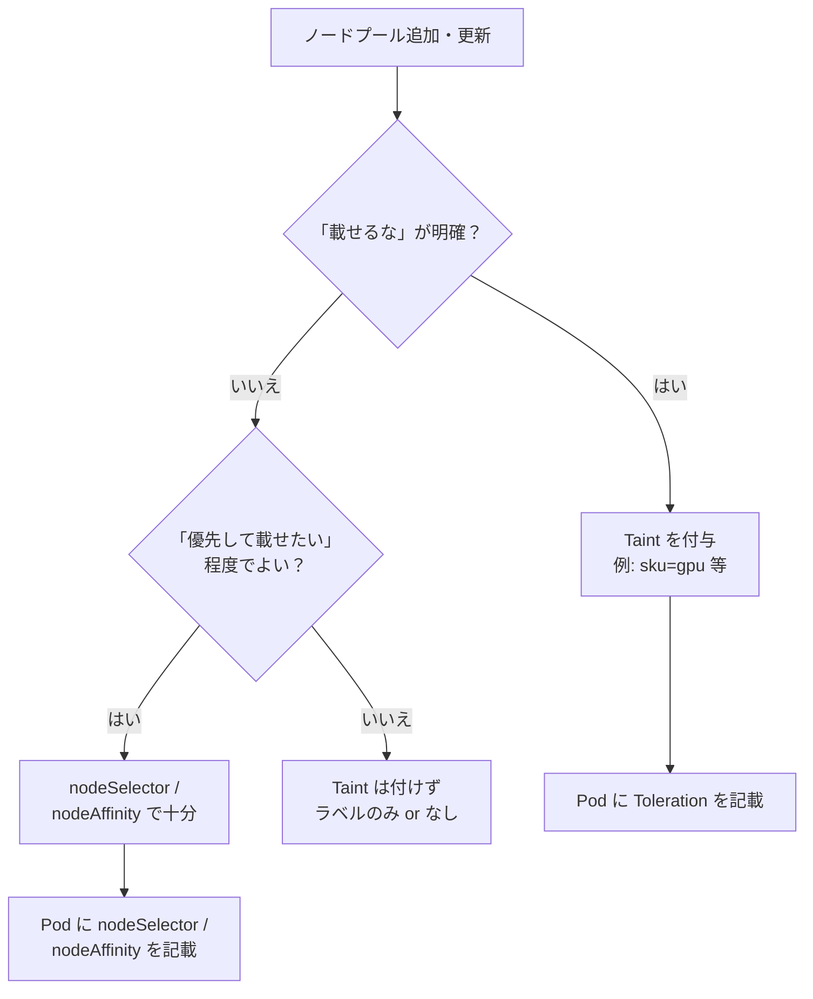

---

## 9. 制限事項と注意点

### 9.1 ノードプール全般

| 項目                      | 内容                                                                                               |
| ------------------------- | -------------------------------------------------------------------------------------------------- |
| **VM サイズ**             | 作成後は**変更不可**。変える場合は新規ノードプールを作り、ワークロードを移してから旧プールを削除。 |
| **複数ノードプール**      | **Standard SKU ロードバランサー**必須。Basic は非対応。                                            |
| **VNet**                  | 全ノードプールは**同一 VNet**。                                                                    |
| **Kubernetes バージョン** | 作成時はコントロールプレーンと揃える。作成後のアップグレードはノードプール単位で可能。             |

### 9.2 システムノードプール

| 項目           | 内容                                                    |
| -------------- | ------------------------------------------------------- |
| **OS**         | **Linux のみ**。Windows はユーザーのみ。                |
| **ノード数**   | 最低 **2**。本番は **3 以上**推奨。                     |
| **削除**       | **別のシステムプールが 1 本以上あるときだけ**削除可能。 |
| **B シリーズ** | システムノードプールでは**非対応**。                    |

### 9.3 テイント・トレラーション

| 項目                          | 内容                                                                                                                                                   |
| ----------------------------- | ------------------------------------------------------------------------------------------------------------------------------------------------------ |
| **設定の単位**                | **ノードプール単位**で `--node-taints` を推奨。個々のノードを `kubectl taint` でいじると、AKS のノードプール API と不整合になり得る。                  |
| **AKS API と Kubernetes API** | AKS ノードプール API で付けた Taint は、**Kubernetes API からは変更しない**。                                                                          |
| **スケール・アップグレード**  | VMSS 利用時、**アップグレードで増えたノードには AKS が Taint を引き継ぐ**。スケール時の挙動はノードプールの Taint 設定に依存するため、運用で確認する。 |

---

## 10. まとめと参照

### 10.1 まとめ

| トピック                | 要点                                                                                                                                          |
| ----------------------- | --------------------------------------------------------------------------------------------------------------------------------------------- |
| **システム / ユーザー** | システム＝基盤コンポーネント、ユーザー＝アプリ。分離すると保護・安定・運用・コスト面で有利。                                                  |
| **専用システムプール**  | `CriticalAddonsOnly=true:NoSchedule` でアプリを載せず、本番は 3 ノード以上推奨。                                                              |
| **テイント**            | 「載せてよい Pod」を制限するノード側のルール。厳格に分けたいときに使う。                                                                      |
| **トレラーション**      | その Taint を「受け入れてよい」と宣言する Pod 側の設定。                                                                                      |
| **kubectl apply**       | コマンドはそのまま。**YAML の nodeSelector / nodeAffinity / tolerations** で、どのノードプールに載せるかを決める。                            |
| **設計**                | テイントは**ノードプール単位**。用途（GPU・Windows・システム・共有リソース）に応じて Taint を設計し、開発者と Toleration のルールを共有する。 |

### 10.2 特殊なノードプール（Microsoft Learn）

次のような専用ノードプールは、別記事で手順が説明されています。

- [Azure スポット ノードプールを AKS クラスターに追加する](https://learn.microsoft.com/ja-jp/azure/aks/spot-node-pool)
- [仮想マシン ノードプールを AKS クラスターに追加する](https://learn.microsoft.com/ja-jp/azure/aks/use-multiple-vm-sizes)
- [AKS クラスターに専用システムノードプールを追加する](https://learn.microsoft.com/ja-jp/azure/aks/use-system-pools)
- [AKS ノードプールで FIPS を有効にする](https://learn.microsoft.com/ja-jp/azure/aks/enable-fips-nodes)
- [AKS クラスターに機密 VM (CVM) を含むノードプールを追加する](https://learn.microsoft.com/ja-jp/azure/aks/use-cvm)
- [AKS で一意のサブネットを持つノードプールを作成する](https://learn.microsoft.com/ja-jp/azure/aks/node-pool-unique-subnet)
- [第 2 世代 VM ノードプールを AKS クラスターに追加する](https://learn.microsoft.com/ja-jp/azure/aks/use-gen2-vms)
- [アーティファクト ストリーミングを含むノードプールを AKS クラスターに追加する](https://learn.microsoft.com/ja-jp/azure/aks/artifact-streaming-node-pool)
- [Windows Server コンテナを AKS で作成する](https://learn.microsoft.com/ja-jp/azure/aks/windows-container-cli)

### 10.3 参照

- [AKS でノードプールを作成する](https://learn.microsoft.com/ja-jp/azure/aks/create-node-pools?tabs=ubuntu%2Cws2025%2Cubuntu-arm%2Cws2025-arm&pivots=azure-cli)
- [AKS でシステムノードプールを管理する](https://learn.microsoft.com/ja-jp/azure/aks/use-system-pools?tabs=azure-cli#add-a-dedicated-system-node-pool-to-an-existing-aks-cluster)
- [AKS クラスターでノードテイントを使用する](https://learn.microsoft.com/ja-jp/azure/aks/use-node-taints)
- [AKS スケジューラの高度な機能のベストプラクティス](https://learn.microsoft.com/en-us/azure/aks/operator-best-practices-advanced-scheduler)（テイントとトレラーションで専用ノードを提供する）
- [Kubernetes: Taints and Tolerations - Example Use Cases](https://kubernetes.io/docs/concepts/scheduling-eviction/taint-and-toleration/#example-use-cases)
