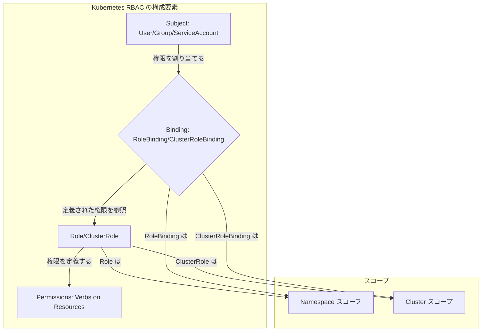
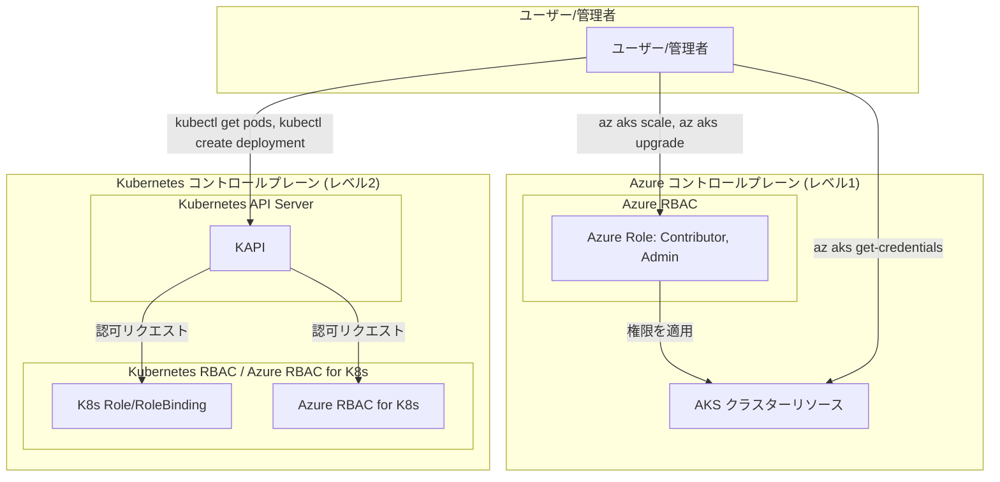
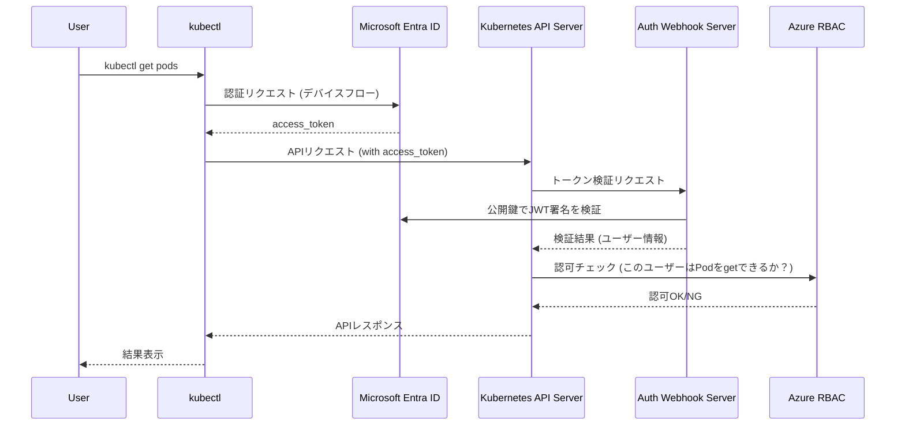

# AKS における Microsoft Entra 統合と Kubernetes RBAC

AKS のアクセス制御には「Kubernetes RBAC のみ」と「Azure RBAC 統合」の 2 つの方式がある。本ドキュメントでは両者の仕組み・違い・使い分けを整理し、実装手順とベストプラクティスをまとめる。

## 目次

1. [Kubernetes RBAC の基礎](#1-kubernetes-rbac-の基礎)
2. [AKS における 2 層のアクセス制御](#2-aks-における-2-層のアクセス制御)
3. [Azure RBAC for Kubernetes 認可の統合](#3-azure-rbac-for-kubernetes-認可の統合)
4. [従来の Kubernetes RBAC との比較](#4-従来の-kubernetes-rbac-との比較)
5. [実装ガイド](#5-実装ガイド)
6. [ベストプラクティス](#6-ベストプラクティス)
7. [まとめ](#7-まとめ)
8. [参考資料](#8-参考資料)

---

## 1. Kubernetes RBAC の基礎

RBAC は **「誰が (Subject)、何に対して (Resource)、何をできるか (Verb)」** という権限モデルでクラスター内のリソースアクセスを制御する仕組み。

### 1.1 RBAC の基本構造

Kubernetes RBAC は 4 つの API オブジェクトを組み合わせて権限を定義・割り当てる。



- **Role** が「何をできるか」という権限セットを定義
- **RoleBinding** がその権限を「誰に」割り当てるかを決定

ClusterRole / ClusterRoleBinding はクラスター全体スコープ版 [1]。

### 1.2 4 つの主要オブジェクト

#### Role（ロール）

特定の **Namespace 内** で有効な権限セットを定義する。

```yaml
apiVersion: rbac.authorization.k8s.io/v1
kind: Role
metadata:
  namespace: default
  name: pod-reader
rules:
  - apiGroups: [""] # "" はコア API グループ
    resources: ["pods"]
    verbs: ["get", "watch", "list"]
```

#### ClusterRole（クラスターロール）

**クラスター全体** に及ぶ権限セットを定義する。Namespace に属さないリソース（Node など）や全 Namespace 横断のアクセス、非リソースエンドポイント（`/healthz` など）の許可に使用 [1]。

#### RoleBinding（ロールバインディング）

特定の Namespace 内で、Role または ClusterRole を Subject に割り当てる。ClusterRole を参照した場合でも、権限は RoleBinding が存在する Namespace 内のみに限定される。

```yaml
apiVersion: rbac.authorization.k8s.io/v1
kind: RoleBinding
metadata:
  name: read-pods
  namespace: default
subjects:
  - kind: User
    name: jane
    apiGroup: rbac.authorization.k8s.io
roleRef:
  kind: Role
  name: pod-reader
  apiGroup: rbac.authorization.k8s.io
```

> ClusterRole を RoleBinding で参照すると、共通の権限セットを各 Namespace で再利用できる。

#### ClusterRoleBinding（クラスターロールバインディング）

ClusterRole をクラスター全体のスコープで Subject に割り当てる。クラスター管理者など、全 Namespace にわたる強力な権限が必要なユーザー向け。

### 1.3 権限モデルと動作原理

Kubernetes RBAC は **許可的（additive）モデル** を採用している。

- デフォルトで全操作が **拒否**
- Role / ClusterRole で明示的に許可した操作のみ実行可能
- **deny ルールは存在しない**（権限は付与のみ）[2]

#### Subject（主体）の種類

| Subject            | 説明                                                                   |
| ------------------ | ---------------------------------------------------------------------- |
| **User**           | クラスター外部で管理される人間またはプロセスのアカウント               |
| **Group**          | ユーザーの集合。認証プロキシなど外部の仕組みから提供される             |
| **ServiceAccount** | Kubernetes API で管理。Pod 内プロセスが API サーバーと通信する際に使用 |

#### Verb（操作）の種類

| Verb               | 説明                         |
| ------------------ | ---------------------------- |
| `get`              | 単一リソースの取得           |
| `list`             | 複数リソースの一覧表示       |
| `watch`            | リソース変更の監視           |
| `create`           | 新規リソースの作成           |
| `update`           | 既存リソースの更新           |
| `patch`            | リソースの部分更新           |
| `delete`           | リソースの削除               |
| `deletecollection` | コレクション内全リソース削除 |

---

## 2. AKS における 2 層のアクセス制御

AKS のアクセス制御は **2 つの異なるレベル** で機能する [3]。

| レベル | 制御対象                            | 仕組み                     |
| ------ | ----------------------------------- | -------------------------- |
| 1      | Azure リソース（クラスター自体）    | Azure RBAC                 |
| 2      | Kubernetes API（Pod, Service など） | K8s RBAC / Azure RBAC 統合 |



### 2.1 レベル 1: Azure リソースへのアクセス

AKS クラスター自体を Azure リソースとして管理するためのアクセス制御。

- **制御対象**: クラスターのスケール、アップグレード、ノードプール管理、`kubeconfig` の取得
- **仕組み**: Azure RBAC
- **管理方法**: Azure Portal / Azure CLI / Azure PowerShell でロール（例: `Azure Kubernetes Service Contributor`）を割り当て

### 2.2 レベル 2: Kubernetes API へのアクセス

クラスター内部のリソース（Pod, Service, Deployment, Secret など）に対する操作の制御。

- **従来方式**: Kubernetes RBAC のみ（YAML マニフェストで個別管理）
- **統合方式**: Azure RBAC for Kubernetes 認可（Microsoft Entra ID と統合し一元管理）

---

## 3. Azure RBAC for Kubernetes 認可の統合

Azure RBAC for Kubernetes 認可は、レベル 2 のアクセス制御を Azure RBAC と Microsoft Entra ID に統合する機能。Azure リソースと Kubernetes リソースのアクセス許可を統一的に管理できる [4]。

### 3.1 動作フロー

統合の核心は、AKS クラスターにデプロイされる **認可 Webhook サーバー**。



> **ポイント**: Microsoft Entra ID に存在する ID → Azure RBAC が認可を判断。Kubernetes ServiceAccount など Entra 外の ID → 従来の K8s RBAC が判断。既存の K8s RBAC を **置き換えるのではなく拡張・共存** する仕組み [3]。

### 3.2 統合のメリット

| メリット                   | 内容                                                                                     |
| -------------------------- | ---------------------------------------------------------------------------------------- |
| **一元的な ID 管理**       | Microsoft Entra ID を単一の ID ソースとして利用。オンプレミス AD との連携も可能          |
| **統合されたアクセス制御** | Azure リソースと K8s リソースの権限を Azure Portal / CLI で一元管理                      |
| **スケーラブルな割り当て** | 管理グループ・サブスクリプション・リソースグループなど広範なスコープでロール割り当て可能 |
| **高度なセキュリティ**     | 条件付きアクセスや MFA を K8s クラスターにも適用可能                                     |
| **監査の簡素化**           | 全認可決定が Azure アクティビティログに記録され、監査証跡の追跡が容易                    |

---

## 4. 従来の Kubernetes RBAC との比較

5 つの観点から両者を比較する。

### 4.1 管理の複雑さとツール

| 比較項目       | 従来の Kubernetes RBAC                         | Azure RBAC 統合                                        |
| -------------- | ---------------------------------------------- | ------------------------------------------------------ |
| **管理単位**   | `Role`, `RoleBinding` の YAML ファイル         | Azure ロール定義・ロール割り当て                       |
| **管理ツール** | `kubectl apply -f <file.yaml>`                 | Azure Portal / Azure CLI (`az role assignment create`) |
| **一貫性**     | 各クラスター・Namespace で個別管理。維持が困難 | Azure Policy と組み合わせ、組織全体に一貫適用可能      |
| **学習コスト** | K8s RBAC オブジェクトと `kubectl` の習熟が必要 | Azure IAM/RBAC の知識を流用可能                        |

クラスターや Namespace の増加に伴い、YAML マニフェスト数が爆発的に増加する問題 [5] を Azure RBAC 統合は解消する。

### 4.2 スコープとスケーラビリティ

**従来の Kubernetes RBAC**:

- スコープは Namespace またはクラスターに限定
- 複数クラスターにまたがる共通ポリシーは各クラスターで個別に作成が必要

**Azure RBAC 統合**:

- Azure の階層構造（リソースグループ → サブスクリプション → 管理グループ）を活用
- 一度のロール割り当てで複数クラスター・将来作成されるクラスターにも自動適用

### 4.3 ID 管理

**従来の Kubernetes RBAC**:

- Kubernetes 自体はユーザー情報を保持しない
- ユーザー管理はクラスター外部に依存し、管理が分散しがち

**Azure RBAC 統合**:

- Microsoft Entra ID を ID 管理基盤として全面活用
- **SSO**: 組織アカウントで `kubectl` にアクセス
- **グループベースの制御**: Entra セキュリティグループを Subject に直接指定
- **ライフサイクル管理**: 入社・退職時に Entra ID 更新のみで AKS アクセス権も連動

### 4.4 監査とコンプライアンス

**従来の Kubernetes RBAC**:

- K8s 監査ログを有効化し、別途ログ収集基盤（Fluentd, Elasticsearch など）の構築が必要
- クラスターごとに独立したログのため横断的な追跡が困難

**Azure RBAC 統合**:

- 全認可アクティビティが **Azure Monitor のアクティビティログ** に統合
- 他の Azure リソースと合わせて一元的に監視・分析・アラート設定が可能

---

## 5. 実装ガイド

### 5.1 前提条件

| 要件                 | バージョン / 条件                             |
| -------------------- | --------------------------------------------- |
| Azure CLI            | `2.24.0` 以降                                 |
| kubectl              | `1.18.3` 以降                                 |
| Microsoft Entra 統合 | 対象 AKS クラスターで有効化済みであること [4] |

### 5.2 Azure RBAC for Kubernetes 認可の有効化

**新規クラスター作成時:**

```bash
az aks create \
    --resource-group myResourceGroup \
    --name myAKSCluster \
    --enable-aad \
    --enable-azure-rbac
```

**既存クラスターの更新時:**

```bash
az aks update \
    --resource-group myResourceGroup \
    --name myAKSCluster \
    --enable-azure-rbac
```

### 5.3 ロールの割り当て

AKS クラスターのリソース ID をスコープとして指定し、ロールを割り当てる。

```bash
# AKS クラスターのリソース ID を取得
AKS_ID=$(az aks show \
    --resource-group myResourceGroup \
    --name myAKSCluster \
    --query id -o tsv)

# ロールを割り当て
az role assignment create \
    --role "Azure Kubernetes Service RBAC Reader" \
    --assignee user@example.com \
    --scope $AKS_ID
```

AKS 用の組み込みロール:

| ロール名                                    | 権限概要                       |
| ------------------------------------------- | ------------------------------ |
| Azure Kubernetes Service RBAC Reader        | 読み取り専用アクセス           |
| Azure Kubernetes Service RBAC Writer        | 読み書きアクセス               |
| Azure Kubernetes Service RBAC Admin         | 管理者アクセス（Namespace 内） |
| Azure Kubernetes Service RBAC Cluster Admin | クラスター全体の管理者         |

### 5.4 kubectl での使用

```bash
# kubeconfig の取得（--admin フラグは付けない）
az aks get-credentials --resource-group myResourceGroup --name myAKSCluster
```

`kubectl get pods` などの実行時にブラウザが起動し、Microsoft Entra ID へのサインインが求められる。認証成功後、割り当てロールの権限範囲内でコマンドが実行される。

---

## 6. ベストプラクティス

| プラクティス             | 詳細                                                                                               |
| ------------------------ | -------------------------------------------------------------------------------------------------- |
| **最小権限の原則**       | `Cluster Admin` の使用は慎重に。可能な限り `Reader` や `Writer` を使用する                         |
| **Entra グループの活用** | 個人ではなく職務・役割ベースのセキュリティグループにロールを割り当て、メンバーシップ管理に集約する |
| **Azure Policy の利用**  | 「Azure RBAC 統合を全 AKS クラスターに強制」「特定ロール割り当ての禁止」等のガードレールを設ける   |
| **定期的な権限レビュー** | Microsoft Entra のアクセスレビュー機能で不要・過剰な権限を特定し削除する                           |
| **監査ログの監視**       | Azure Monitor で認可アクティビティログを継続監視。予期しない権限昇格やアクセス拒否を検知する       |

---

## 7. まとめ

Kubernetes ネイティブの RBAC は強力だが、複数クラスターの大規模環境では管理が複雑化しやすい。

**Azure RBAC for Kubernetes 認可の統合** は、この課題に対するソリューション:

| 価値                     | 内容                                                           |
| ------------------------ | -------------------------------------------------------------- |
| **管理の一元化**         | Azure と K8s のアクセス制御を Azure ツールセットで統一管理     |
| **ID の統合**            | 全社 ID 管理と連携し、ライフサイクル管理を自動化               |
| **スケーラビリティ向上** | サブスクリプション・管理グループの広範なスコープでポリシー適用 |
| **セキュリティ強化**     | Entra の MFA・条件付きアクセス + Azure 統合監査ログを活用      |

Microsoft Entra ID を認証基盤として利用しており、複数 AKS クラスターに一貫したガバナンスポリシーを適用したい組織にとって、Azure RBAC 統合は有力な選択肢となる。

---

## 8. 参考資料

| #   | タイトル                                                                                                                            | ソース                   |
| --- | ----------------------------------------------------------------------------------------------------------------------------------- | ------------------------ |
| 1   | [RBAC 認可を使用する](https://kubernetes.io/ja/docs/reference/access-authn-authz/rbac/)                                             | Kubernetes Documentation |
| 2   | [Kubernetes RBAC とは？基本概念と使い方を解説](https://www.sysdig.com/jp/learn-cloud-native/kubernetes-rbac)                        | Sysdig                   |
| 3   | [概念 - AKS におけるアクセスと ID](https://learn.microsoft.com/ja-jp/azure/aks/concepts-identity)                                   | Microsoft Learn          |
| 4   | [Kubernetes 認可に Azure RBAC を使用する](https://learn.microsoft.com/ja-jp/azure/aks/manage-azure-rbac)                            | Microsoft Learn          |
| 5   | [Is Kubernetes RBAC too painful?](https://www.reddit.com/r/kubernetes/comments/1j7jlbr/is_kubernetes_rbac_too_painful_how_are_you/) | Reddit r/kubernetes      |
