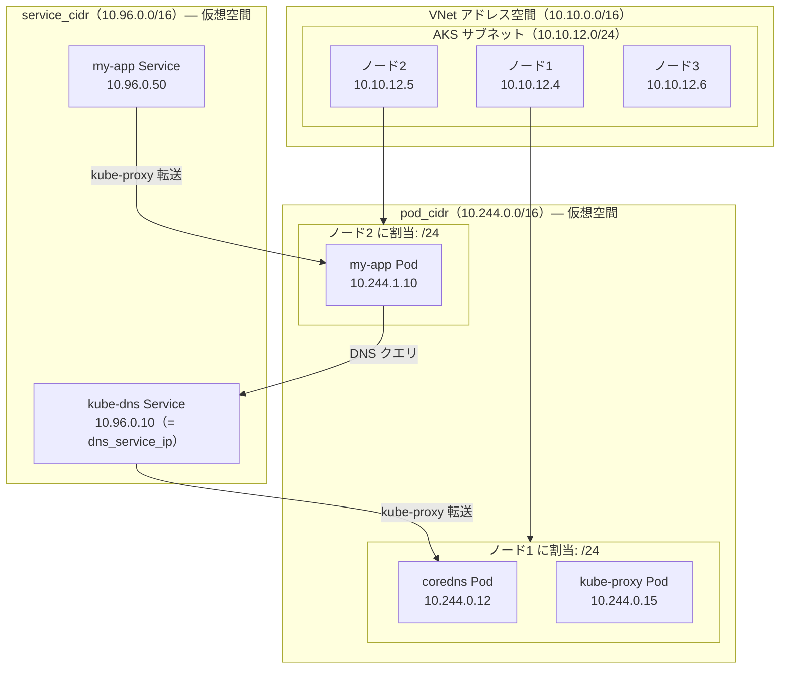
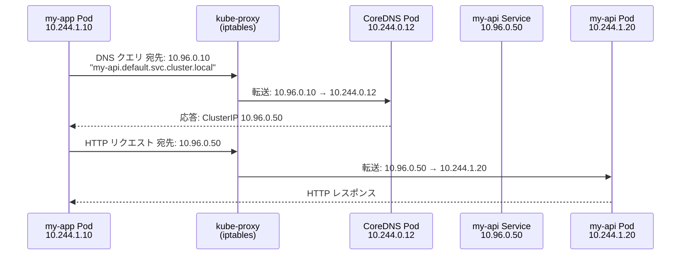
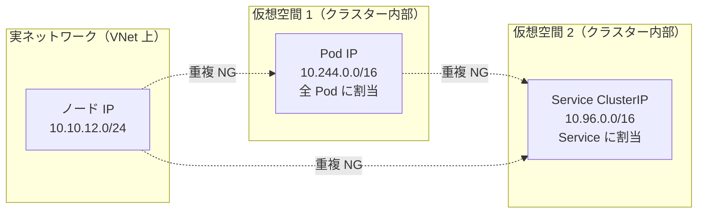

# AKS ネットワーク アドレス空間の図解

> 調査日: 2026-02-14

## Overlay モードの全体像

AKS Overlay モードでは、ノード IP は VNet サブネットから、Pod IP と Service IP はそれぞれ独立した仮想空間から割り当てられます。

## DNS 解決フロー

Pod がサービス名で通信する際、CoreDNS が名前を ClusterIP に解決し、kube-proxy が実際の Pod IP に転送します。

## 3 つのアドレス空間の対比

3 つの CIDR は相互に重複できません。ノード CIDR のみ VNet 上の実 IP で、残り 2 つはクラスター内部の仮想空間です。

## アドレス空間の対応表

| 空間         | 範囲例          | 存在場所         | 割り当て対象            |
| ------------ | --------------- | ---------------- | ----------------------- |
| ノード CIDR  | `10.10.12.0/24` | VNet 上（実 IP） | AKS ノード VM           |
| pod_cidr     | `10.244.0.0/16` | 仮想空間         | 全 Pod（system + user） |
| service_cidr | `10.96.0.0/16`  | 仮想空間         | Service の ClusterIP    |

## 参考リンク

- [AKS ネットワーク概念](https://learn.microsoft.com/en-us/azure/aks/concepts-network)
- [Azure CNI Overlay 概要](https://learn.microsoft.com/en-us/azure/aks/concepts-network-azure-cni-overlay)
- [Azure CNI Overlay 構成](https://learn.microsoft.com/en-us/azure/aks/azure-cni-overlay)
- [AKS IP アドレス計画](https://learn.microsoft.com/en-us/azure/aks/concepts-network-ip-address-planning)
- [CNI ネットワーク概要](https://learn.microsoft.com/en-us/azure/aks/concepts-network-cni-overview)
