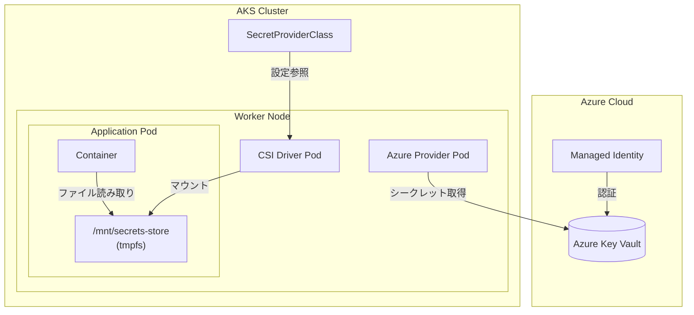
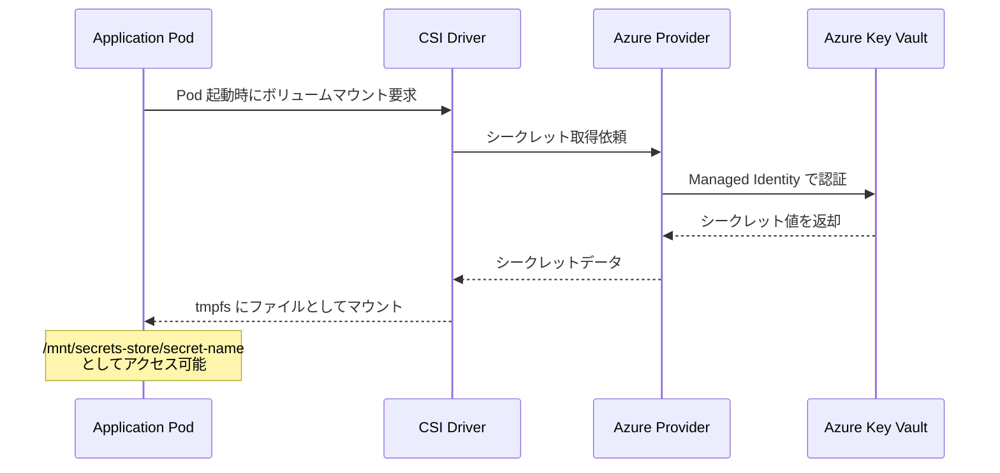
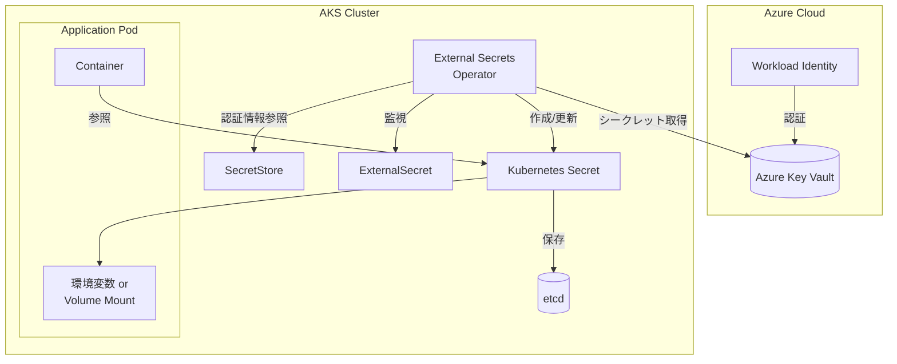
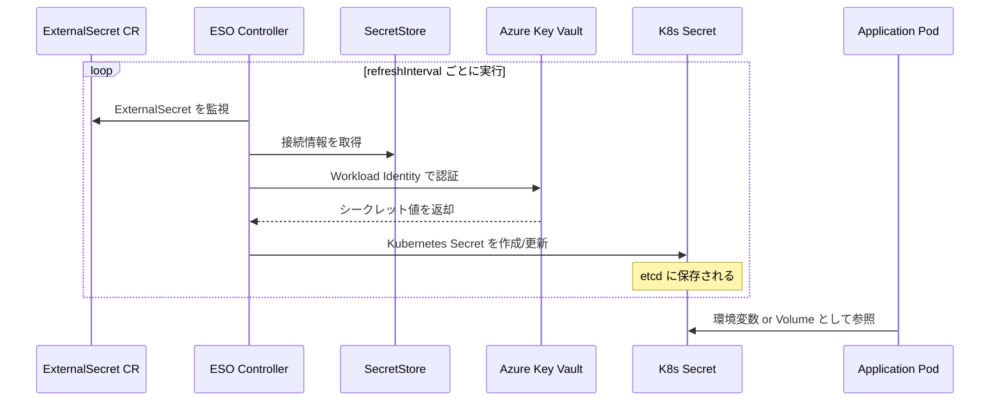
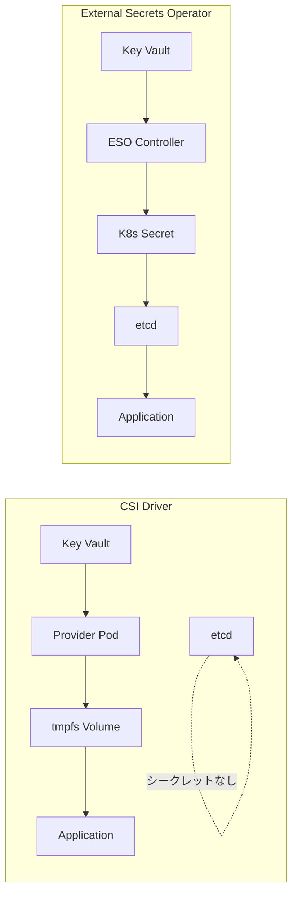
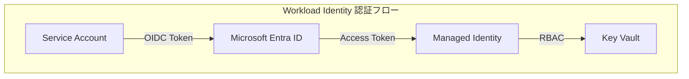
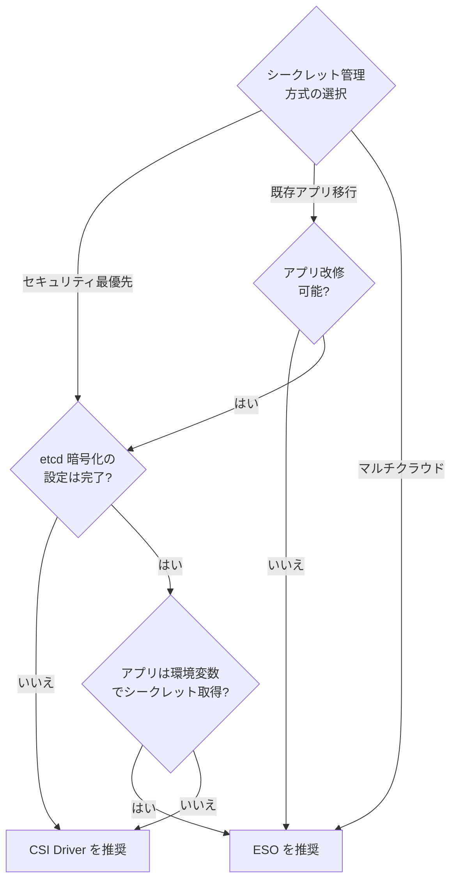

# AKS から Azure Key Vault シークレットを取得する方法の比較

Azure Key Vault に保存されたシークレットを AKS クラスターから安全に取得する主要な 2 つのアプローチを比較します。

## 概要

| 項目               | Secrets Store CSI Driver     | External Secrets Operator (ESO) |
| ------------------ | ---------------------------- | ------------------------------- |
| 提供元             | Kubernetes SIG + Azure       | External Secrets プロジェクト   |
| AKS サポート       | 公式アドオン                 | Helm でインストール             |
| シークレットの形態 | ファイルとしてマウント       | Kubernetes Secret オブジェクト  |
| etcd への保存      | なし（オプションで同期可能） | あり                            |
| アプリ改修         | 必要（ファイル読み取り）     | 不要（従来通り）                |

---

## アーキテクチャ比較

### Secrets Store CSI Driver の仕組み



**処理フロー:**



### External Secrets Operator の仕組み



**処理フロー:**



---

## 詳細比較

### セキュリティモデル



| セキュリティ項目     | CSI Driver               | ESO                     |
| -------------------- | ------------------------ | ----------------------- |
| etcd 暗号化依存      | ❌ 不要                  | ⚠️ 必要（推奨）         |
| シークレット露出範囲 | Pod 内のみ               | クラスター全体          |
| RBAC 制御            | SecretProviderClass 単位 | Secret + ExternalSecret |
| 監査ログ             | Key Vault のみ           | Key Vault + K8s API     |

### 認証方式

両方のソリューションで **Workload Identity** の使用が推奨されます。



---

## 設定例

### CSI Driver の設定

```yaml
# SecretProviderClass の定義
apiVersion: secrets-store.csi.x-k8s.io/v1
kind: SecretProviderClass
metadata:
  name: azure-keyvault-secrets
spec:
  provider: azure
  parameters:
    usePodIdentity: "false"
    useVMManagedIdentity: "true" # Managed Identity を使用
    clientID: "<managed-identity-client-id>"
    keyvaultName: "<keyvault-name>"
    objects: |
      array:
        - |
          objectName: ExampleSecret
          objectType: secret
    tenantId: "<tenant-id>"
  # オプション: Kubernetes Secret への同期
  secretObjects:
    - secretName: synced-secret
      type: Opaque
      data:
        - objectName: ExampleSecret
          key: password
---
# Pod での使用
apiVersion: v1
kind: Pod
metadata:
  name: my-app
spec:
  containers:
    - name: app
      image: my-app:latest
      volumeMounts:
        - name: secrets-store
          mountPath: "/mnt/secrets-store"
          readOnly: true
  volumes:
    - name: secrets-store
      csi:
        driver: secrets-store.csi.k8s.io
        readOnly: true
        volumeAttributes:
          secretProviderClass: azure-keyvault-secrets
```

### External Secrets Operator の設定

```yaml
# SecretStore の定義
apiVersion: external-secrets.io/v1
kind: SecretStore
metadata:
  name: azure-store
spec:
  provider:
    azurekv:
      authType: WorkloadIdentity
      vaultUrl: "https://<keyvault-name>.vault.azure.net"
      serviceAccountRef:
        name: workload-identity-sa
---
# ExternalSecret の定義
apiVersion: external-secrets.io/v1
kind: ExternalSecret
metadata:
  name: my-external-secret
spec:
  refreshInterval: 1h # 同期間隔
  secretStoreRef:
    name: azure-store
    kind: SecretStore
  target:
    name: my-k8s-secret # 作成される K8s Secret 名
    creationPolicy: Owner
  data:
    - secretKey: password # K8s Secret 内のキー名
      remoteRef:
        key: ExampleSecret # Key Vault 内のシークレット名
---
# Pod での使用（従来通り）
apiVersion: v1
kind: Pod
metadata:
  name: my-app
spec:
  containers:
    - name: app
      image: my-app:latest
      env:
        - name: DB_PASSWORD
          valueFrom:
            secretKeyRef:
              name: my-k8s-secret
              key: password
```

---

## ユースケース別推奨



### CSI Driver を選ぶべきケース

- 🔒 **セキュリティ最優先**: etcd にシークレットを保存したくない
- 📁 **ファイルベースのアプリ**: 設定ファイルとしてシークレットを読み込む設計
- 🏢 **AKS ネイティブ**: Azure 公式サポートのアドオンを使いたい
- 🔄 **自動ローテーション**: マウントされたシークレットの自動更新が必要

### ESO を選ぶべきケース

- 🔄 **既存アプリ移行**: アプリ改修なしで移行したい
- 🌐 **マルチクラウド**: AWS/GCP/HashiCorp Vault など複数プロバイダーを統一管理
- 📊 **環境変数利用**: 従来の `secretKeyRef` パターンを維持したい
- 🎛️ **柔軟な同期**: `refreshInterval` で細かい同期制御が必要

---

## 機能比較表

| 機能                 |  CSI Driver   | ESO |
| -------------------- | :-----------: | :-: |
| Azure Key Vault 連携 |      ✅       | ✅  |
| AWS Secrets Manager  |      ❌       | ✅  |
| HashiCorp Vault      |      ❌       | ✅  |
| GCP Secret Manager   |      ❌       | ✅  |
| 自動ローテーション   |      ✅       | ✅  |
| Windows コンテナ     |      ✅       | ✅  |
| etcd バイパス        |      ✅       | ❌  |
| 環境変数直接利用     | ⚠️ (同期必要) | ✅  |
| AKS 公式アドオン     |      ✅       | ❌  |
| ClusterSecretStore   |      ❌       | ✅  |

---

## 参考リンク

- [Azure Key Vault provider for Secrets Store CSI Driver (Microsoft Learn)](https://learn.microsoft.com/ja-jp/azure/aks/csi-secrets-store-driver)
- [External Secrets Operator 公式ドキュメント](https://external-secrets.io/)
- [AKS での Workload Identity 設定](https://learn.microsoft.com/ja-jp/azure/aks/workload-identity-overview)
- [Kubernetes Secrets Best Practices](https://kubernetes.io/docs/concepts/security/secrets-good-practices/)
