# Kubernetes Ingress vs Gateway API 完全ガイド

> Kubernetes における外部トラフィック管理の2つのアプローチを徹底比較

## 目次

- [1. 概要](#1-概要)
- [2. アーキテクチャ比較](#2-アーキテクチャ比較)
- [3. Ingress API 詳細](#3-ingress-api-詳細)
- [4. Gateway API 詳細](#4-gateway-api-詳細)
- [5. 機能比較表](#5-機能比較表)
- [6. メリット・デメリット](#6-メリットデメリット)
- [7. ユースケース別推奨](#7-ユースケース別推奨)
- [8. 移行ガイドライン](#8-移行ガイドライン)
- [9. まとめ](#9-まとめ)

---

## 1. 概要

### 1.1 外部トラフィック管理の進化

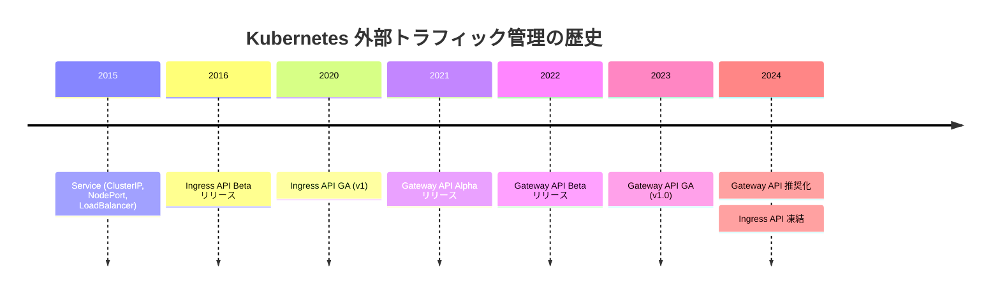

### 1.2 位置づけの違い

| 項目                    | Ingress API                  | Gateway API                    |
| ----------------------- | ---------------------------- | ------------------------------ |
| **ステータス**          | GA（凍結）                   | GA（活発に開発中）             |
| **API グループ**        | `networking.k8s.io/v1`       | `gateway.networking.k8s.io/v1` |
| **設計思想**            | シンプルな HTTP ルーティング | ロール指向・拡張可能           |
| **Kubernetes 公式推奨** | 非推奨（新規利用）           | **推奨**                       |

> **重要**: Kubernetes プロジェクトは Gateway API の使用を推奨しています。Ingress API は凍結されており、今後の機能追加は行われません。

---

## 2. アーキテクチャ比較

### 2.1 全体構成図

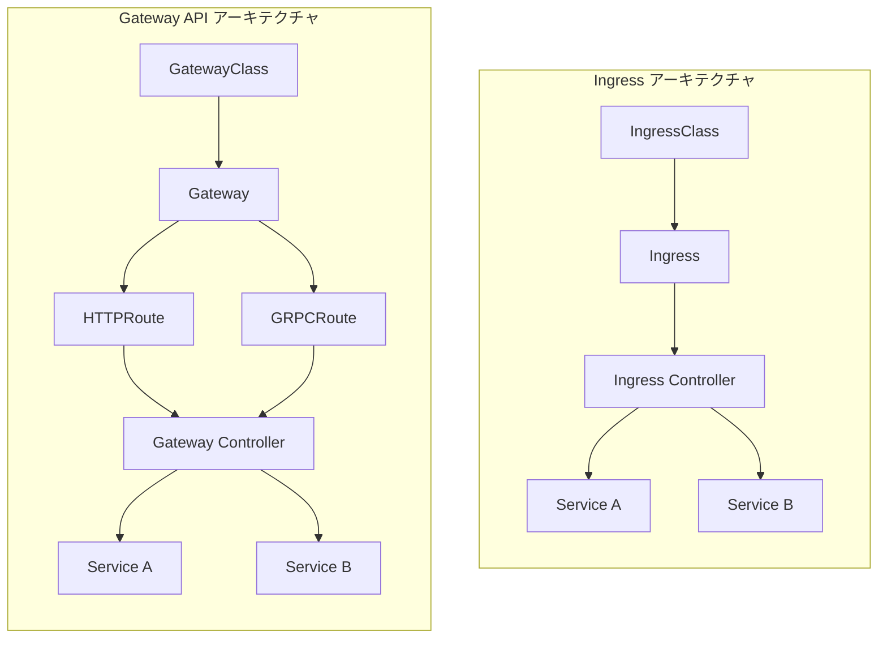

### 2.2 リソース階層の違い

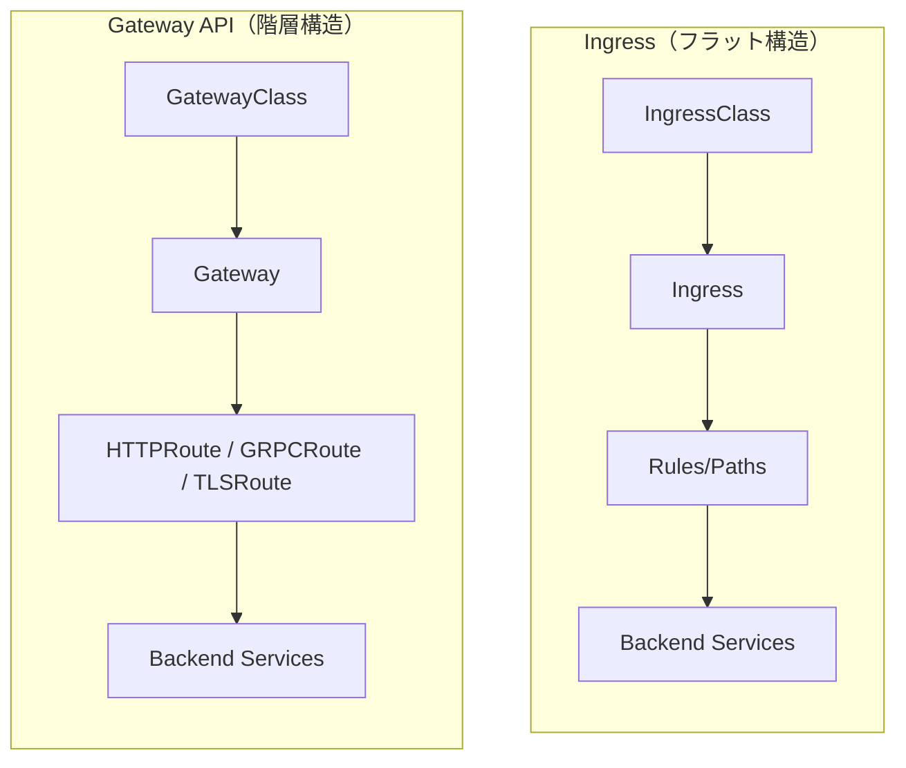

### 2.3 ロール指向設計（Gateway API の特徴）

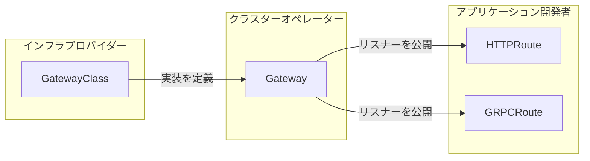

---

## 3. Ingress API 詳細

### 3.1 リソース構成

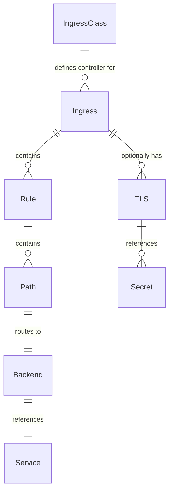

### 3.2 基本的な Ingress マニフェスト

```yaml
apiVersion: networking.k8s.io/v1
kind: IngressClass
metadata:
  name: nginx
spec:
  controller: k8s.io/ingress-nginx
---
apiVersion: networking.k8s.io/v1
kind: Ingress
metadata:
  name: example-ingress
  annotations:
    # コントローラー固有の設定はアノテーションで指定
    nginx.ingress.kubernetes.io/rewrite-target: /
    nginx.ingress.kubernetes.io/ssl-redirect: "true"
spec:
  ingressClassName: nginx
  tls:
    - hosts:
        - example.com
      secretName: example-tls
  rules:
    - host: example.com
      http:
        paths:
          - path: /api
            pathType: Prefix
            backend:
              service:
                name: api-service
                port:
                  number: 8080
          - path: /
            pathType: Prefix
            backend:
              service:
                name: frontend-service
                port:
                  number: 80
```

### 3.3 Ingress のトラフィックフロー

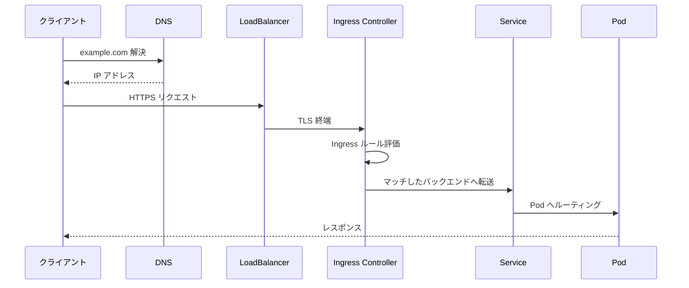

---

## 4. Gateway API 詳細

### 4.1 リソースモデル

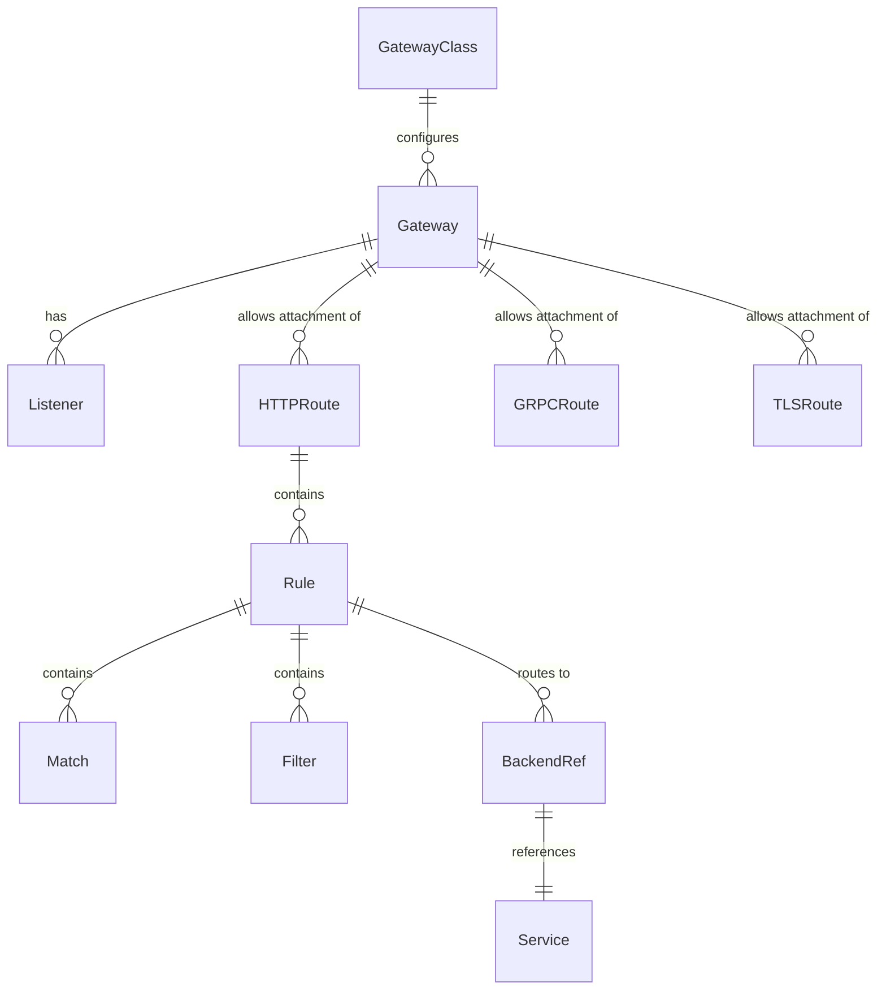

### 4.2 Gateway API の主要リソース

#### GatewayClass（インフラプロバイダー管理）

```yaml
apiVersion: gateway.networking.k8s.io/v1
kind: GatewayClass
metadata:
  name: example-gateway-class
spec:
  controllerName: example.com/gateway-controller
  parametersRef:
    group: example.com
    kind: GatewayConfig
    name: example-config
```

#### Gateway（クラスターオペレーター管理）

```yaml
apiVersion: gateway.networking.k8s.io/v1
kind: Gateway
metadata:
  name: example-gateway
  namespace: gateway-system
spec:
  gatewayClassName: example-gateway-class
  listeners:
    - name: http
      protocol: HTTP
      port: 80
      hostname: "*.example.com"
      allowedRoutes:
        namespaces:
          from: All
    - name: https
      protocol: HTTPS
      port: 443
      hostname: "*.example.com"
      tls:
        mode: Terminate
        certificateRefs:
          - name: example-cert
      allowedRoutes:
        namespaces:
          from: Selector
          selector:
            matchLabels:
              gateway-access: "true"
```

#### HTTPRoute（アプリケーション開発者管理）

```yaml
apiVersion: gateway.networking.k8s.io/v1
kind: HTTPRoute
metadata:
  name: example-route
  namespace: app-namespace
spec:
  parentRefs:
    - name: example-gateway
      namespace: gateway-system
  hostnames:
    - "api.example.com"
  rules:
    - matches:
        - path:
            type: PathPrefix
            value: /v1
          headers:
            - name: X-API-Version
              value: v1
      filters:
        - type: RequestHeaderModifier
          requestHeaderModifier:
            add:
              - name: X-Gateway-Route
                value: api-v1
      backendRefs:
        - name: api-v1-service
          port: 8080
          weight: 90
        - name: api-v2-service
          port: 8080
          weight: 10
```

### 4.3 Gateway API のトラフィックフロー

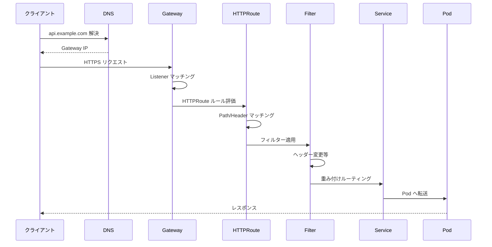

### 4.4 その他の Route タイプ

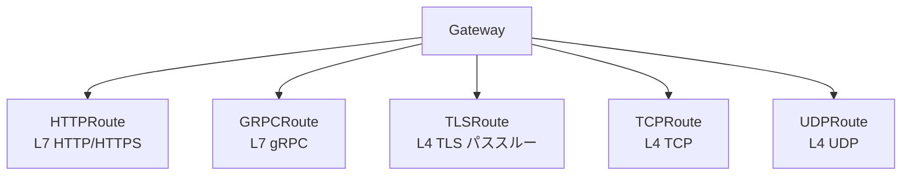

---

## 5. 機能比較表

### 5.1 基本機能

| 機能                     | Ingress | Gateway API | 備考         |
| ------------------------ | :-----: | :---------: | ------------ |
| HTTP ルーティング        |   ✅    |     ✅      | 両方サポート |
| HTTPS/TLS 終端           |   ✅    |     ✅      | 両方サポート |
| パスベースルーティング   |   ✅    |     ✅      | 両方サポート |
| ホストベースルーティング |   ✅    |     ✅      | 両方サポート |
| 複数バックエンド         |   ✅    |     ✅      | 両方サポート |

### 5.2 高度な機能

| 機能                       | Ingress | Gateway API | 備考                            |
| -------------------------- | :-----: | :---------: | ------------------------------- |
| ヘッダーマッチング         |   ⚠️    |     ✅      | Ingress はアノテーション依存    |
| クエリパラメータマッチング |   ⚠️    |     ✅      | Ingress はアノテーション依存    |
| トラフィック重み付け       |   ⚠️    |     ✅      | Ingress はアノテーション依存    |
| リクエスト/レスポンス変換  |   ⚠️    |     ✅      | Gateway API は Filter で標準化  |
| gRPC サポート              |   ⚠️    |     ✅      | Gateway API は GRPCRoute で対応 |
| TCP/UDP ルーティング       |   ❌    |     ✅      | Gateway API のみ                |
| TLS パススルー             |   ⚠️    |     ✅      | Gateway API は TLSRoute で対応  |

### 5.3 運用・管理機能

| 機能                 | Ingress | Gateway API | 備考                             |
| -------------------- | :-----: | :---------: | -------------------------------- |
| ロール分離           |   ❌    |     ✅      | Gateway API の設計思想           |
| Namespace 分離       |   ⚠️    |     ✅      | Gateway API は標準でサポート     |
| ルートのアタッチ制御 |   ❌    |     ✅      | Gateway の allowedRoutes         |
| 実装間ポータビリティ |   ⚠️    |     ✅      | Ingress はアノテーション依存     |
| 適合性テスト         |   ❌    |     ✅      | Gateway API は公式テストスイート |

**凡例**: ✅ 標準サポート / ⚠️ 実装依存・アノテーション依存 / ❌ 非サポート

---

## 6. メリット・デメリット

### 6.1 Ingress API

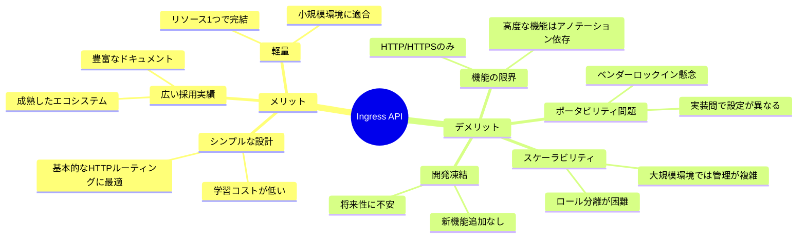

#### Ingress のメリット詳細

| メリット         | 説明                                             |
| ---------------- | ------------------------------------------------ |
| **シンプルさ**   | 1つのリソースで HTTP ルーティングを定義可能      |
| **成熟度**       | 長年の実績があり、多くのコントローラーが対応     |
| **学習コスト**   | 概念がシンプルで理解しやすい                     |
| **既存資産**     | 多くの組織で既に導入済み                         |
| **ドキュメント** | 豊富なチュートリアルとトラブルシューティング情報 |

#### Ingress のデメリット詳細

| デメリット             | 説明                                       |
| ---------------------- | ------------------------------------------ |
| **機能制限**           | HTTP/HTTPS のみ、L4 ルーティング不可       |
| **アノテーション地獄** | 高度な機能は実装固有のアノテーションに依存 |
| **ポータビリティ**     | コントローラー間で設定が互換性なし         |
| **ロール分離不可**     | インフラ・オペレーター・開発者の責務が混在 |
| **凍結状態**           | 新機能追加なし、バグ修正のみ               |

### 6.2 Gateway API

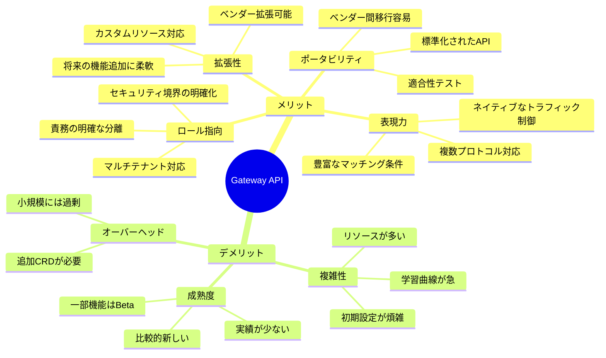

#### Gateway API のメリット詳細

| メリット             | 説明                                                     |
| -------------------- | -------------------------------------------------------- |
| **表現力**           | ヘッダー、クエリパラメータ、メソッドなど多様なマッチング |
| **ロール指向**       | インフラ/オペレーター/開発者の責務を明確に分離           |
| **マルチプロトコル** | HTTP、gRPC、TCP、UDP、TLS パススルーをサポート           |
| **ポータビリティ**   | 標準 API により実装間の移行が容易                        |
| **拡張性**           | Policy Attachment でカスタム機能を追加可能               |
| **トラフィック制御** | 重み付けルーティング、ミラーリングを標準サポート         |
| **Namespace 分離**   | クロスネームスペースのルーティングを安全に制御           |
| **将来性**           | 活発な開発、Kubernetes 公式推奨                          |

#### Gateway API のデメリット詳細

| デメリット           | 説明                                                     |
| -------------------- | -------------------------------------------------------- |
| **複雑性**           | 複数リソース（GatewayClass, Gateway, Route）の理解が必要 |
| **学習コスト**       | 新しい概念とパラダイムの習得が必要                       |
| **成熟度**           | 一部機能はまだ Beta または Experimental                  |
| **小規模への過剰性** | シンプルな要件には設定が冗長                             |
| **エコシステム**     | Ingress に比べて対応コントローラーが少ない               |
| **既存資産**         | Ingress からの移行作業が必要                             |

---

## 7. ユースケース別推奨

### 7.1 選択フローチャート

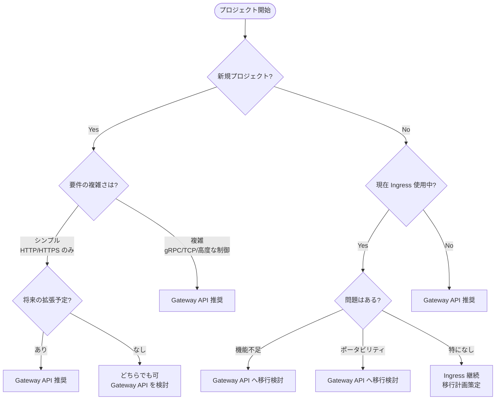

### 7.2 シナリオ別推奨

| シナリオ                      | 推奨             | 理由                              |
| ----------------------------- | ---------------- | --------------------------------- |
| **新規 Web アプリケーション** | Gateway API      | 将来性、標準化されたAPI           |
| **マイクロサービス**          | Gateway API      | gRPC サポート、高度なルーティング |
| **マルチテナント環境**        | Gateway API      | ロール分離、Namespace 制御        |
| **既存 Ingress の拡張**       | Gateway API 移行 | 機能制限の回避                    |
| **シンプルな静的サイト**      | どちらでも可     | 要件次第だが Gateway API 推奨     |
| **レガシーシステム統合**      | Ingress 継続     | 移行コストとリスク考慮            |
| **L4 ロードバランシング**     | Gateway API      | TCP/UDP Route サポート            |

### 7.3 組織規模別推奨

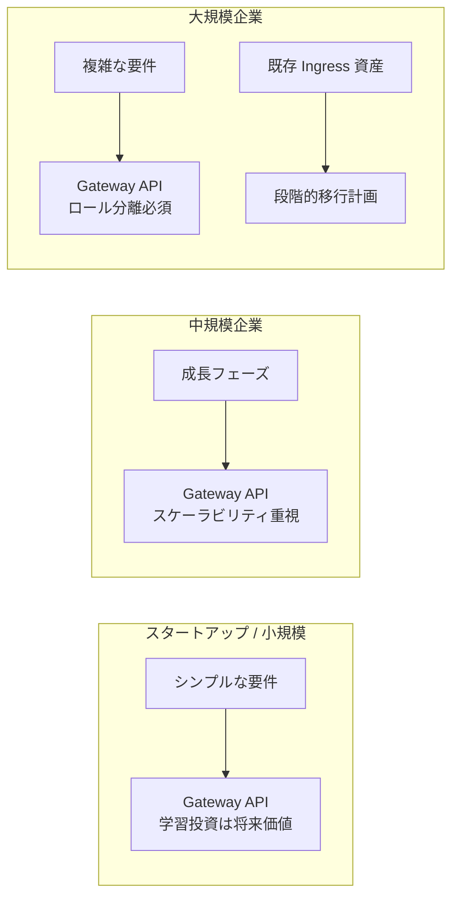

---

## 8. 移行ガイドライン

### 8.1 移行戦略

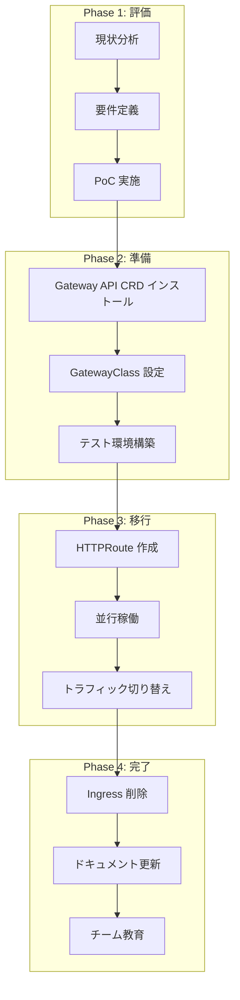

### 8.2 Ingress から HTTPRoute への変換例

#### Before: Ingress

```yaml
apiVersion: networking.k8s.io/v1
kind: Ingress
metadata:
  name: example
  annotations:
    nginx.ingress.kubernetes.io/rewrite-target: /
spec:
  ingressClassName: nginx
  rules:
    - host: example.com
      http:
        paths:
          - path: /api
            pathType: Prefix
            backend:
              service:
                name: api-svc
                port:
                  number: 8080
```

#### After: Gateway API

```yaml
apiVersion: gateway.networking.k8s.io/v1
kind: Gateway
metadata:
  name: example-gateway
spec:
  gatewayClassName: example-class
  listeners:
    - name: http
      protocol: HTTP
      port: 80
      hostname: example.com
---
apiVersion: gateway.networking.k8s.io/v1
kind: HTTPRoute
metadata:
  name: example-route
spec:
  parentRefs:
    - name: example-gateway
  hostnames:
    - example.com
  rules:
    - matches:
        - path:
            type: PathPrefix
            value: /api
      filters:
        - type: URLRewrite
          urlRewrite:
            path:
              type: ReplacePrefixMatch
              replacePrefixMatch: /
      backendRefs:
        - name: api-svc
          port: 8080
```

### 8.3 移行時の注意点

| 注意点                       | 対策                                          |
| ---------------------------- | --------------------------------------------- |
| **アノテーションの互換性**   | Gateway API の Filter や Policy で代替        |
| **コントローラーの対応状況** | 使用コントローラーの Gateway API サポート確認 |
| **DNS 切り替え**             | 並行稼働期間を設けて段階的に移行              |
| **モニタリング設定**         | 新しいメトリクス・ログの設定                  |
| **チーム教育**               | Gateway API の概念とリソース構造の理解促進    |

---

## 9. まとめ

### 9.1 結論

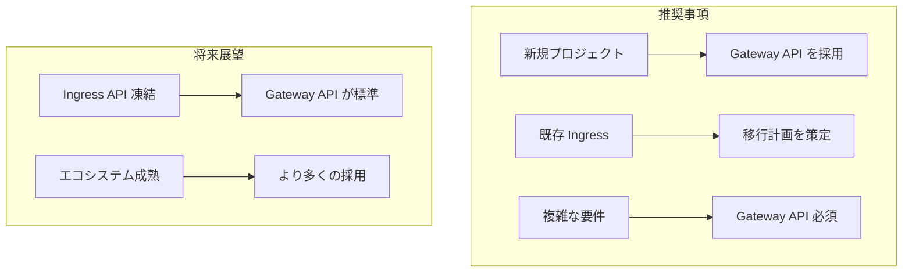

### 9.2 選択の指針

| 状況                    | 推奨                           |
| ----------------------- | ------------------------------ |
| **新規プロジェクト**    | **Gateway API** を強く推奨     |
| **既存 Ingress で満足** | 継続使用可能だが移行計画を検討 |
| **高度な機能が必要**    | **Gateway API** へ移行         |
| **マルチテナント**      | **Gateway API** 必須           |
| **L4 ルーティング**     | **Gateway API** 必須           |

### 9.3 キーメッセージ

> **Gateway API は Ingress の後継として設計された、より表現力豊かで拡張可能なAPI です。**
>
> Kubernetes プロジェクトは Gateway API の使用を推奨しており、Ingress API は凍結されています。
> 新規プロジェクトでは Gateway API を採用し、既存の Ingress 環境では計画的な移行を検討することを推奨します。

---

## 参考リンク

- [Kubernetes Gateway API 公式ドキュメント](https://gateway-api.sigs.k8s.io/)
- [Kubernetes Ingress 公式ドキュメント](https://kubernetes.io/docs/concepts/services-networking/ingress/)
- [Gateway API 実装一覧](https://gateway-api.sigs.k8s.io/implementations/)
- [Ingress から Gateway API への移行ガイド](https://gateway-api.sigs.k8s.io/guides/migrating-from-ingress/)
- [Kubernetes 公式 Gateway API 解説（日本語）](https://kubernetes.io/ja/docs/concepts/services-networking/gateway/)

---

_最終更新: 2026年1月_
