# Kubernetes サービスタイプの違い

このドキュメントでは、Kubernetes のサービスタイプの違いを Mermaid 図を用いて視覚的に説明します。

## 目次

1. [サービスタイプの概要](#サービスタイプの概要)
2. [ClusterIP（通常型）](#1-clusterip通常型)
3. [Headless Service（clusterIP: None）](#2-headless-serviceclusterip-none)
4. [NodePort](#3-nodeport)
5. [LoadBalancer](#4-loadbalancer)
6. [ExternalName](#5-externalname)
7. [比較表](#比較表)

---

## サービスタイプの概要

Kubernetes の Service は、Pod へのアクセスを提供するための抽象化レイヤーです。以下の 5 つのタイプがあります。

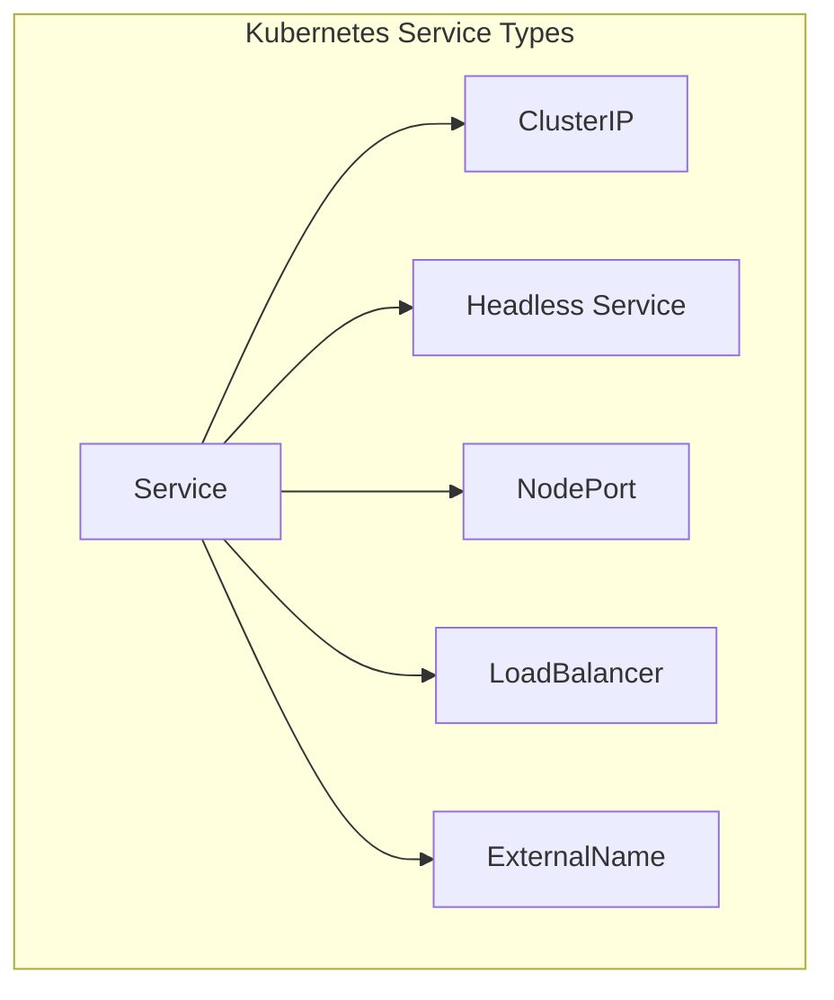

---

## 1. ClusterIP（通常型）

**説明**: クラスタ内部でのみアクセス可能な仮想 IP アドレスを提供します。

### アーキテクチャ図

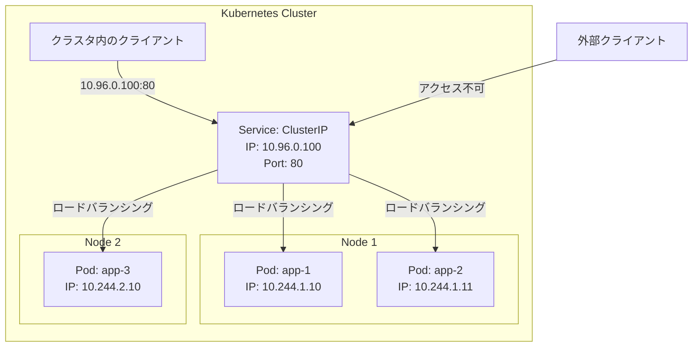

### データフロー

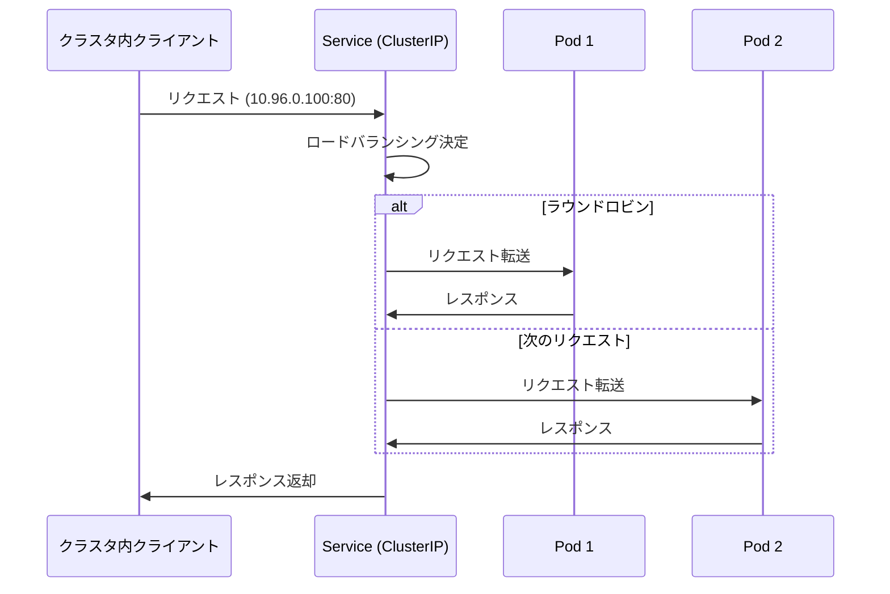

### 特徴

- ✅ クラスタ内部からのみアクセス可能
- ✅ 仮想 IP アドレス（例: 10.96.0.100）が自動割り当て
- ✅ 複数の Pod にロードバランシング
- ❌ クラスタ外部からはアクセス不可

### 使用例

```yaml
spec:
  type: ClusterIP # デフォルト（省略可能）
  selector:
    app: sample-app
  ports:
    - port: 80
      targetPort: 8080
```

---

## 2. Headless Service（clusterIP: None）

**説明**: 仮想 IP を割り当てず、各 Pod の IP アドレスを直接返すサービスです。

### アーキテクチャ図

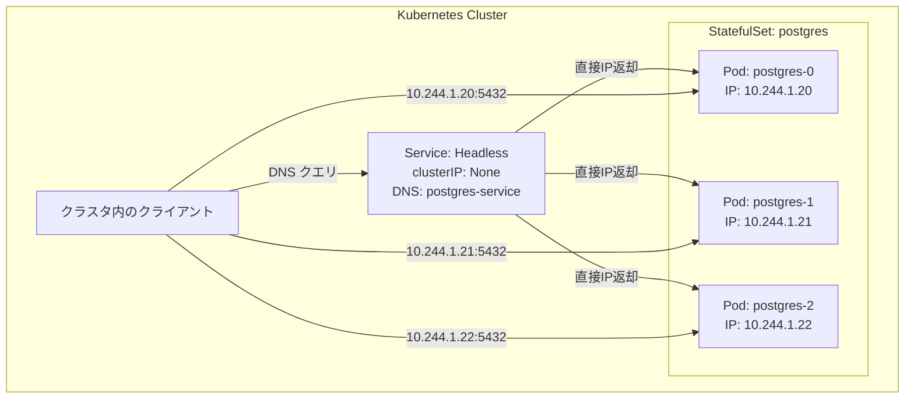

### DNS 解決の流れ

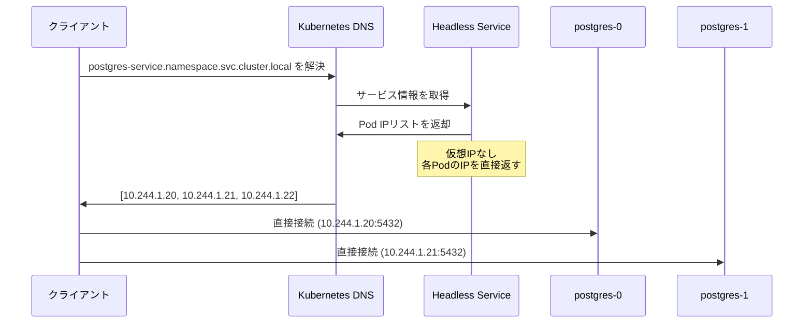

### 特徴

- ✅ 各 Pod の IP アドレスを直接取得可能
- ✅ StatefulSet と組み合わせて使用
- ✅ データベースのレプリケーションに適している
- ❌ 仮想 IP アドレスなし（ロードバランシングなし）

### 使用例

```yaml
spec:
  clusterIP: None # Headless Service
  selector:
    app: postgres
  ports:
    - port: 5432
      name: postgres
```

---

## 3. NodePort

**説明**: クラスタ内のすべてのノードの同じポート番号で外部からアクセスできるようにします。

**なぜこの仕組みなのか**: NodePort タイプの Service を作成すると、各ノードで実行されている kube-proxy が指定されたポート（30000-32767 の範囲）でリッスンします。外部クライアントは各ノードの IP アドレスと NodePort 番号を使って直接アクセスし、kube-proxy がそのトラフィックを Service の ClusterIP に転送します。これにより、どのノードにアクセスしても同じ Service に到達できます。

**注意**: 以下の図は minikube 環境（1 ノード構成）を想定しています。

### アーキテクチャ図

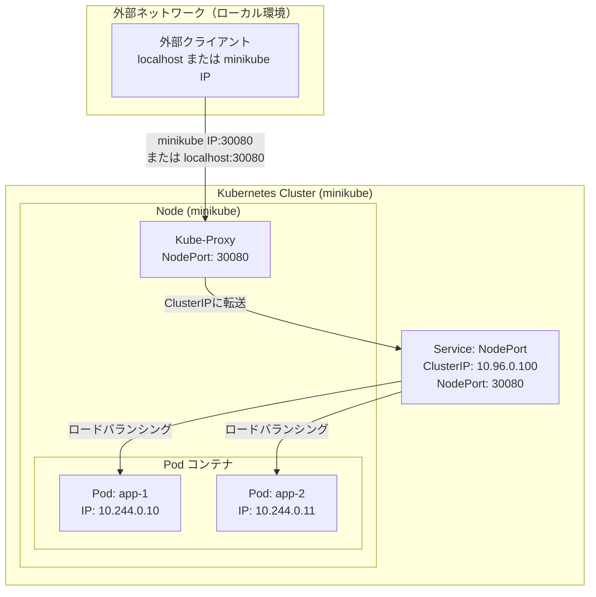

### データフロー（minikube 環境）

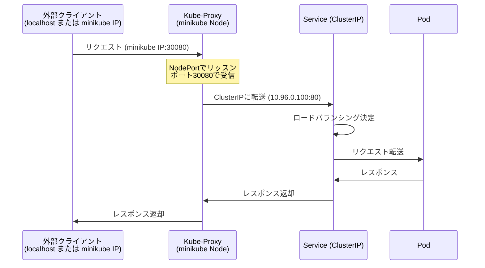

### 特徴

- ✅ クラスタ外部からアクセス可能
- ✅ すべてのノードの同じポートでアクセス可能（複数ノード環境の場合）
- ✅ ポート番号: 30000-32767（自動または手動指定）
- ✅ minikube 環境では `minikube ip` で取得できる IP アドレスと NodePort 番号でアクセス可能
- ⚠️ 本番環境では通常 LoadBalancer や Ingress を使用

### 使用例

```yaml
spec:
  type: NodePort
  ports:
    - port: 80
      targetPort: 8080
      nodePort: 30080 # オプション（省略時は自動割り当て）
```

---

## 4. LoadBalancer

**説明**: クラウドプロバイダーのロードバランサーを自動的に作成します。

### アーキテクチャ図

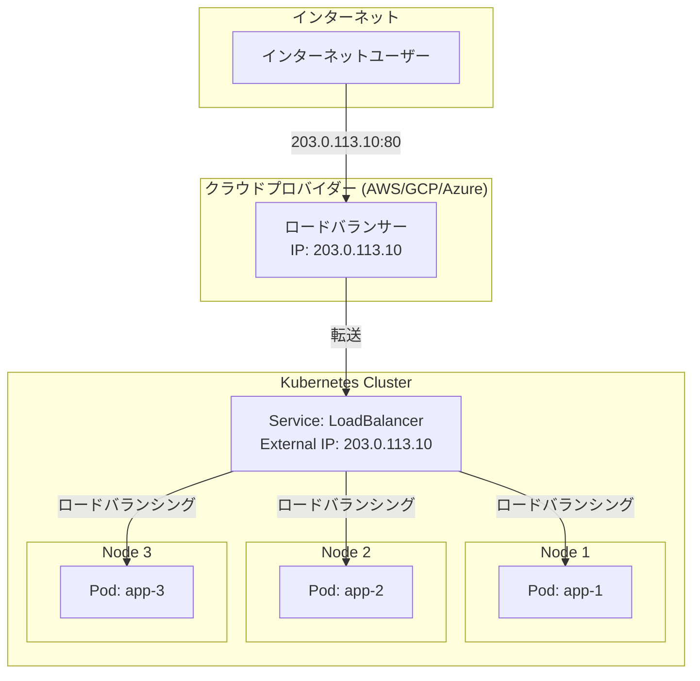

### データフロー

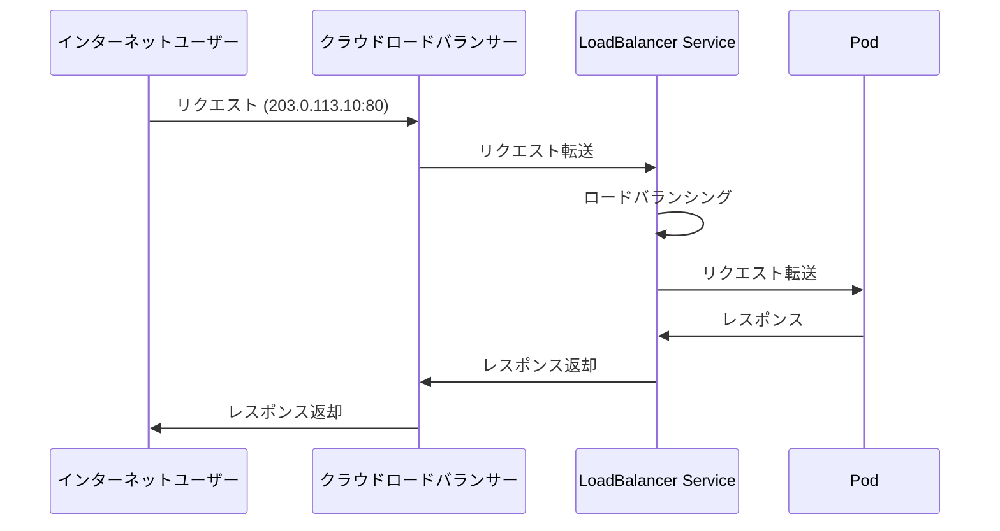

### 特徴

- ✅ クラスタ外部から安定した IP アドレスでアクセス可能
- ✅ クラウドプロバイダーのロードバランサー機能を利用
- ✅ 本番環境に適している
- ⚠️ クラウドプロバイダーが必要（ローカル環境では動作しない）
- ⚠️ 追加コストが発生する場合がある

### 使用例

```yaml
spec:
  type: LoadBalancer
  ports:
    - port: 80
      targetPort: 8080
```

---

## 5. ExternalName

**説明**: クラスタ外部のサービスを参照するための DNS エイリアスを提供します。

### アーキテクチャ図

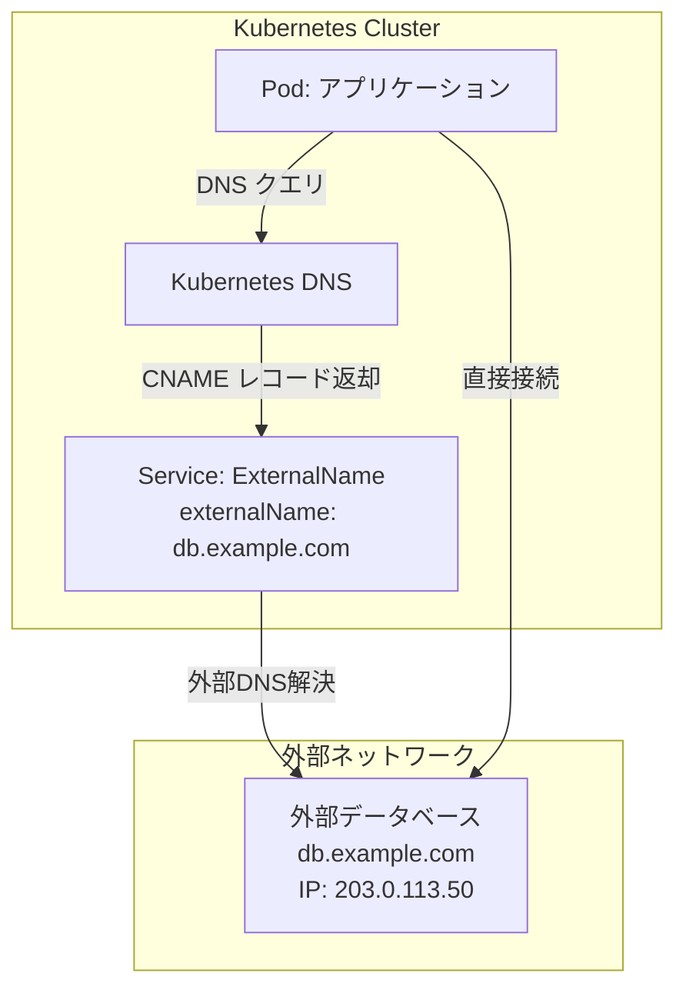

### DNS 解決の流れ

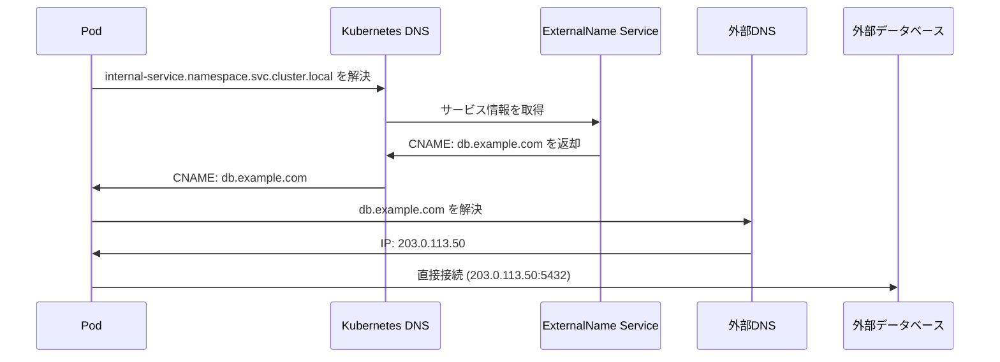

### 特徴

- ✅ クラスタ外部のサービスを簡単に参照可能
- ✅ DNS エイリアスとして機能
- ✅ 実際のトラフィックはクラスタ外に転送
- ❌ プロキシ機能なし（単純な DNS エイリアス）

### 使用例

```yaml
spec:
  type: ExternalName
  externalName: db.example.com
```

---

## 比較表

| タイプ           | クラスタ内部アクセス | クラスタ外部アクセス | 仮想 IP | 主な用途                  | コスト |
| ---------------- | -------------------- | -------------------- | ------- | ------------------------- | ------ |
| **ClusterIP**    | ✅                   | ❌                   | ✅      | 内部通信（デフォルト）    | 無料   |
| **Headless**     | ✅                   | ❌                   | ❌      | データベース、StatefulSet | 無料   |
| **NodePort**     | ✅                   | ✅                   | ✅      | 開発環境、テスト          | 無料   |
| **LoadBalancer** | ✅                   | ✅                   | ✅      | 本番環境                  | 有料\* |
| **ExternalName** | ✅                   | -                    | ❌      | 外部サービス連携          | 無料   |

\*クラウドプロバイダーのロードバランサー料金が発生

---

## まとめ

各サービスタイプは異なる用途に適しています：

1. **ClusterIP**: クラスタ内部の通信に使用（最も一般的）
2. **Headless Service**: データベースなど、各 Pod に直接接続が必要な場合
3. **NodePort**: 開発環境やシンプルな構成で外部アクセスが必要な場合
4. **LoadBalancer**: 本番環境で安定した外部アクセスが必要な場合
5. **ExternalName**: クラスタ外部のサービスを参照する場合

用途に応じて適切なタイプを選択することが重要です。
