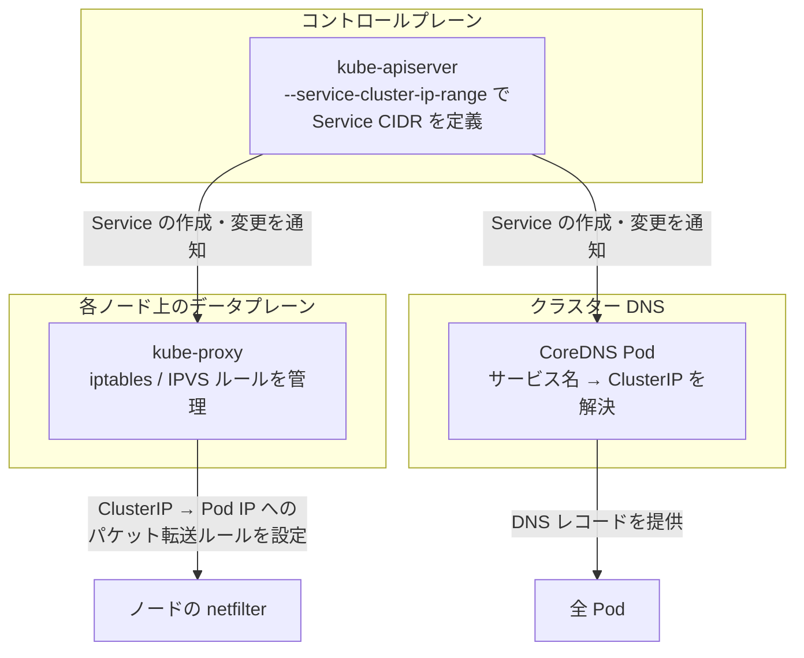
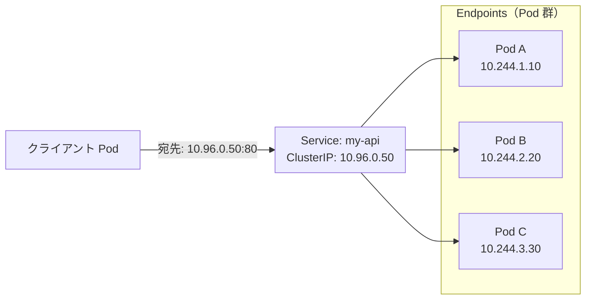
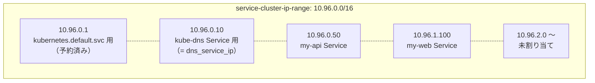
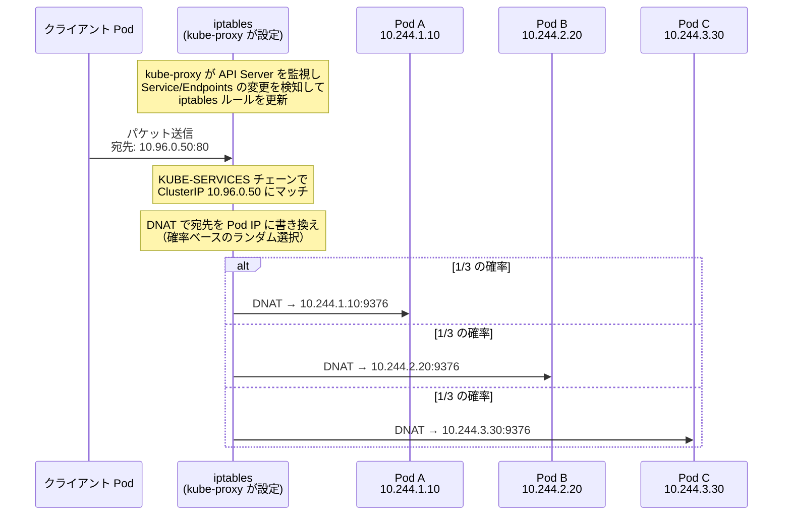
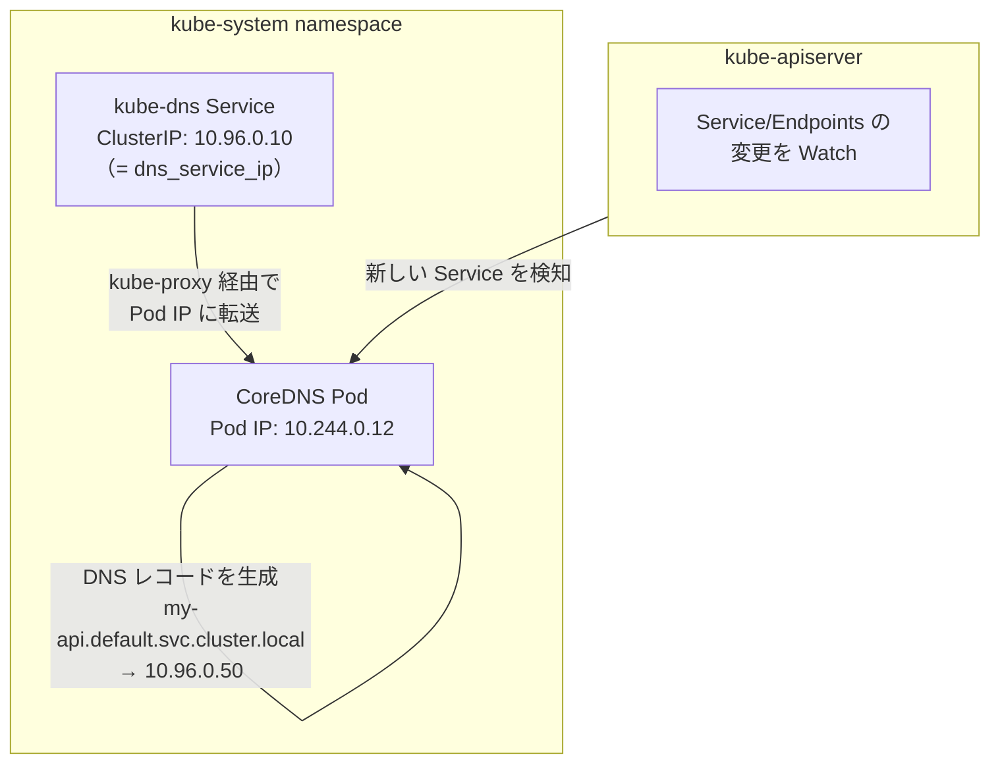
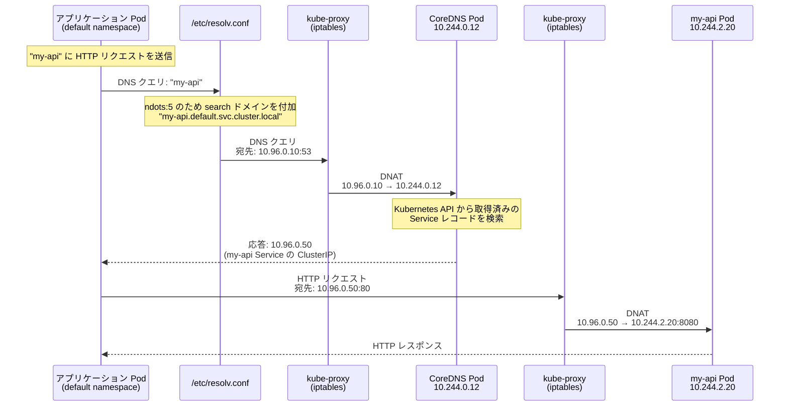
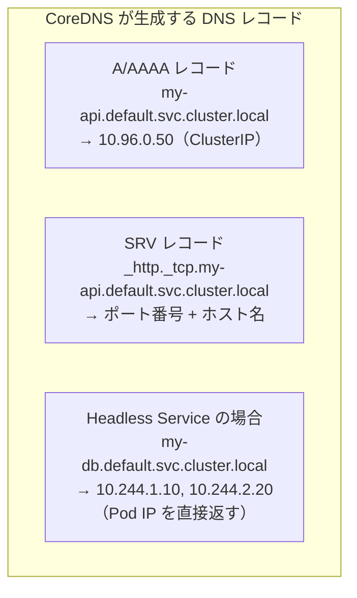
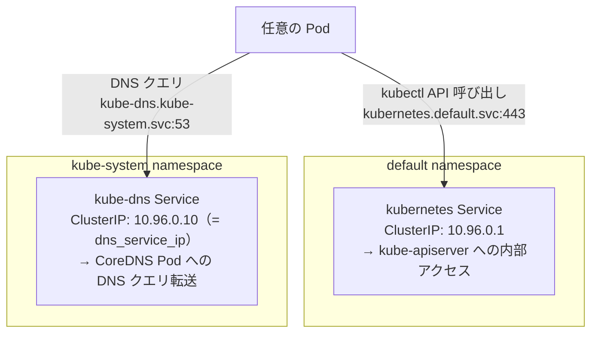
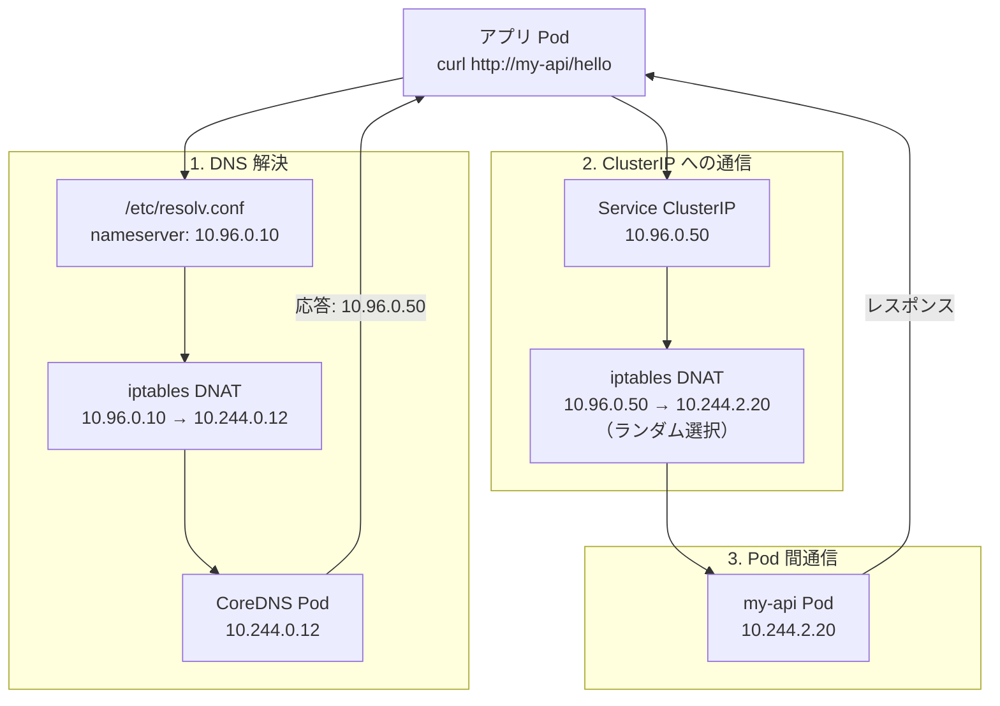

# Kubernetes Service と DNS の仕組み

> 調査日: 2026-02-14

本ドキュメントは、Kubernetes が既定で提供する **Service** と **DNS** の仕組みについて、クラスター内部のネットワーキングの観点から解説します。AKS 固有の話題ではなく、Kubernetes 本体のアーキテクチャに基づいています。

---

## 全体像

Kubernetes クラスターには、Pod 間の通信を支える 2 つの基盤メカニズムが組み込まれています。



| 基盤                   | 役割                                     | 担当コンポーネント          |
| ---------------------- | ---------------------------------------- | --------------------------- |
| **Service（仮想 IP）** | Pod 群に安定したエンドポイントを提供する | kube-apiserver + kube-proxy |
| **DNS（名前解決）**    | サービス名を仮想 IP に変換する           | CoreDNS（旧 kube-dns）      |

---

## Service の仕組み

### なぜ Service が必要か

Pod は一時的な存在です。スケーリングやデプロイのたびに IP が変わります。Service は Pod 群の前に「安定した仮想 IP（ClusterIP）」を置き、クライアントが個々の Pod の IP を意識せずに通信できる仕組みです。



### ClusterIP の割り当て

kube-apiserver の起動パラメータ `--service-cluster-ip-range`（AKS では `service_cidr`）で定義された CIDR から、Service ごとにユニークな IP が割り当てられます。



**重要な制約:**

- ClusterIP はクラスター内部のみで有効です。VNet 上にはルーティングされません
- Service CIDR の最初の IP（`10.96.0.1`）は `kubernetes.default.svc.cluster.local` に自動予約されます
- `dns_service_ip`（既定: `.10`）は CoreDNS Service の ClusterIP です

### kube-proxy によるパケット転送

ClusterIP は「仮想的」な IP であり、どのネットワークインターフェースにも割り当てられていません。実際のパケット転送は、各ノード上の **kube-proxy** が設定する **iptables / IPVS ルール**によって実現されます。



実際の iptables ルールの例（Kubernetes 公式ドキュメントより）:

```shell
# ClusterIP 10.0.1.175:80 へのトラフィックを KUBE-SVC チェーンに転送
-A KUBE-SERVICES -d 10.0.1.175/32 -p tcp --dport 80 -j KUBE-SVC-NWV5X2332I4OT4T3

# 3 つの Pod に均等に分散（確率ベースのランダム選択）
-A KUBE-SVC-... -m statistic --mode random --probability 0.33333 -j KUBE-SEP-...(Pod A)
-A KUBE-SVC-... -m statistic --mode random --probability 0.50000 -j KUBE-SEP-...(Pod B)
-A KUBE-SVC-... -j KUBE-SEP-...(Pod C)

# 各 Pod への DNAT（宛先 NAT）ルール
-A KUBE-SEP-... -p tcp -j DNAT --to-destination 10.244.3.6:9376
```

### kube-proxy のモード

| モード               | 仕組み                              | 特徴                               |
| -------------------- | ----------------------------------- | ---------------------------------- |
| **iptables**（既定） | netfilter の iptables ルールで DNAT | Service 数が増えるとルール数が増大 |
| **IPVS**             | Linux カーネルの IP Virtual Server  | 大規模クラスターで高パフォーマンス |

---

## DNS の仕組み

### CoreDNS の役割

CoreDNS は kube-system namespace で動作する Pod で、Kubernetes API を監視し、Service が作成されるたびに DNS レコードを自動生成します。



**CoreDNS 自体も Service + Pod の構成です:**

- CoreDNS **Pod** は `pod_cidr` から IP を取得します（例: `10.244.0.12`）
- CoreDNS **Service**（`kube-dns`）は `service_cidr` から ClusterIP を取得します（例: `10.96.0.10`）
- Pod が DNS クエリを送る先は Service の ClusterIP で、kube-proxy が CoreDNS Pod に転送します

### Pod の DNS 設定

Kubernetes は Pod 作成時に `/etc/resolv.conf` を自動生成します。

```text
nameserver 10.96.0.10
search default.svc.cluster.local svc.cluster.local cluster.local
options ndots:5
```

| 設定         | 値                           | 説明                                                    |
| ------------ | ---------------------------- | ------------------------------------------------------- |
| `nameserver` | `10.96.0.10`                 | CoreDNS Service の ClusterIP（= `dns_service_ip`）      |
| `search`     | `<ns>.svc.cluster.local ...` | 短縮名を展開する検索ドメインリスト                      |
| `ndots`      | `5`                          | ドットが 5 個未満の名前は search ドメインを付加して検索 |

### DNS 名前解決フロー

Pod 内のアプリケーションが `my-api` というサービス名で通信する場合の完全なフローです。



### DNS レコードの形式

CoreDNS は Service の種類に応じて以下の DNS レコードを自動生成します。



| Service タイプ                | DNS レコードの返す値    | 用途                                    |
| ----------------------------- | ----------------------- | --------------------------------------- |
| 通常の ClusterIP              | Service の ClusterIP    | ロードバランシングが必要な場合          |
| Headless（`clusterIP: None`） | 各 Pod の IP を直接返す | StatefulSet 等で Pod を直接指定する場合 |

### DNS 名の省略規則

`search` ドメインにより、同一 namespace 内では短縮名が使用できます。

| Pod の namespace | 宛先 Service    | 指定する名前      | 展開結果                            |
| ---------------- | --------------- | ----------------- | ----------------------------------- |
| default          | default/my-api  | `my-api`          | `my-api.default.svc.cluster.local`  |
| default          | other-ns/my-api | `my-api.other-ns` | `my-api.other-ns.svc.cluster.local` |
| 任意             | 任意            | FQDN 指定         | `my-api.default.svc.cluster.local.` |

---

## 既定で存在する Service

Kubernetes クラスターは起動時に以下の Service を自動作成します。



| Service      | namespace   | ClusterIP                            | 役割                                                       |
| ------------ | ----------- | ------------------------------------ | ---------------------------------------------------------- |
| `kubernetes` | default     | CIDR の最初の IP（例: `10.96.0.1`）  | Pod から kube-apiserver にアクセスするためのエンドポイント |
| `kube-dns`   | kube-system | `dns_service_ip`（例: `10.96.0.10`） | 全 Pod の `/etc/resolv.conf` に設定される DNS サーバー     |

---

## CoreDNS の構成

CoreDNS は ConfigMap（`kube-system/coredns`）で構成されます。

```yaml
apiVersion: v1
kind: ConfigMap
metadata:
  name: coredns
  namespace: kube-system
data:
  Corefile: |
    .:53 {
        errors
        health { lameduck 5s }
        ready
        kubernetes cluster.local in-addr.arpa ip6.arpa {
            pods insecure
            fallthrough in-addr.arpa ip6.arpa
            ttl 30
        }
        prometheus :9153
        forward . /etc/resolv.conf
        cache 30
        loop
        reload
        loadbalance
    }
```

| プラグイン    | 役割                                                            |
| ------------- | --------------------------------------------------------------- |
| `kubernetes`  | `cluster.local` ドメインの名前解決を Kubernetes API から取得    |
| `forward`     | クラスター外のドメイン（例: `google.com`）をノードの DNS に転送 |
| `cache`       | DNS レスポンスを 30 秒キャッシュ                                |
| `loadbalance` | A レコードの応答順序をラウンドロビンでシャッフル                |

---

## まとめ: パケットが Pod に届くまでの全経路



1. **DNS 解決**: アプリが `my-api` を名前解決 → CoreDNS が ClusterIP `10.96.0.50` を返す
2. **ClusterIP 転送**: kube-proxy の iptables ルールが ClusterIP を Pod IP に DNAT
3. **Pod 間通信**: パケットが実際の Pod に到達し、レスポンスが返る

**Service と DNS は独立した仕組みですが、組み合わせることで「サービス名だけで Pod 間通信ができる」という Kubernetes の中核機能を実現しています。**

---

## 参考リンク

### Kubernetes 公式ドキュメント

- [Service](https://kubernetes.io/docs/concepts/services-networking/service/) — Service の概念全体
- [Virtual IPs and Service Proxies](https://kubernetes.io/docs/reference/networking/virtual-ips/) — kube-proxy による仮想 IP の実装
- [Service ClusterIP allocation](https://kubernetes.io/docs/concepts/services-networking/cluster-ip-allocation/) — ClusterIP の割り当て方式
- [DNS for Services and Pods](https://kubernetes.io/docs/concepts/services-networking/dns-pod-service/) — CoreDNS によるサービスディスカバリ
- [Customizing DNS Service](https://kubernetes.io/docs/tasks/administer-cluster/dns-custom-nameservers/) — CoreDNS の構成カスタマイズ

### Microsoft Learn（AKS）

- [AKS ネットワーク概念](https://learn.microsoft.com/en-us/azure/aks/concepts-network) — AKS でのネットワーク全体像
- [AKS IP アドレス計画](https://learn.microsoft.com/en-us/azure/aks/concepts-network-ip-address-planning) — Service CIDR のサイジング
- [AKS の DNS 概念](https://learn.microsoft.com/en-us/azure/aks/dns-concepts) — AKS での CoreDNS 動作
- [AKS の Service 概念](https://learn.microsoft.com/en-us/azure/aks/concepts-network-services) — AKS での Service タイプ
