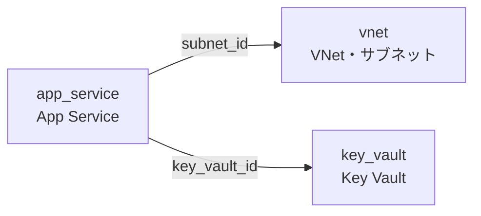

# Terragrunt 入門チュートリアル（Azure 環境向け）

> 作成日: 2026-02-28
> 対象バージョン: Terragrunt v0.99.4 / Terraform >= 1.9 / azurerm Provider ~> 4.0

本チュートリアルでは、Terraform に精通しているが Terragrunt は未経験のエンジニアを対象に、環境別（dev / stg / prd）で重複している設定ファイルを Terragrunt で DRY 化する方法を STEP-by-STEP で解説する。

---

## 目次

1. [STEP 0: 前提条件](#step-0-前提条件)
2. [STEP 1: Terragrunt の基本概念](#step-1-terragrunt-の基本概念)
3. [STEP 2: Before/After 構成比較](#step-2-beforeafter-構成比較)
4. [STEP 3: root.hcl の作成（重複排除の核心）](#step-3-roothcl-の作成重複排除の核心)
5. [STEP 4: 環境別 terragrunt.hcl の作成](#step-4-環境別-terragrunthcl-の作成)
6. [STEP 5: 依存関係の管理（dependency）](#step-5-依存関係の管理dependency)
7. [STEP 6: 主要コマンド](#step-6-主要コマンド)
8. [STEP 7: Tips & トラブルシューティング](#step-7-tips--トラブルシューティング)
9. [参考リンク](#参考リンク)

---

## STEP 0: 前提条件

### 必要ツール

| ツール         | バージョン | 用途                     |
| -------------- | ---------- | ------------------------ |
| **Terragrunt** | v0.99.4    | Terraform ラッパー       |
| **Terraform**  | >= 1.9     | IaC エンジン             |
| **Azure CLI**  | 最新       | Azure 認証・リソース操作 |

### Azure Storage Account の事前作成

azurerm バックエンドは S3 や GCS と異なり、Terragrunt による **自動リソース作成に非対応** である。事前に Storage Account を手動で作成する必要がある。

```bash
# 変数定義
RESOURCE_GROUP="terraform-state-rg"
STORAGE_ACCOUNT="yourprojtfstate"   # グローバルで一意な名前（小文字英数字のみ）
CONTAINER_NAME="tfstate"
LOCATION="japaneast"
ALLOWED_IP="203.0.113.10"           # アクセスを許可する IP アドレス

# リソースグループ作成
az group create \
  --name "$RESOURCE_GROUP" \
  --location "$LOCATION"

# Storage Account 作成
az storage account create \
  --name "$STORAGE_ACCOUNT" \
  --resource-group "$RESOURCE_GROUP" \
  --location "$LOCATION" \
  --sku Standard_LRS \
  --kind StorageV2 \
  --min-tls-version TLS1_2 \
  --allow-blob-public-access false \
  --default-action Deny \
  --allow-shared-key-access false

# Blob バージョニング有効化
az storage account blob-service-properties update \
  --account-name "$STORAGE_ACCOUNT" \
  --resource-group "$RESOURCE_GROUP" \
  --enable-versioning true

# FW ルール: 特定 IP のみ許可
az storage account network-rule add \
  --account-name "$STORAGE_ACCOUNT" \
  --resource-group "$RESOURCE_GROUP" \
  --ip-address "$ALLOWED_IP"

# Blob コンテナ作成（Entra 認証で操作）
az storage container create \
  --name "$CONTAINER_NAME" \
  --account-name "$STORAGE_ACCOUNT" \
  --auth-mode login
```

> **注意**: Storage Account 名はグローバルで一意でなければならない。プロジェクト略称 + `tfstate` などの命名を推奨する。`ALLOWED_IP` は自分の環境に合わせて変更すること。GitHub Actions から接続する場合は、ランナーの IP レンジまたは Azure サービスタグの許可が別途必要。

---

## STEP 1: Terragrunt の基本概念

### Terragrunt とは

Terragrunt は [Gruntwork](https://gruntwork.io/) が開発する **Terraform のラッパーツール** である。Terraform の設定ファイルに存在する重複を排除（DRY 化）し、複数環境・複数モジュールの管理を効率化する。

### main.tf 方式と Terragrunt の違い

Terragrunt を導入すると、従来 main.tf に複数の `module` ブロックをまとめて書いていた構成が、**モジュールごとに独立したディレクトリ + state** に分割される。これにより以下のメリットが得られる。

| 観点                   | main.tf 方式（単一 state）     | Terragrunt（state 分割）            |
| ---------------------- | ------------------------------ | ----------------------------------- |
| **plan/apply の範囲**  | 全リソースに走る               | 変更したモジュールだけ              |
| **apply 失敗時の影響** | state 全体が中途半端になりうる | 該当モジュールだけ対処              |
| **state ロック**       | 誰かが plan 中は全員ブロック   | モジュールごとに独立                |
| **依存関係**           | Terraform が暗黙的に推論       | `dependency` ブロックで明示的に宣言 |
| **CI/CD の実行時間**   | リソース数に比例して増加       | 並列実行 + 変更モジュールだけ実行   |

小規模プロジェクトでは main.tf 方式で十分だが、**リソース数が増える・チームが大きくなる・CI/CD の実行時間が気になる** 段階で Terragrunt の state 分割が効いてくる。

### 現在の重複問題

典型的な Terraform プロジェクトでは、環境ごとに同じ設定ファイルがコピーされている。

```
azure-terraform-modules/
├── envs/
│   ├── dev/
│   │   ├── backend.tf       ← 重複 ①
│   │   ├── providers.tf     ← 重複 ②
│   │   ├── terraform.tf     ← 重複 ③
│   │   ├── main.tf
│   │   ├── variables.tf
│   │   └── ...
│   ├── stg/
│   │   ├── backend.tf       ← 重複 ①（key だけ異なる）
│   │   ├── providers.tf     ← 重複 ②（完全一致）
│   │   ├── terraform.tf     ← 重複 ③（完全一致）
│   │   ├── main.tf
│   │   └── ...
│   └── prd/
│       ├── backend.tf       ← 重複 ①（key だけ異なる）
│       ├── providers.tf     ← 重複 ②（完全一致）
│       ├── terraform.tf     ← 重複 ③（完全一致）
│       ├── main.tf
│       └── ...
└── modules/
```

backend.tf は state ファイルのキーだけが異なり、providers.tf と terraform.tf は **完全に同一のコピー** である。環境が増えるたびにこれらのファイルを手動でコピーし、バージョン更新時は全環境を個別に修正する必要がある。

### 5 つの核心概念

| 概念               | 役割                                   | 解決する問題                         |
| ------------------ | -------------------------------------- | ------------------------------------ |
| **`remote_state`** | backend.tf を自動生成                  | 環境ごとの backend 設定の重複        |
| **`generate`**     | 任意の .tf ファイルを自動生成          | providers.tf / terraform.tf の重複   |
| **`include`**      | 親の設定ファイル（root.hcl）を取り込む | 設定の継承                           |
| **`inputs`**       | Terraform 変数に値を渡す               | 環境固有の値の注入                   |
| **`dependency`**   | モジュール間の依存関係を定義           | 依存する output の参照・実行順序制御 |

### v0.99.4 固有の注意点

v0.99.x では従来バージョン（v0.85 以前）から以下の変更がある。

| 項目                       | 旧（v0.85 以前）                | 新（v0.99.x）                        |
| -------------------------- | ------------------------------- | ------------------------------------ |
| **Root 設定ファイル名**    | `terragrunt.hcl`                | **`root.hcl`**（推奨）               |
| **include の検索**         | `find_in_parent_folders()`      | `find_in_parent_folders("root.hcl")` |
| **環境変数プレフィックス** | `TERRAGRUNT_*`                  | **`TG_*`**                           |
| **全モジュール実行**       | `terragrunt run-all plan`       | `terragrunt run --all plan`          |
| **依存グラフ表示**         | `terragrunt graph-dependencies` | `terragrunt dag graph`               |

> v0.99.x でも旧パターンは警告付きで動作するが、Terragrunt 2.0 で廃止予定のため最初から新しい記法を使うことを推奨する。

---

## STEP 2: Before/After 構成比較

### Before: 重複だらけの Terraform 構成

```
azure-terraform-modules/
├── envs/
│   ├── dev/
│   │   ├── backend.tf        ┐
│   │   ├── providers.tf      ├─ 3 ファイル × 3 環境 = 9 ファイルが重複
│   │   ├── terraform.tf      ┘
│   │   ├── locals.tf
│   │   ├── main.tf
│   │   ├── outputs.tf
│   │   ├── variables.tf
│   │   └── terraform.tfvars
│   ├── stg/
│   │   ├── backend.tf        ┐
│   │   ├── providers.tf      ├─ dev とほぼ同一
│   │   ├── terraform.tf      ┘
│   │   └── ...
│   └── prd/
│       ├── backend.tf        ┐
│       ├── providers.tf      ├─ dev とほぼ同一
│       ├── terraform.tf      ┘
│       └── ...
└── modules/
    ├── vnet/
    ├── key_vault/
    └── app_service/
```

### After: Terragrunt で DRY 化した構成

Terragrunt では `terraform { source = ... }` ブロックが **1 つの terragrunt.hcl に 1 つだけ** という制約があるため、環境ディレクトリの下に **modules/ と 1:1 対応** するサブディレクトリを作る。

```hcl
# 1 つの terragrunt.hcl に複数の source は書けない
terraform {
  source = "../modules/vnet"
}
terraform {
  source = "../modules/key_vault"    # ← エラー
}
```

ディレクトリ数が多いと感じる場合は、Terraform モジュール側を統合すればよい。粒度は **Terragrunt ではなくモジュール設計** で決まる。

```
# モジュールを統合すれば Terragrunt 側のディレクトリも減る
modules/
├── vnet/            ┐
├── subnet/          ├─ → modules/network/ に統合
└── nsg/             ┘

dev/
└── network/                    ← 1 ディレクトリで済む
    └── terragrunt.hcl
```

```
azure-terraform-modules/
├── root.hcl                    ← backend / provider / versions を一元管理
│
├── modules/                    ← 従来と同じ Terraform モジュール（変更なし）
│   ├── vnet/                 ─┐
│   ├── key_vault/             ├─ モジュール定義
│   └── app_service/          ─┘
│
├── dev/                        ← modules/ と 1:1 対応
│   ├── vnet/                 ─── modules/vnet を呼び出す
│   │   └── terragrunt.hcl       include + inputs のみ
│   ├── key_vault/            ─── modules/key_vault を呼び出す
│   │   └── terragrunt.hcl
│   └── app_service/          ─── modules/app_service を呼び出す
│       └── terragrunt.hcl       dependency ブロック付き
├── stg/                        ← dev/ と同構造（inputs の値が異なる）
│   └── ...
└── prd/
    └── ...
```

### ファイル対応表

#### 重複ファイル（root.hcl に集約）

| Before（重複ファイル）    | After（集約先）                              | 仕組み                                               |
| ------------------------- | -------------------------------------------- | ---------------------------------------------------- |
| `envs/*/backend.tf` × 3   | `root.hcl` の `remote_state` ブロック        | 環境ごとに `.terragrunt-cache/backend.tf` を自動生成 |
| `envs/*/providers.tf` × 3 | `root.hcl` の `generate "provider"` ブロック | `.terragrunt-cache/provider.tf` を自動生成           |
| `envs/*/terraform.tf` × 3 | `root.hcl` の `generate "versions"` ブロック | `.terragrunt-cache/versions.tf` を自動生成           |

#### 非重複ファイル（構造自体が変わる）

Terragrunt ではモジュールを `terraform { source = ... }` で直接参照するため、環境側の構成が大きく簡素化される。

| Before                                     | After                                    | 理由                                                                                                                                   |
| ------------------------------------------ | ---------------------------------------- | -------------------------------------------------------------------------------------------------------------------------------------- |
| `envs/*/main.tf`                           | **不要**                                 | `terraform { source = "..." }` でモジュールを直接参照するため、環境側の `module "xxx" {}` 呼び出しが不要になる                         |
| `envs/*/variables.tf` + `terraform.tfvars` | 各 `terragrunt.hcl` の `inputs` ブロック | 環境側の中継用 `variable` 宣言は不要になる。型定義はモジュール側の `variables.tf` に残り、`inputs` → `TF_VAR_*` 経由で型チェックされる |
| `envs/*/locals.tf`                         | 各 `terragrunt.hcl` の `locals` ブロック | 必要に応じて移行。環境ごとの計算ロジックを記述                                                                                         |
| `envs/*/outputs.tf`                        | **不要**                                 | モジュール側の `outputs.tf` がそのまま使われる。`dependency` ブロックで他モジュールから参照可能                                        |

---

## STEP 3: root.hcl の作成（重複排除の核心）

プロジェクトルートに配置する `root.hcl` が、重複排除の中心的な役割を担う。

### 完全な root.hcl

```hcl
# root.hcl — プロジェクト全体の共有設定
# すべての環境別 terragrunt.hcl から include される

# ─────────────────────────────────────────────
# backend.tf の自動生成（remote_state）
# ─────────────────────────────────────────────
# 各環境の .terragrunt-cache/ に backend.tf を生成する。
# key には path_relative_to_include() を使い、
# ディレクトリ構造に基づいた一意なキーを自動で割り当てる。
remote_state {
  backend = "azurerm"

  config = {
    resource_group_name  = "terraform-state-rg"
    storage_account_name = "yourprojtfstate"
    container_name       = "tfstate"
    key                  = "${path_relative_to_include()}/terraform.tfstate"
  }

  generate = {
    path      = "backend.tf"
    if_exists = "overwrite_terragrunt"
  }
}

# ─────────────────────────────────────────────
# providers.tf の自動生成（generate）
# ─────────────────────────────────────────────
generate "provider" {
  path      = "provider.tf"
  if_exists = "overwrite_terragrunt"
  contents  = <<-EOF
    provider "azurerm" {
      features {}
    }
  EOF
}

# ─────────────────────────────────────────────
# terraform.tf（versions）の自動生成（generate）
# ─────────────────────────────────────────────
generate "versions" {
  path      = "versions.tf"
  if_exists = "overwrite_terragrunt"
  contents  = <<-EOF
    terraform {
      required_version = ">= 1.9"

      required_providers {
        azurerm = {
          source  = "hashicorp/azurerm"
          version = "~> 4.0"
        }
      }
    }
  EOF
}
```

### path_relative_to_include() の動作

`path_relative_to_include()` は、**include 元の root.hcl から見た、呼び出し元 terragrunt.hcl への相対パス** を返す。これにより state ファイルのキーが自動的にディレクトリ構造と一致する。

| terragrunt.hcl の場所            | `path_relative_to_include()` の値 | 生成される state キー               |
| -------------------------------- | --------------------------------- | ----------------------------------- |
| `dev/vnet/terragrunt.hcl`        | `dev/vnet`                        | `dev/vnet/terraform.tfstate`        |
| `dev/key_vault/terragrunt.hcl`   | `dev/key_vault`                   | `dev/key_vault/terraform.tfstate`   |
| `stg/vnet/terragrunt.hcl`        | `stg/vnet`                        | `stg/vnet/terraform.tfstate`        |
| `prd/app_service/terragrunt.hcl` | `prd/app_service`                 | `prd/app_service/terraform.tfstate` |

### if_exists = "overwrite_terragrunt" の挙動

`generate` ブロックの `if_exists` オプションは、生成先に既にファイルが存在する場合の動作を制御する。

| オプション                 | 動作                                                                              |
| -------------------------- | --------------------------------------------------------------------------------- |
| **`overwrite_terragrunt`** | Terragrunt が生成したファイルのみ上書き。手動作成ファイルは保護される（**推奨**） |
| `overwrite`                | 常に上書き（手動ファイルも上書きされる）                                          |
| `skip`                     | 既存ファイルがあればスキップ                                                      |
| `error`                    | 既存ファイルがあればエラー終了                                                    |

`overwrite_terragrunt` は生成ファイルの先頭に特殊コメント（`# Generated by Terragrunt`）を挿入し、次回実行時にこのコメントがあるファイルだけを上書きする。手動で作成・編集したファイルを誤って上書きするリスクがないため、最も安全な選択肢である。

---

## STEP 4: 環境別 terragrunt.hcl の作成

各モジュールのディレクトリに `terragrunt.hcl` を配置し、`include` で root.hcl を取り込む。環境固有の値は `inputs` で渡す。

### 例 1: vnet モジュール（基本形）

```hcl
# dev/vnet/terragrunt.hcl

include "root" {
  path = find_in_parent_folders("root.hcl")
}

terraform {
  source = "${get_repo_root()}/modules/vnet"
}

inputs = {
  resource_group_name = "dev-network-rg"
  location            = "japaneast"
  vnet_name           = "dev-vnet"
  address_space       = ["10.0.0.0/16"]

  subnets = {
    default = {
      address_prefixes = ["10.0.1.0/24"]
    }
    app = {
      address_prefixes = ["10.0.2.0/24"]
    }
  }
}
```

### 例 2: key_vault モジュール（シンプル）

```hcl
# dev/key_vault/terragrunt.hcl

include "root" {
  path = find_in_parent_folders("root.hcl")
}

terraform {
  source = "${get_repo_root()}/modules/key_vault"
}

inputs = {
  resource_group_name = "dev-security-rg"
  location            = "japaneast"
  key_vault_name      = "dev-proj-kv"
  sku_name            = "standard"
}
```

### 例 3: app_service モジュール（dependency 付き — STEP 5 で詳解）

```hcl
# dev/app_service/terragrunt.hcl

include "root" {
  path = find_in_parent_folders("root.hcl")
}

terraform {
  source = "${get_repo_root()}/modules/app_service"
}

# VNet と Key Vault に依存（詳細は STEP 5 参照）
dependency "vnet" {
  config_path = "../vnet"

  mock_outputs_allowed_terraform_commands = ["validate", "plan"]
  mock_outputs = {
    subnet_ids = { app = "/subscriptions/xxx/resourceGroups/xxx/subnets/app" }
  }
}

dependency "key_vault" {
  config_path = "../key_vault"

  mock_outputs_allowed_terraform_commands = ["validate", "plan"]
  mock_outputs = {
    key_vault_id = "/subscriptions/xxx/resourceGroups/xxx/providers/Microsoft.KeyVault/vaults/xxx"
  }
}

inputs = {
  resource_group_name = "dev-app-rg"
  location            = "japaneast"
  app_service_name    = "dev-proj-app"
  sku_name            = "B1"

  subnet_id    = dependency.vnet.outputs.subnet_ids["app"]
  key_vault_id = dependency.key_vault.outputs.key_vault_id
}
```

### .terragrunt-cache に生成されるファイル

Terragrunt は実行時に `.terragrunt-cache/` ディレクトリを作成し、その中に Terraform のソースコードと生成ファイルをコピーして実行する。

```
dev/vnet/
├── terragrunt.hcl                 ← 自分で作成するファイル
└── .terragrunt-cache/
    └── <hash>/
        └── <hash>/
            ├── backend.tf         ← remote_state から自動生成
            ├── provider.tf        ← generate "provider" から自動生成
            ├── versions.tf        ← generate "versions" から自動生成
            ├── main.tf            ← modules/vnet/ からコピー
            ├── variables.tf       ← modules/vnet/ からコピー
            ├── outputs.tf         ← modules/vnet/ からコピー
            └── ...
```

> `.terragrunt-cache/` は `.gitignore` に追加すること（STEP 7 参照）。

---

## STEP 5: 依存関係の管理（dependency）

### Terraform 単体との比較

Terragrunt ではモジュールごとに state が分離される。Terraform 単体で state を分割すると `terraform_remote_state` data source で backend 設定を手動記述する必要があるが、Terragrunt の `dependency` ブロックはこれを自動化する。

```hcl
# Terraform 単体の場合（自分で書く必要がある）
data "terraform_remote_state" "vnet" {
  backend = "azurerm"
  config = {
    resource_group_name  = "terraform-state-rg"
    storage_account_name = "yourprojtfstate"
    container_name       = "tfstate"
    key                  = "dev/vnet/terraform.tfstate"
  }
}

# Terragrunt の場合（config_path を指定するだけ）
dependency "vnet" {
  config_path = "../vnet"
}
```

### dependency ブロックの詳細

`dependency` ブロックは、あるモジュールが別のモジュールの output を参照する場合に使用する。

```hcl
dependency "vnet" {
  # 依存先の terragrunt.hcl がある相対パス
  config_path = "../vnet"

  # validate / plan 時はモック値を使用する
  # （依存先がまだ apply されていなくても plan が通る）
  mock_outputs_allowed_terraform_commands = ["validate", "plan"]

  # モック値の定義（型を実際の output に合わせる）
  mock_outputs = {
    vnet_id    = "mock-vnet-id"
    subnet_ids = { app = "mock-subnet-id" }
  }
}
```

| 属性                                          | 説明                                                   |
| --------------------------------------------- | ------------------------------------------------------ |
| **`config_path`**                             | 依存先の terragrunt.hcl への相対パス                   |
| **`mock_outputs`**                            | 依存先が未 apply 時に使うプレースホルダー値            |
| **`mock_outputs_allowed_terraform_commands`** | モック値の使用を許可するコマンドのリスト               |
| `skip_outputs`                                | `true` にすると常にモック値を使用                      |
| `mock_outputs_merge_strategy_with_state`      | `no_merge` または `shallow`。既存 state とのマージ戦略 |

### dependency outputs のアクセス方法

dependency の output には `dependency.<name>.outputs.<output_name>` でアクセスする。

```hcl
inputs = {
  # dependency "vnet" の output "vnet_id" を参照
  vnet_id = dependency.vnet.outputs.vnet_id

  # ネストされた output も参照可能
  app_subnet_id = dependency.vnet.outputs.subnet_ids["app"]

  # 複数の dependency を同時に参照
  key_vault_id = dependency.key_vault.outputs.key_vault_id
}
```

### 依存関係グラフの可視化

以下の例では、app_service が vnet と key_vault に依存している。



`terragrunt run --all apply` を実行すると、Terragrunt はこの依存グラフに従って以下の順序で apply する:

1. `vnet` と `key_vault` を **並列** で apply
2. 両方が完了したら `app_service` を apply

---

## STEP 6: 主要コマンド

### 単一モジュール操作

モジュールのディレクトリ（terragrunt.hcl がある場所）で実行する。

```bash
# 初期化（.terragrunt-cache 作成 + terraform init）
terragrunt init

# 実行計画
terragrunt plan

# 適用
terragrunt apply

# 出力値の確認
terragrunt output

# 破棄
terragrunt destroy
```

> これらは `terragrunt run -- <command>` の省略形である。`terragrunt plan` と `terragrunt run -- plan` は同じ動作をする。

### 複数モジュール操作

プロジェクトルートまたは環境ディレクトリで実行する。

```bash
# 全モジュールの plan（依存グラフ順に実行）
terragrunt run --all plan

# 全モジュールの apply
terragrunt run --all apply

# 依存関係グラフを DOT 形式で出力
terragrunt dag graph

# DOT を画像に変換（graphviz が必要）
terragrunt dag graph | dot -Tpng > dependency-graph.png
```

### 旧 → 新コマンド対応表

| 旧コマンド（v0.85 以前）        | 新コマンド（v0.99.x）        | 備考                              |
| ------------------------------- | ---------------------------- | --------------------------------- |
| `terragrunt plan`               | `terragrunt run -- plan`     | 省略形 `terragrunt plan` も利用可 |
| `terragrunt run-all plan`       | `terragrunt run --all plan`  | ハイフン → フラグ                 |
| `terragrunt run-all apply`      | `terragrunt run --all apply` |                                   |
| `terragrunt graph-dependencies` | `terragrunt dag graph`       | サブコマンド体系に変更            |
| `terragrunt validate-inputs`    | `terragrunt validate-inputs` | 変更なし                          |

### 旧 → 新環境変数対応表

| 旧環境変数                   | 新環境変数           | 説明                                      |
| ---------------------------- | -------------------- | ----------------------------------------- |
| `TERRAGRUNT_LOG_LEVEL`       | `TG_LOG_LEVEL`       | ログレベル（error/warn/info/debug/trace） |
| `TERRAGRUNT_NON_INTERACTIVE` | `TG_NON_INTERACTIVE` | 対話プロンプトを自動承認                  |
| `TERRAGRUNT_WORKING_DIR`     | `TG_WORKING_DIR`     | 作業ディレクトリ指定                      |
| `TERRAGRUNT_NO_COLOR`        | `TG_NO_COLOR`        | カラー出力を無効化                        |
| —                            | `TG_STRICT_MODE`     | 厳格モード有効化                          |
| —                            | `TG_LOG_FORMAT`      | ログ出力フォーマット                      |

---

## STEP 7: Tips & トラブルシューティング

### .terragrunt-cache の .gitignore 設定

```bash
# .gitignore に追加
echo ".terragrunt-cache" >> .gitignore
```

`.terragrunt-cache/` は実行のたびに再生成されるため、バージョン管理に含めてはならない。

### 既存 State の移行手順

既に `terraform apply` 済みの環境を Terragrunt に移行する場合は、以下の手順で state を引き継ぐ。

```bash
# 1. 現在の state が正しいことを確認
cd envs/dev
terraform state list

# 2. Terragrunt 側のディレクトリを作成し terragrunt.hcl を配置
mkdir -p ../../dev/vnet
# （terragrunt.hcl を作成 — root.hcl の remote_state で同じ key を指定する）

# 3. Terragrunt 側で init（新しい backend を設定）
cd ../../dev/vnet
terragrunt init

# 4. 旧 state を新しい backend にコピー
#    旧 backend の key と新 backend の key が同じであれば自動的に引き継がれる。
#    異なる場合は terraform state mv や terraform init -migrate-state を使用する。

# 5. plan で差分がないことを確認
terragrunt plan
# 「No changes」と表示されれば移行成功
```

### Provider 認証のベストプラクティス

Azure Provider の認証には `ARM_*` 環境変数を使用する。provider ブロックにクレデンシャルをハードコードしてはならない。

```bash
# Service Principal 認証
export ARM_CLIENT_ID="your-client-id"
export ARM_CLIENT_SECRET="your-client-secret"
export ARM_SUBSCRIPTION_ID="your-subscription-id"
export ARM_TENANT_ID="your-tenant-id"

# または Azure CLI 認証（開発環境向け）
az login
export ARM_SUBSCRIPTION_ID="your-subscription-id"
```

### if_exists オプション比較表

| オプション                 | 既存ファイルがない | Terragrunt 生成ファイルがある | 手動ファイルがある |
| -------------------------- | ------------------ | ----------------------------- | ------------------ |
| **`overwrite_terragrunt`** | 生成する           | 上書きする                    | **保護する**       |
| `overwrite`                | 生成する           | 上書きする                    | 上書きする         |
| `skip`                     | 生成する           | スキップする                  | スキップする       |
| `error`                    | 生成する           | エラー                        | エラー             |

### run --all の注意点

```bash
# apply 時に確認プロンプトをスキップ（CI/CD 向け）
terragrunt run --all apply --auto-approve

# 並列実行数の制御
terragrunt run --all apply --parallelism 3

# 特定のモジュールだけ実行
terragrunt run --all plan --filter "dev/**"
```

> **注意**: `--auto-approve` は全モジュールに対して確認なしで apply を実行する。本番環境では慎重に使用すること。

### GitHub Actions での CI/CD

State 分割による CI/CD への悪影響はない。`terragrunt run --all` が依存グラフを自動解決するため、パイプライン側で実行順序を制御する必要はない。

```yaml
name: Terraform

on:
  push:
    branches: [main]
  pull_request:

env:
  ARM_CLIENT_ID: ${{ secrets.ARM_CLIENT_ID }}
  ARM_CLIENT_SECRET: ${{ secrets.ARM_CLIENT_SECRET }}
  ARM_SUBSCRIPTION_ID: ${{ secrets.ARM_SUBSCRIPTION_ID }}
  ARM_TENANT_ID: ${{ secrets.ARM_TENANT_ID }}
  TG_NON_INTERACTIVE: true

jobs:
  plan:
    runs-on: ubuntu-latest
    steps:
      - uses: actions/checkout@v4

      - name: Setup Terraform
        uses: hashicorp/setup-terraform@v3

      - name: Setup Terragrunt
        run: |
          curl -sL https://github.com/gruntwork-io/terragrunt/releases/download/v0.99.4/terragrunt_linux_amd64 \
            -o /usr/local/bin/terragrunt
          chmod +x /usr/local/bin/terragrunt

      - name: Plan
        working-directory: dev
        run: terragrunt run --all plan
```

#### State 分割が CI/CD にもたらすメリット

| 観点                 | 単一 state               | 分割 state（Terragrunt）       |
| -------------------- | ------------------------ | ------------------------------ |
| **影響範囲**         | 全リソースに plan が走る | 変更したモジュールだけ実行可能 |
| **並列実行**         | 不可                     | 依存のないモジュールは並列     |
| **state ロック競合** | 1 つの lock に集中       | モジュールごとに独立           |
| **障害時の復旧**     | 全体が巻き込まれる       | 該当モジュールだけ対処         |

`--filter-affected` を使うと、git diff から変更があったモジュールだけ実行でき、CI の時間を短縮できる。

```bash
# 変更があったモジュールだけ plan
terragrunt run --all --filter-affected plan
```

---

## 参考リンク

### Terragrunt 公式ドキュメント

- [Terragrunt Quick Start](https://terragrunt.gruntwork.io/docs/getting-started/quick-start/)
- [State Backend](https://terragrunt.gruntwork.io/docs/features/state-backend/)
- [Code Generation（generate）](https://terragrunt.gruntwork.io/docs/features/codegen/)
- [Includes](https://terragrunt.gruntwork.io/docs/features/includes/)
- [Inputs](https://terragrunt.gruntwork.io/docs/features/inputs/)
- [HCL ブロックリファレンス](https://terragrunt.gruntwork.io/docs/reference/hcl/blocks/)
- [組み込み関数リファレンス](https://terragrunt.gruntwork.io/docs/reference/hcl/functions/)
- [CLI リファレンス（run）](https://terragrunt.gruntwork.io/docs/reference/cli/commands/run/)
- [CLI リデザイン移行ガイド](https://terragrunt.gruntwork.io/docs/migrate/cli-redesign/)
- [root.hcl 移行ガイド](https://terragrunt.gruntwork.io/docs/migrate/migrating-from-root-terragrunt-hcl/)

### Azure 関連

- [Terraform azurerm Backend](https://developer.hashicorp.com/terraform/language/backend/azurerm)
- [Terraform azurerm Provider](https://registry.terraform.io/providers/hashicorp/azurerm/latest/docs)
